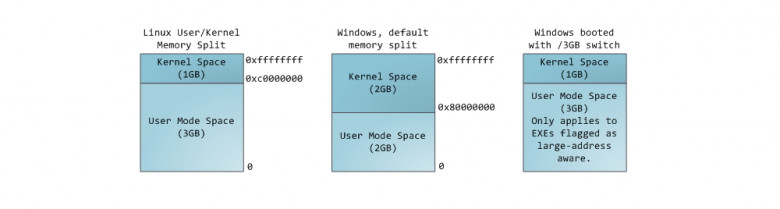
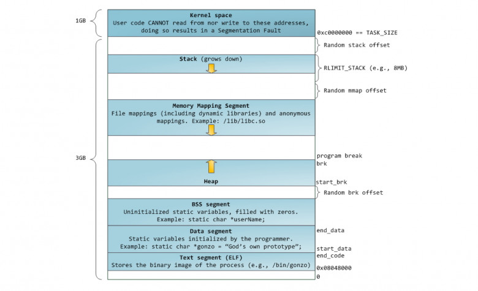
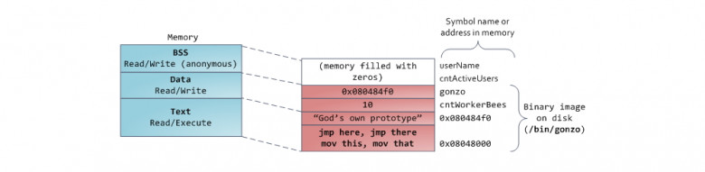
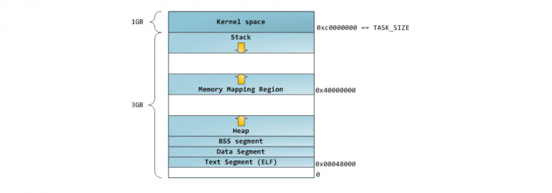

# Организация памяти процесса

[Статья](https://habr.com/ru/companies/smart_soft/articles/185226/)

Управление памятью — центральный аспект в работе операционных систем. Он оказывает основополагающее влияние на сферу программирования и системного администрирования. В нескольких последующих постах я коснусь вопросов, связанных с работой памяти. Упор будет сделан на практические аспекты, однако и детали внутреннего устройства игнорировать не будем. Рассматриваемые концепции являются достаточно общими, но проиллюстрированы в основном на примере Linux и Windows, выполняющихся на x86-32 компьютере. Первый пост описывает организацию памяти пользовательских процессов.

**Каждый процесс** в многозадачной ОС выполняется в собственной "**песочнице**". Эта песочница представляет собой **виртуальное адресное пространство**, которое в 32-битном защищенном режиме **всегда имеет размер равный 4 гигабайтам**. Соответствие между виртуальным пространством и физической памятью описывается с помощью **таблицы страниц** (**page table**). Ядро создает и заполняет таблицы, а процессор обращается к ним при необходимости осуществить трансляцию адреса. **Каждый процесс работает со своим набором таблиц**. Есть один важный момент — концепция виртуальной адресации распространяется **на все выполняемое ПО, включая и само ядро**. По этой причине для него резервируется часть виртуального адресного пространства (т.н. `kernel space`).

Это конечно **не значит**, что ядро занимает все это пространство, просто данный диапазон адресов может быть использован для мэппирования любой части физического адресного пространства по выбору ядра. Страницы памяти, соответствующие `kernel space`, помечены в таблицах страниц как доступные исключительно для [привилегированного кода](https://manybutfinite.com/post/cpu-rings-privilege-and-protection/) (кольцо 2 или более привилегированное). При попытке обращения к этим страницам из `user mode` кода генерируется page fault. В случае с Linux, `kernel space` всегда присутствует в памяти процесса, и разные процессы мэппируют `kernel space` в одну и ту же область физической памяти. Таким образом, код и данные ядра всегда доступны при необходимости обработать прерывание или системный вызов. В противоположность, оперативная память, замэппированная в `user mode space`, меняется при каждом переключении контекста.

Синим цветом на рисунке отмечены области виртуального адресного пространства, которым в соответствие поставлены участки физической памяти; белым цветом — еще не использованные области. Как видно, Firefox использовал большую часть своего виртуального адресного пространства. Все мы знаем о легендарной прожорливости этой программы в отношении оперативной памяти. Синие полосы на рисунке — это **сегменты памяти** программы, такие как куча (heap), стек и так далее. Обратите внимание, что в данном случае под сегментами мы подразумеваем просто непрерывные адресные диапазоны. Это **не те сегменты**, о которых мы говорим при описании сегментации в Intel процессорах. Так или иначе, вот стандартная схема организации памяти процесса в Linux:

Давным давно, когда компьютерная техника находилась в совсем еще младенческом возрасте, начальные виртуальные адреса сегментов были **совершенно одинаковыми** почти для всех процессов, выполняемых машиной. Из-за этого значительно упрощалось удаленное эксплуатирование уязвимостей. Эксплойту часто необходимо обращаться к памяти по абсолютным адресам, например по некоторому адресу в стеке, по адресу библиотечной функции, и тому подобное. Хакер, рассчитывающий осуществить удаленную атаку, должен выбирать адреса для обращения в слепую в расчете на то, что размещение сегментов программы в памяти на разных машинах будет идентичным. И когда оно действительно идентичное, случается, что людей хакают. По этой причине, приобрел популярность механизм рандомизации расположения сегментов в адресном пространстве процесса. Linux рандомизирует расположение [стека](https://lxr.linux.no/linux+v2.6.28.1/fs/binfmt_elf.c#L542), [сегмента для memory mapping](https://lxr.linux.no/linux+v2.6.28.1/fs/binfmt_elf.c#L542), и [кучи](https://lxr.linux.no/linux+v2.6.28.1/arch/x86/kernel/process_32.c#L729) — их стартовый адрес вычисляется путем добавления смещения. К сожалению, 32-битное пространство не очень-то большое, и эффективность рандомизации в [известной степени нивелируется](https://web.stanford.edu/~blp/papers/asrandom.pdf).

В верхней части `user mode space` расположен **стековый сегмент**. Большинство языков программирования используют его для хранения локальных переменных и аргументов, переданных в функцию. Вызов функции или метода приводит к помещению в стек т.н. **стекового фрейма**. Когда функция возвращает управление, стековый фрейм уничтожается. Стек устроен достаточно просто — данные обрабатываются в соответствии с принципом [«последним пришёл — первым обслужен» (LIFO)](https://en.wikipedia.org/wiki/LIFO). По этой причине, для отслеживания содержания стека не нужно сложных управляющих структур — достаточно всего лишь указателя на верхушку стека. Добавление данных в стек и их удаление — быстрая и четко определенная операция. Более того, многократное использование одних и тех же областей стекового сегмента приводит к тому, что они, как правило, находятся в [кеше процессора](https://manybutfinite.com/post/intel-cpu-caches/), что еще более ускоряет доступ. **Каждый тред в рамках процесса работает с собственным стеком**.

Возможна ситуация, когда пространство, отведенное под стековый сегмент, не может вместить в себя добавляемые данные. В результате, будет сгенерирован `page fault`, который в Linux обрабатывается функцией [expand_stack()](https://lxr.linux.no/linux+v2.6.28/mm/mmap.c#L1716). Она, в свою очередь, вызовет другую функцию — [acct_stack_growth()](https://lxr.linux.no/linux+v2.6.28/mm/mmap.c#L1544), которая отвечает за проверку возможности увеличить стековый сегмент. Если размер стекового сегмента меньше значения константы `RLIMIT_STACK` (обычно 8 МБ), то он наращивается, и программа продолжает выполняться как ни в чем не бывало. Это стандартный механизм, посредством которого размер стекового сегмента увеличивается в соответствии с потребностями. Однако, если достигнут максимально разрещённый размер стекового сегмента, то происходит **переполнение стека (stack overflow)**, и программе посылается сигнал **Segmentation Fault**. Стековый сегмент может увеличиваться при необходимости, но никогда не уменьшается, даже если сама стековая структура, содержащаяся в нем, становиться меньше. Подобно федеральному бюджету, стековый сегмент может только расти.

Динамическое наращивание стека — единственная ситуация, когда обращение к «немэппированной» области памяти, может быть расценено как валидная операция. Любое другое обращение приводит к генерации **page fault**, за которым следует **Segmentation Fault**. Некоторые используемые области помечены как *read-only*, и обращение к ним также приводит к **Segmentation Fault**.

Под стеком располагается сегмент для **memory mapping**. Ядро использует этот сегмент для мэппирования (отображания в память) содержимого файлов. Любое приложение может воспользоваться данным функционалом посредством системного вызовома [mmap()](https://man7.org/linux/man-pages/man2/mmap.2.html) ([ссылка на описание реализации вызова mmap](https://lxr.linux.no/linux+v2.6.28.1/arch/x86/kernel/sys_i386_32.c#L27)) или [CreateFileMapping()](https://learn.microsoft.com/ru-ru/windows/win32/api/memoryapi/nf-memoryapi-createfilemappingw?redirectedfrom=MSDN) / [MapViewOfFile()](https://learn.microsoft.com/ru-ru/windows/win32/api/memoryapi/nf-memoryapi-mapviewoffile?redirectedfrom=MSDN) в Windows. Отображение файлов в память — удобный и высокопроизводительный метод файлового ввода / вывода, и он используется, например, для загрузки динамических библиотек. Существует возможность осуществить **анонимное отображение в память (anonymous memory mapping)**, в результате чего получим область, в которую не отображен никакой файл, и которая вместо этого используется для размещения разного рода данных, с которыми работает программа. Если в Linux запросить выделение большого блока памяти с помощью [malloc()](https://man7.org/linux/man-pages/man3/malloc.3.html), то вместо того, чтобы выделить память в куче, стандартная библиотека C задействует механизм анонимного отображения. Слово «большой», в данном случае, означает величину в байтах большую, чем значение константы `MMAP_THRESHOLD`. По умолчанию, это величина равна 128 кБ, и может контролироваться через вызов [mallopt()](https://man7.org/linux/man-pages/man3/undocumented.3.html).

**Кстати о куче.** Она идет следующей в нашем описании адресного пространства процесса. Подобно стеку, куча используется для выделения памяти во время выполнения программы. В отличие от стека, память, выделенная в куче, сохранится после того, как функция, вызвавшая выделение этой памяти, завершится. Большинство языков предоставляют средства управления памятью в куче. Таким образом, ядро и среда выполнения языка совместно осуществляют динамическое выделение дополнительной памяти. В языке C, интерфейсом для работы с кучей является семейство функций [malloc()](https://man7.org/linux/man-pages/man3/malloc.3.html), в то время как в языках с поддержкой **garbage collection**, вроде Go, основной интерфейс — это оператор `new`.

Если текущий размер кучи позволяет выделить запрошенный объем памяти, то выделение может быть осуществлено средствами одной лишь среды выполнения, без привлечения ядра. В противном случае, функция `malloc()` задействует системный вызов [brk()](https://man7.org/linux/man-pages/man2/brk.2.html) для необходимого увеличения кучи ([ссылка на описание реализации вызова brk](https://lxr.linux.no/linux+v2.6.28.1/mm/mmap.c#L248)). Управление памятью в куче — [нетривиальная задача](http://g.oswego.edu/dl/html/malloc.html), для решения которой используются сложные алгоритмы. Данные алгоритмы стремятся достичь высокой скорости и эффективности в условиях непредсказуемых и хаотичных пэттернов выделения памяти в наших программах. Время, затрачиваемое на каждый запрос по выделению памяти в куче, может разительно отличаться. Для решения данной проблемы, системы реального времени используют [специализированные аллокаторы памяти](http://www.gii.upv.es/tlsf/). Куча также подвержена фрагментированию, что, к примеру, изображено на рисунке:

Наконец, мы добрались до сегментов, расположенных в нижней части адресного пространства процесса: **BSS**, **сегмент данных (data segment)** и **сегмент кода (text segment)**. **BSS** и data **сегмент** хранят данные, соответствующий `static` переменным в исходном коде на C. Разница в том, что в BSS хранятся данные, соответствующие *неинициализированным* переменным, чьи значения явно не указаны в исходном коде (*в действительности, там хранятся объекты, при создании которых в декларации переменной либо явно указано нулевое значение, либо значение изначально не указано, и в линкуемых файлах нет таких же common символов, с ненулевым значением. — прим. перевод.*). Для сегмента BSS используется анонимное отображение в память, т.е. никакой файл в этот сегмент не мэппируется. Если в исходном файле на C использовать `int cntActiveUsers`, то место под соответствующий объект будет выделено в BSS.

Забыли добавить, что такое BSS, видящим это впервые может быть не ясно. **BSS, Block Started by Symbol**. В образе бинарника в BSS записывается только число и кол-во переменных, которое должно быть им инициализировано — к примеру 10 интов со значением 0. Когда программа загружается в память, то уже в ней будет зарезервировано 10 нулей.

В отличии от **BSS**, **data cегмент** хранит объекты, которым в исходном коде соответствуют декларации `static` переменных, инициализированных ненулевым значением. Этот сегмент памяти **не является анонимным** — в него мэппируется часть образа программы. Таким образом, если мы используем `static int cntWorkerBees = 10`, то место под соответствующий объект будет выделено в **data сегменте**, и оно будет хранить значение 10. Хотя в **data сегмент** отображается файл, это т.н. **«приватный мэппинг» (private memory mapping)**. Это значит, что изменения данных в этом сегменте не повлияют на содержание соответствующего файла. Так и должно быть, иначе присвоения значений глобальным переменным привели бы к изменению содержания файла, хранящегося на диске. В данном случае это совсем не нужно!

С указателями все немножко посложнее. В примере из наших диаграмм, **содержимое объекта**, соответствующего переменной `gonzo` — это 4-байтовый адрес — размещается в **data сегменте**. А вот строка, на которую ссылается указатель, не попадет в **data сегмент**. Строка будет находиться в **сегменте кода**, который доступен только на чтение и хранит весь Ваш код и такие мелочи, как, например, строковые литералы (*в действительности, строка хранится в секции .rodata, которая вместе с другими секциями, содержащими исполняемый код, рассматривается как сегмент, который загружается в память с правами на выполнение кода / чтения данных **** прим. перевод.*). В **сегмент кода** также мэппируется часть исполняемого файла. Если Ваша программа попытается осуществить запись в **text сегмент**, то заработает **Segmentation Fault**. Это позволяет бороться с «бажными» указателями, хотя самый лучший способ борьбы с ними **** это вообще не использовать C. Ниже приведена диаграмма, изображающая сегменты и переменные из наших примеров:

Мы можем посмотреть, как используются области памяти процесса, прочитав содержимое файла `/proc/pid_of_process/maps`. Обратите внимание, что содержимое самого сегмента может состоять из различных областей. Например, каждой мэппируемой в **memory mapping** сегмент динамической библиотеке отводится своя область, и в ней можно выделить области для **BSS** и **data сегментов** библиотеки. В следующем посте поясним, что конкретно подразумевается под словом "область". Учтите, что иногда люди говорят "**data сегмент**", подразумевая под этим **data + BSS + heap**.

Можно использовать утилиты **nm** и **objdump** для просмотра содержимого бинарных исполняемых образов: символов, их адресов, сегментов и т.д. Наконец, то, что описано в этом посте — это так называемая "гибкая" организация памяти процесса (**flexible memory layout**), которая вот уже несколько лет используется в Linux по умолчанию. Данная схема предполагает, что у нас определено значение константы `RLIMIT_STACK`. Когда это не так, Linux использует т.н. **классическую организацию**, которая изображена на рисунке:

Ну вот и все. На этом наш разговор об организации памяти процесса завершен. В следующем посте рассмотрим как ядро отслеживает размеры описанных областей памяти. Также коснемся вопроса мэппирования, какое отношение к этому имеет чтение и запись файлов, и что означают цифры, описывающие использование памяти.

«Page-кэш, или как связаны между собой оперативная память и файлы».