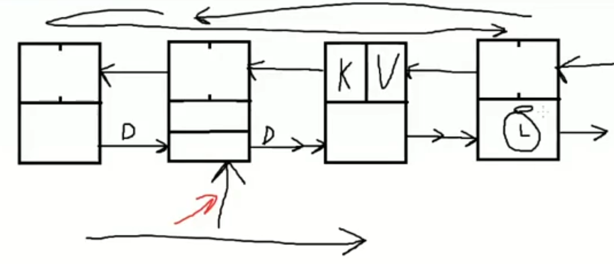
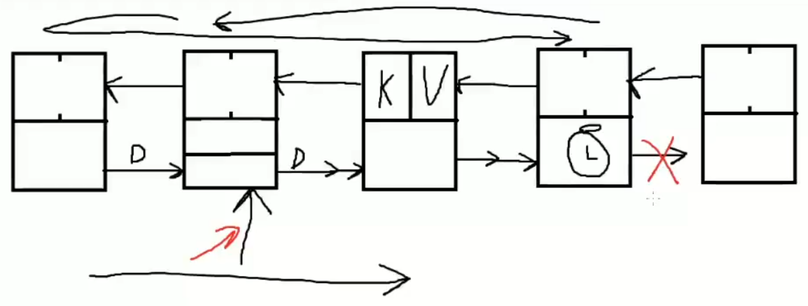
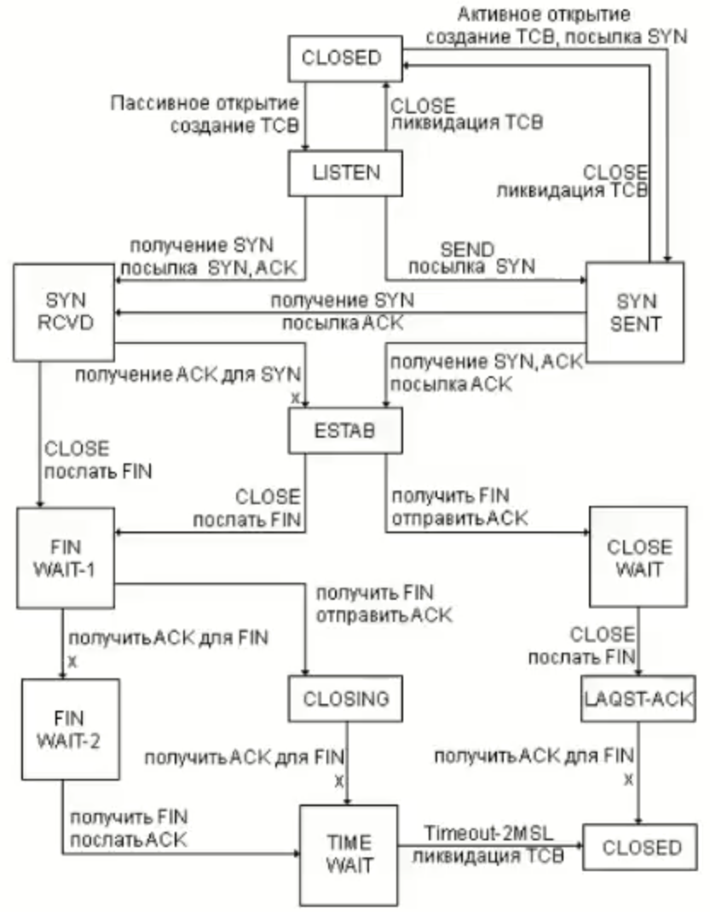
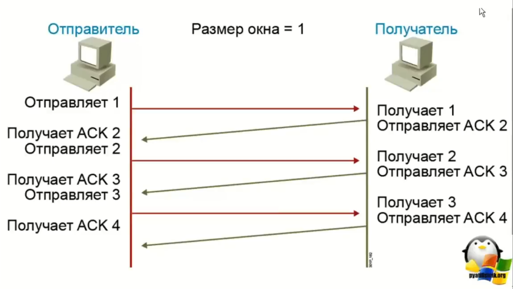
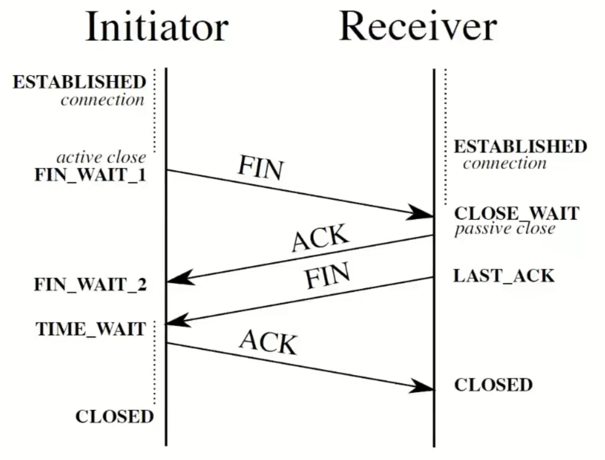

# Контекст и низкоуровневые сетевые протоколы

Рубаха Юрий

## О чем будем говорить

1. `context.Context`
2. Сетевые протоколы
3. Работа с ними в Go

## Контекст

```go
type Context  interface {
    Deadline() (deadline time.Time, ok bool)
    Done() <-chan struct{}
    Err() error
    Value(key any) any
}
```
https://pkg.go.dev/context
https://go.dev/blog/context


### Пакет context

```go
func Background() Context
func TODO() Context
```

```go
func WithCancel(parent Context) (ctx Context, cancel CancelFunc)
func WithoutCancel(parent Context) Context
func WithDeadline(parent Context, deadline time.Time) (Context, CancelFunc)
func WithTimeout(parent Context, timeout time.Duration) (Context, CancelFunc)
func WithValue(parent Context, key interface{}, val interface{}) Context
```

```go
func AfterFunc(ctx Context, f func()) (stop func() bool)
```



**WithoutCancel**



## TCP

- Доставка пакета гаранитруется (или получим ошибку)
- Порядок пакетов гарантируется
- Соединение устанавливается
- Есть overhead
- Подходит для http, электронной почты

### Диаграмма состояний



### Установка соединения



### Завершение соединения



## UDP

- Доставка пакета не гарантируется
- Порядок сообщений не гарантируется
- Соединение не устанавливается
- Быстрый
- Подходит для потокового аудио и видео, статистики, игр

## Пакет net

### `Dialer`

Тип, задача которого установка соединений
Обладает следующим интерфейсом:

```go
func (d *Dialer) Dial(network, address string) (Conn, error)
func (d *Dialer) DialContext(ctx context.Context, network, address string) (Conn, error)
```

Можно использовать стандартные значения параметров функций
```go
func Dial(network, address string) (Conn, error)
func DialTimeout(network, address string, timeout time.Duration) (Conn, error)
```

### Примеры установки соединений

```go
Dial("tcp", "golang.org:http")
Dial("tcp", "192.0.2.1:http")
Dial("tcp", "198.51.100.1:80")
Dial("udp", "[2001:db8::1]:domain")
Dial("udp", "[fe80::1%lo0]:53")
Dial("tcp", ":80")
```

### Тип `Conn`

Является абстракцией над поточным сетевым соединением.
Является имплементацией Reader, Writer, Closer.
Это потокобезопасный тип.

