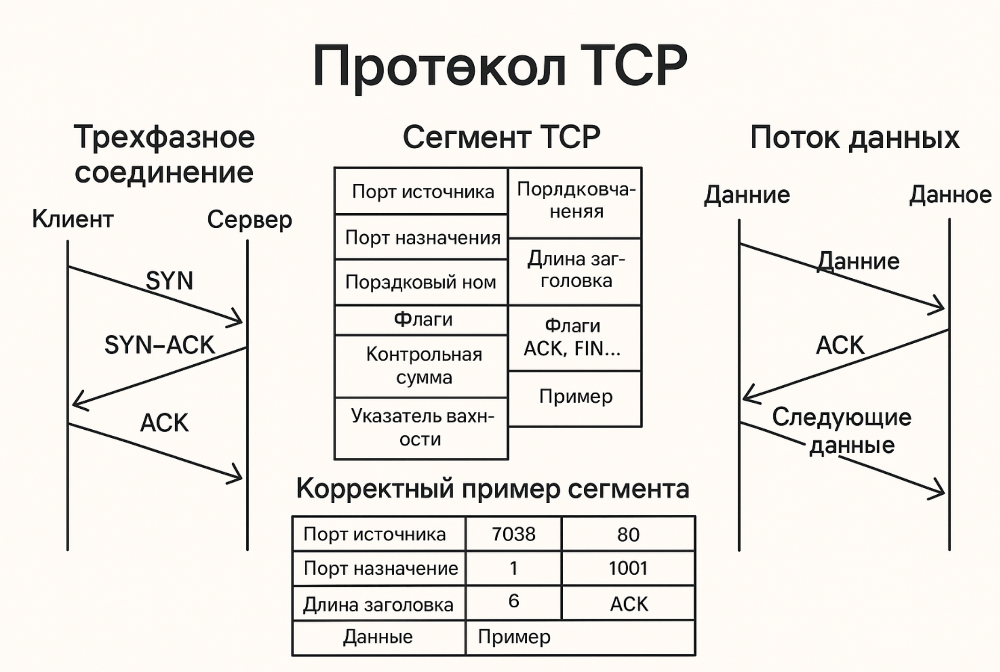

# Протокол TCP (Transmission Control Protocol)

TCP — это один из основных транспортных протоколов в модели TCP/IP. Он обеспечивает **надежную, установившую соединение, ориентированную на поток передачу данных** между двумя конечными точками (например, между браузером и сервером).

## 🔹 Как выглядит передача информации

### 1. Установление соединения: "тройное рукопожатие" (three-way handshake)

Перед началом передачи данных TCP устанавливает соединение:

1. Клиент → Сервер: SYN
2. Сервер → Клиент: SYN-ACK
3. Клиент → Сервер: ACK

После этого соединение считается установленным.

### 2. Передача данных

Данные передаются в виде **сегментов**. Каждый TCP-сегмент включает:

**📦 Структура TCP-сегмента**:

| Поле                   | Описание                                          |
| ---------------------- | ------------------------------------------------- |
| Source Port            | Порт отправителя                                  |
| Destination Port       | Порт получателя                                   |
| Sequence Number        | Порядковый номер байта в потоке                   |
| Acknowledgment Number  | Подтверждение полученных байт                     |
| Header Length          | Длина заголовка TCP                               |
| Flags (SYN, ACK, FIN…) | Управление соединением                            |
| Window Size            | Размер окна (сколько данных можно принять)        |
| Checksum               | Контрольная сумма                                 |
| Urgent Pointer         | Указывает на приоритетные данные                  |
| Options + Padding      | Дополнительные параметры                          |
| **Data**               | Полезная нагрузка (байты пользовательских данных) |


Пример:

TCP-сегмент:
┌──────────────────────────────────────┐
│ Заголовок TCP (20–60 байт)          │
│ ▸ Порты, номера, флаги, окно, и т.д.│
├──────────────────────────────────────┤
│ Полезные данные (данные приложения) │
└──────────────────────────────────────┘


### 🔹 Что происходит при потере пакета?
TCP гарантирует доставку всех байт **в правильном порядке**. Если сегмент утерян:

**Механизм повторной передачи (retransmission)**:
1. Получатель не отправляет подтверждение (ACK) для потерянного сегмента.
2. Отправитель ждет таймаут (или 3 дубликата ACK) → повторно отправляет сегмент.
3. Получатель принимает потерянный сегмент и отправляет подтверждение.

📌 TCP **сам восстанавливает утерянные данные**, в отличие от UDP.

**Методы обнаружения потерь**:
- **Таймаут** (если ACK не пришел вовремя).
- **Дублирующие ACK**: если сегмент 3 раза подтверждает один и тот же номер, это сигнал, что следующий пакет утерян → отправитель может ускоренно передать пропущенный.

### 🔹 Как называется вид передачи

TCP реализует:

- **Потоковую передачу данных** — данные воспринимаются как непрерывный байтовый поток.
- **Надежную доставку с управлением перегрузкой**.
- **Установленное соединение** — в отличие от UDP.

### 🔚 Закрытие соединения: (four-way handshake)
1. Отправитель: FIN
2. Получатель: ACK
3. Получатель: FIN
4. Отправитель: ACK



### 🧩 Структура TCP-сегмента (заголовок + данные)

TCP-сегмент состоит из:

+----------------------+  ←  0 байт (начало заголовка)
| Source Port          | 2 байта
+----------------------+
| Destination Port     | 2 байта
+----------------------+
| Sequence Number      | 4 байта
+----------------------+
| Acknowledgment Number| 4 байта
+----------------------+
| Data Offset (4 бита) |
| Reserved (3 бита)    |
| Flags (9 бит)        | 2 байта
+----------------------+
| Window Size          | 2 байта
+----------------------+
| Checksum             | 2 байта
+----------------------+
| Urgent Pointer       | 2 байта
+----------------------+
| (Options, padding)   | переменная длина (если есть)
+----------------------+  ← конец заголовка
| Payload (данные)     | переменная длина
+----------------------+


📋 Расшифровка всех полей:

| Поле                      | Описание                                                      |
| ------------------------- | ------------------------------------------------------------- |
| **Source Port**           | Порт отправителя (например, 60221)                            |
| **Destination Port**      | Порт получателя (например, 80 или 443)                        |
| **Sequence Number**       | Номер первого байта данных (для контроля порядка)             |
| **Acknowledgment Number** | Подтверждение принятого байта от получателя                   |
| **Data Offset**           | Размер TCP-заголовка в 32-битных словах (обычно 5 или больше) |
| **Flags**                 | Служебные флаги (SYN, ACK, FIN, RST, PSH, URG и др.)          |
| **Window Size**           | Размер окна для контроля потока                               |
| **Checksum**              | Контрольная сумма TCP-сегмента                                |
| **Urgent Pointer**        | Используется с флагом URG (редко применяется)                 |
| **Options**               | Дополнительные параметры (MSS, SACK, timestamps и др.)        |
| **Payload**               | Полезная нагрузка (данные, например HTTP-запрос)              |

🎯 Пример (из твоего пакета Frame 3883):

| Поле                  | Значение                |
| --------------------- | ----------------------- |
| Source Port           | 60221                   |
| Destination Port      | 80                      |
| Sequence Number       | 1838032169              |
| Acknowledgment Number | 0                       |
| Flags                 | SYN                     |
| Header Length         | 32 байта                |
| Window                | 64240                   |
| Options               | MSS, SACK, Window Scale |
| Payload               | 0 байт (Len: 0)         |


🚦 Основные TCP-флаги:


| Флаг    | Назначение                               |
| ------- | ---------------------------------------- |
| **SYN** | Запрос установить соединение             |
| **ACK** | Подтверждение получения                  |
| **FIN** | Запрос завершить соединение              |
| **RST** | Принудительное завершение соединения     |
| **PSH** | Принудительная передача данных           |
| **URG** | Есть срочные данные (с `Urgent Pointer`) |


**Как устроена передача по сетям: уровни и инкапсуляция**

1. Ethernet-кадр (Физический/Канальный уровень)

- MAC-адреса, тип протокола (например, IPv4)

2. IP-пакет (Сетевой уровень)

- Здесь уже есть:
    - Src IP (адрес отправителя)
    - Dst IP (адрес получателя)
    - Другие поля IP (TTL, протокол и т.п.)

- В этом IP-пакете содержится...

3. TCP-сегмент (Транспортный уровень)

- Уже внутри IP-пакета
- Здесь есть порты, номера последовательностей, флаги, данные


**Пример из твоего пакета (уровни):**

```yaml
Ethernet II Header
    Src MAC: 00:0c:29:3d:61:d3
    Dst MAC: 58:f8:5c:57:f4:7d

IP Header
    Src IP: 192.168.1.13
    Dst IP: 157.240.205.61
    Protocol: TCP (6)

TCP Header
    Src Port: 60221
    Dst Port: 80
    Seq: ...
    Flags: SYN
    ...
```

