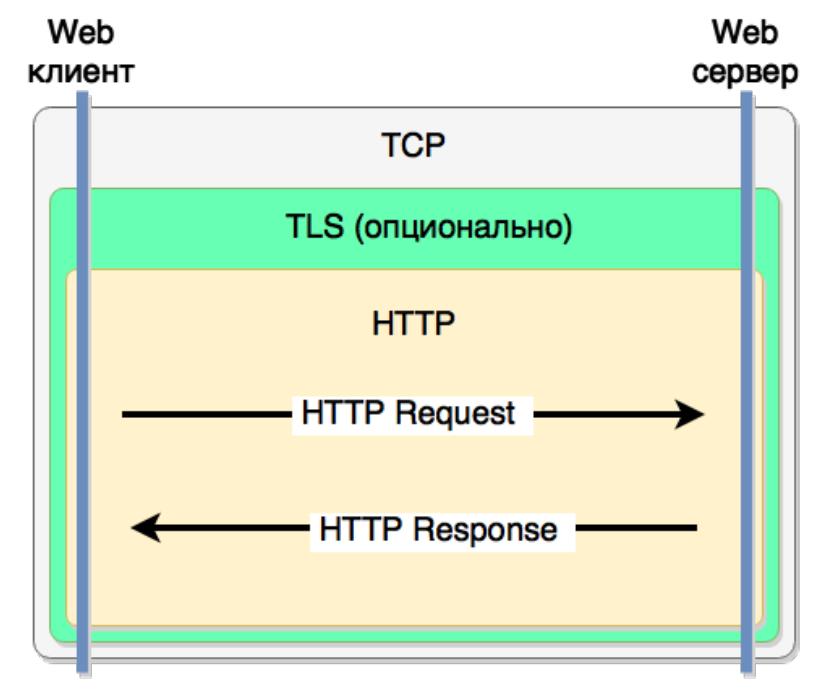

# Протокол HTTP

- HTTP клиент и сервер на Go
- Middleware
- Построение API сервиса

## Что такое HTTP?



- HTTP — протокол прикладного уровня, который используется для обмена данными в сети Интернет.
- Позволяет клиентам (обычно веб-браузерам) запрашивать ресурсы (страницы, изображения, видео, данные) с серверов.
- Работает по модели клиент-сервер:
- Клиент отправляет HTTP-запрос.
- Сервер отвечает HTTP-ответом.

## Задачи HTTP

- Передача документов
- Передача мета-информации
- Авторизация
- Поддержка сессий
- Кеширование документов
- Согласование содержимого (negotiation)
- Управление соединением

## Ключевые особенности HTTP

- Работает поверх TCP/TLS
- Протокол запрос-ответ
- Не поддерживает состояние (соединение) - stateless
- Текстовый протокол
- Расширяемый протокол

## HTTP запрос

```
GET /search?query=go+syntax&limit=5 HTTP/1.1
Accept: text/html,application/xhtml+xml
Accept-Encoding: gzip, deflate
Cache-Control: max-age=0
Connection: keep-alive
Host: site.ru
User-Agent: Mozilla/5.0 Gecko/20100101 Firefox/39.0

POST /add_item HTTP/1.1
Accept: application/json
Accept-Encoding: gzip, deflate
Cache-Control: max-age=0
Connection: keep-alive
Host: www.ru
Content-Length: 42
Content-Type: application/json
{"id":123,"title":"for loop","text":"..."}
```

Перевод строки - `\r\n`

## HTTP ответ

```
HTTP/1.1 404 Not Found
Server: nginx/1.5.7
Date: Sat, 25 Jul 2015 09:58:17 GMT
Content-Type: text/html; charset=iso-8859-1
Connection: close

<!DOCTYPE HTML PUBLIC "-//IETF//DTD HTML 2.0//EN">
<HTML><HEAD>...
```

## HTTP / 2.0

- HTTP/2 - бинарный протокол
- используется мультиплексирование потоков
- сервер может возвращать еще не запрошенные файлы
- используется HPACK сжатие заголовков

Уровни и их единицы данных (пример с твоими терминами):

| Уровень                          | Единица данных         | Что содержит                                                        |
| -------------------------------- | ---------------------- | ------------------------------------------------------------------- |
| Канальный уровень (Data Link)    | Фрейм (Ethernet frame) | Заголовок канального уровня (MAC-адреса и пр.) + сетевой пакет      |
| Сетевой уровень (Network)        | Пакет (IP packet)      | Заголовок IP (адреса источника и назначения) + транспортный сегмент |
| Транспортный уровень (Transport) | Сегмент (TCP segment)  | Заголовок TCP + данные (поток байт, например HTTP/2 фреймы)         |
| Прикладной уровень (Application) | Фрейм (HTTP/2 frame)   | Заголовок HTTP/2 + полезная нагрузка протокола HTTP/2               |

Объяснение:
- Канальный уровень — упаковывает IP-пакет в Ethernet-фрейм, добавляя MAC-адреса, контрольную сумму и т.д.
- Сетевой уровень — упаковывает TCP-сегмент в IP-пакет с IP-адресами.
- Транспортный уровень — упаковывает данные приложения в TCP-сегмент, обеспечивает надёжную доставку.
- Прикладной уровень — внутри TCP-сегмента могут быть разные протоколы, например HTTP/2, который сам разбивает данные на фреймы.

## HTTP клиент - GET

```go
func main() {
    resp, err := http.Get("http://127.0.0.1:7070/")
    if err != nil {
        log.Fatal(err)
    }
    defer resp.Body.Close() // <-- Зачем?
    body, err := ioutil.ReadAll(resp.Body)
    if err != nil {
        log.Fatal(err)
    }
    ...
}
```

**вызов блокирующий**
`body, err := ioutil.ReadAll(resp.Body)`

- `resp.Body` — это поток (stream) данных HTTP-ответа.
- `ioutil.ReadAll` читает все данные из этого потока до конца и возвращает их как срез байт.
- Во время чтения код останавливается (блокируется), пока не получит весь ответ или не встретит ошибку.

**Что это значит на практике?**
- Пока `ReadAll` не дочитает весь ответ, выполнение текущей горутины приостанавливается.
- Если сервер долго шлёт данные или соединение медленное, программа ждёт.
- Если хочешь не блокировать основную логику, читай тело в отдельной горутине или используй чтение частями.

## Работа с аргументами

```go
reqArgs := url.Values{}
reqArgs.Add("query", "go syntax")
reqArgs.Add("limit", "5")

reqUrl, _ := url.Parse("http://site.ru/search")
reqUrl.RawQuery = reqArgs.Encode()

req, _ := http.NewRequest("GET", reqUrl.String(), nil)
req.Header.Add("User-Agent", `Mozilla/5.0 Gecko/20100101 Firefox/39.0`)

resp, err := http.DefaultClient.Do(req)
```

Для запуска: 
https://goplay.space/#QHza-h5jNm2
https://go.dev/play/p/QHza-h5jNm2

## HTTP клиент

[Официальная дока](https://pkg.go.dev/net/http#Client)

```go
client := http.Client{
    Transport: &http.Transport{
        MaxIdleConns: 100,
        IdleConnTimeout: 90 * time.Second,
    },
}
```

## HTTP клиент - POST

```go
type AddRequest struct {
    Id      int     `json:"id"`
    Title   string  `json:"title"`
    Text    string  `json:"text"`
}

...

addReq := &AddRequest{
    Id:     123,
    Title:  "for loop",
    Text:   "...",
}

jsonBody, _ := json.Marshal(&addReq)
req, err := http.NewRequest("POST", "https://site.ru/add_item",
bytes.NewBuffer(jsonBody))
resp, err := http.DefaultClient.Do(req)
```

## HTTP сервер

```go
type MyHandler struct {
    // все нужные объекты: конфиг, логер, соединение с базой и т.п.
}
// реализуем интерфейс `http.Handler`

func (h *MyHandler) ServeHTTP(w http.ResponseWriter, r *http.Request) {
    // эта функция будет обрабатывать входящие запросы
}
func main() {
    handler := &MyHandler{}

    server := &http.Server{
        Addr:           ":8080",
        Handler:        handler,
        ReadTimeout:    10 * time.Second,
        WriteTimeout:   10 * time.Second,
    }

    server.ListenAndServe()
}
```

### HTTP сервер - обработчик

```go
func (h *MyHandler) ServeHTTP(w http.ResponseWriter, r *http.Request) {
    if r.URL.Path == "/search" {
        args := r.URL.Query()
        query := args.Get("query")
        limit, err := strconv.Atoi(args.Get("limit"))
        if err != nil {
            w.WriteHeader(http.StatusBadRequest)
            return
        }

        results, err := h.doSomeBusinessLogic(query, limit)
        if err != nil {
            w.WriteHeader(http.StatusInternalServerError)
            return
        }

        w.Header().Set("Content-Type", "application/json; charset=utf-8")
        w.WriteHeader(http.StatusOK)

        json.NewEncoder(w).Encode(results)
    }
}
```

### HTTP сервер - функция как обработчик

```go
type MyHandler struct {

}

func (h *MyHandler) ServeHTTP(w ResponseWriter, r *Request) {

}
...

server := &http.Server{
    Handler: handler, // <--
}
```

```go
func SomeHttpHandler(w http.ResponseWriter, r *http.Request) {

}
...
server := &http.Server{
    Handler: http.HandlerFunc(SomeHttpHandler), // <--
}
```

### HTTP сервер - routing (примитив)

```go
type MyHandler struct {}

func (h *MyHandler) ServeHTTP(w http.ResponseWriter, r *http.Request) {
    switch r.URL.Path {
        case "/search":
            h.Search(w, r)
        case "/add"
            h.AddItem(w, r)
        default:
            http.NotFound(w, r)
    }
}

func (h *MyHandler) Search(w ResponseWriter, r *Request) {
    // ...
}

func (h *MyHandler) AddItem(w ResponseWriter, r *Request) {
    // ...
}
```

### HTTP сервер - routing (правильно)

```go
type MyHandler struct {}

func (h *MyHandler) Search(w ResponseWriter, r *Request) {
    // ...
}

func (h *MyHandler) AddItem(w ResponseWriter, r *Request) {
    // ...
}

func main() {
    handler := &MyHandler{}
    mux := http.NewServeMux()
    mux.HandleFunc("/search", handler.Search)
    mux.HandleFunc("/add", handler.AddItem)

    server := &http.Server{
        Addr: ":8080",
        Handler: mux,
    }

    log.Fatal(server.ListenAndServe())
}
```