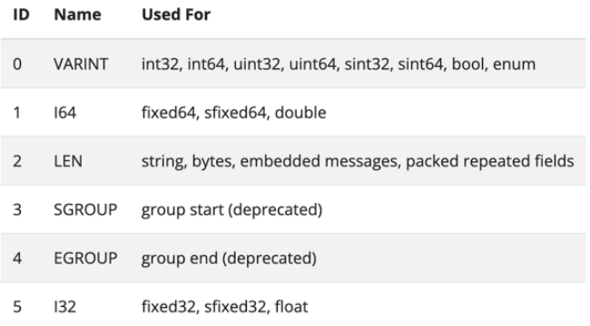
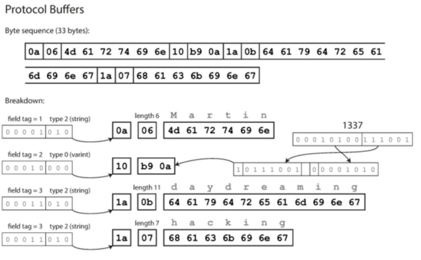
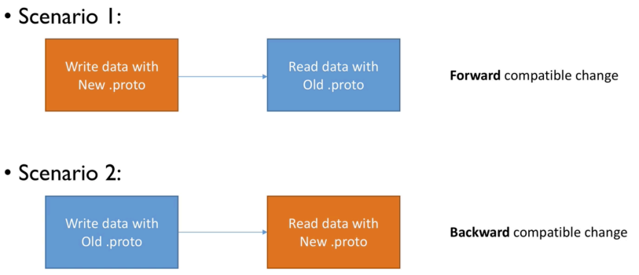
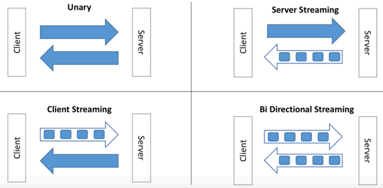
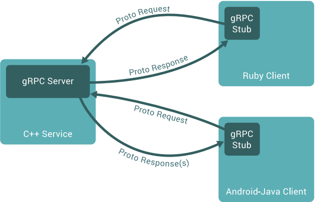
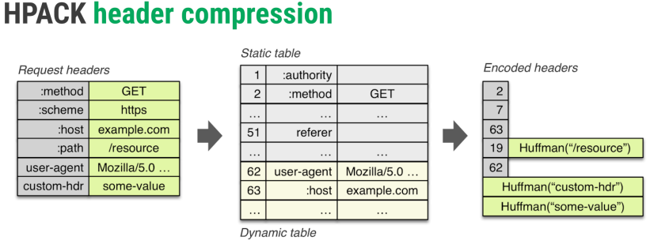
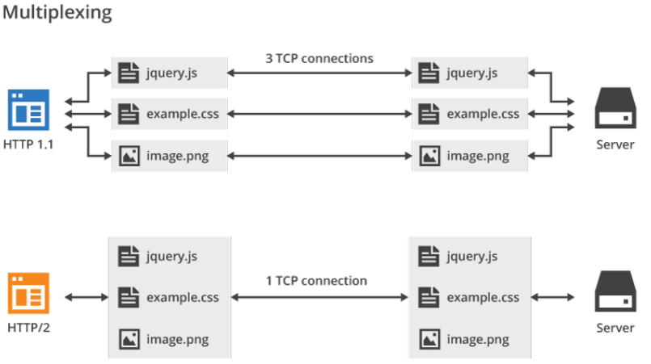

# gRPC (теория)

## О чем будем говорить

- Посмотрим на Protobuf
- Что такое gRPC

## План занятия

- Знакомимся с Protocol buffers
- Прямая и обратная совместимость в Protocol buffers
- Описание API с помощью Protobuf
- Что такое gRPC и HTTP/2

## Protobuf

```proto
syntax = "proto3";              // Указывает, что используется версия proto3

message SearchRequest {
  string query = 1;             // Текст поискового запроса
  int32 page_number = 2;        // Номер страницы (для пагинации)
  int32 results_per_page = 3;   // Количество результатов на странице
}
```

**Краткие пояснения:**

- `message SearchRequest` — определяет структуру сообщения с именем `SearchRequest`.

- `string` и `int32` — типы полей (строка и 32-битное целое число).

- `= 1`, `= 2`, `= 3` — теги полей. Они используются при сериализации и не должны изменяться после публикации схемы, чтобы обеспечить совместимость.

Это сообщение может использоваться, например, для отправки запроса на поиск в API, где клиент указывает поисковую строку и параметры пагинации.


### Protobuf: tags

- Номера тегов уникальны в рамках сообщения
- Номера от 1 до 536.870.911
- Номера от 19.000 до 19.999 заразервированы компилятором
- Теги с 1 до 15 занимают 1 байт


В **protobuf** **теги** (порядковые номера полей) **всегда начинаются с 1, а не с 0**.

Вот почему:

**🔢 Почему теги начинаются с 1**

- **Тег 0 зарезервирован** внутри Protocol Buffers и **не может использоваться** для пользовательских полей.

- Это сделано по архитектурным причинам: тег 0 в wire format зарезервирован как "неопределённое поле" и используется внутренне.

- Поэтому **всегда начинаем с 1 и далее: 1, 2, 3, ...** — и при этом важно не менять их после публикации схемы.

**🛠 Практические рекомендации:**

- **Каждое поле должно иметь уникальный тег** внутри одного message.
- Неизменяемость тегов критична: **если ты меняешь номер тега у существующего поля**, получатель не сможет правильно расшифровать сообщение.
- Если ты удаляешь поле — лучше не переиспользовать его тег, чтобы избежать конфликтов.

### Protocol buffers: типы данных

https://developers.google.com/protocol-buffers/docs/encoding

**✅ Скалярные типы protobuf3**

| Тип          | Размер          | Описание         |
| ------------ | --------------- | ---------------- |
| `float`/`double`      | 32 бит/64 бит   | Соответствует `float32`/`float64`. Фиксированный размер. |
| `fixed32`/`fixed64`   | 32 бит/64 бит   | Соответствует `uint32`/`uint64`. Беззнаковое целое фиксированного размера. **Эффективен, если часто передаёшь большие числа.** |
| `sfixed32`/`sfixed64` | 32 бит/64 бит   | Соответствует `int32`/`int64`. Знаковое целое фиксированного размера. **Эффективен, если часто передаёшь большие числа.** |
| `int32`/`int64`       | varint/varint   | Целое со знаком. Эффективен для положительных чисел (0...127 = 1 байт). Отрицательные — до 10 байт. |
| `uint32`/`uint64`   | varint/varint          | Целое без знака. Эффективен для маленьких чисел.   |
| `sint32`/`sint64`   | varint (ZigZag)/varint (ZigZag) | Поддерживает отрицательные значения эффективнее, чем `int32`/`int64`. Использует ZigZag-кодирование.      |
| `bool `    | 1 байт          | `true` или `false`.            |
| `string`   | длина + UTF-8   | Строка в кодировке UTF-8. Сериализуется как длина + байты. Поддержка Unicode.  |
| `bytes`    | длина + `[]byte` | Сырые байты. Подходит для бинарных данных.      |

**💡 Особенности сериализации**

**📏 Varint**

- Используется в `int32`, `int64`, `uint32`, `uint64`, `sint32`, `sint64`.

- **Маленькие числа занимают меньше места**

  - Пример: `0 ... 127` → 1 байт

- **Отрицательные значения в** `int32`/`int64` → всегда 5/10 байт!

  - Поэтому для них лучше использовать `sint32`/`sint64` + ZigZag

**⚡ ZigZag (в `sint32`/`sint64`)**

ZigZag-кодирование позволяет эффективно кодировать отрицательные числа:

| Значение | ZigZag | Varint |
| -------- | ------ | ------ |
| 0        | 0      | 0x00   |
| -1       | 1      | 0x01   |
| 1        | 2      | 0x02   |
| -2       | 3      | 0x03   |


**📦 fixed vs varint**
- `fixed32` / `fixed64` **всегда 4 / 8 байт**, независимо от значения.
- **Используй их, если значения часто большие**, и ты не хочешь тратить до 10 байт на varint.

#### Мои изыскания

`varint` работает по принципу паровозика с вагончиками, при этом движение идет вправо, т.е. мы идем с конца состава.

`вагон*` -> ... `вагон*` -> `паровоз`
*наличие зависит от размера числа

При этом структура вагона паровоза и вагонов схожа: `[*][***_****]`, где первый бит `[*]` — бит продолжения (у вагонов он 1, означает, что паровоз дальше)

Для отрицательных чисел в `int64` (старший бит всегда есть и равен 1) и занимает это все 8 байт `1******* ******** ... ****`.
Например, -1: `00000000 00000000 ... 0001` -> инверс -> `11111111 1111 ... 1110` -> +1 -> `11111111 11111111 ... 1111` (все 64 бита = 1)
Для передачи информации об отрицательных числах, размером 64 бита, в `varint` необходимо 10 байт информации.

**Логически:**
Необходимо 64 бита полезной информации, а вагонах/паровозике 7 бит полезной нагрузки, тогда $ceil(64/7)=10$:
`[1][***_****]` -> ... -> `[1][***_****]` -> `[0][***_****]`

При этом сначала идут младшие биты, чтобы была возможность сразу расчитывать и не хранить по мере перехода от вагона к вагону.

Например:
**varint**: `[1]011_1001]` -> `[0][000_1010]`

Это число в стандартной двоичной записи `00_0101 0011_1001` = **1 337**

с `varint`/(ZigZag) поинтереснее: отрицательные и положительные числа стартуют от нуля вместе, поэтому объем памяти для небольших отрицательных чисел горазда меньше.
Для больших отрицательных эффективнее `sfixed64`.

📊 Представление числа -1 в разных типах Protocol Buffers

| В десятичной | `sfixed64`             | `int64` (`varint`)                                                 | `sint64` (`varint`, ZigZag)  | ZigZag |
| ------------ | ---------------------- | ------------------------------------------------------------------ | ---------------------------- | ------ |
| `-1`         | `1111...1111` (64 бит) | `[1][111_1111]` → ... → `[1][111_1111][0][000_0001]` → **10 байт** | `[0][000_0001]` → **1 байт** | `1`    |

* в `int64` все верно! конец такой `[0][000_0001]` так как получаем из 10 байт 70 бит полозной, а нам надо 64, т.е. в паровозе мы используем только младший бит

### Protocol buffers: repeated fields

Слайс реализуется через **repeated**:

```proto
message SearchResponse {
    repeated Result results = 1;
}
message Result {
    string url = 1;
    string title = 2;
    repeated string snippets = 3;
}
```

``` proto
...
Snippets    []string `protobuf:"bytes,3,rep,name=snippets,proto3" json:"snippets,omitempty"`
...
Results     []*Result `protobuf:"bytes,1,rep,name=results,proto3" json:"results,omitempty"`
```

### Protocol buffers: Enums

```proto
enum EyeColor {
    EYE_COLOR_UNSPECIFIED = 0;
    EYE_COLOR_GREEN = 1;
    EYE_COLOR_BLUE = 2;
}
message Person {
    string name = 1;
    EyeColor eye_color = 2;
}
```

```go
type EyeColor int32
const (
    EyeColor_UNSPECIFIED    EyeColor = 0  // обязательное "нулевое" значение
    EyeColor_EYE_GREEN      EyeColor = 1
    EyeColor_EYE_BLUE       EyeColor = 2
)
```

### Protocol buffers: дефолтные значения

| Тип поля   | Значение по умолчанию     | Комментарий                                               |
| ---------- | ------------------------- | --------------------------------------------------------- |
| `string`   | `""`                      | Пустая строка                                             |
| `bool`     | `false`                   |                                                           |
| `int32`    | `0`                       | То же для `int64`, `uint32`, `uint64`, `float`, `double`  |
| `bytes`    | `[]byte{}` (пустой слайс) |                                                           |
| `enum`     | Первое объявленное        | Всегда начинается с нуля                                  |
| `repeated` | Пустой слайс              | Не `nil`, а именно пустой список (в сериализованном виде) |
| `message`  | `nil` в Go                | То есть поле отсутствует, если явно не задано             |

[Дефолтные значения](https://developers.google.com/protocol-buffers/docs/reference/go-generated#singular-message)


### Protocol buffers: oneof, map


`oneof` - только одно поле из списка может иметь значение и не может быть **repeated**.


```proto
message Message {
    int32 id = 1;
    oneof auth {
        string mobile = 2;
        string email = 3;
        int32 userid = 4;
    }
}
```

`map` - ассоциативный массив;
ключи - скаляры (кроме `float`/`double`);
значения - любые типы, не может быть **repeated**.

```proto
message Result {
    string result = 1;
}
message SearchResponse {
    map<string, Result> results = 1;
}
```


### Protocol buffers: wire types


В Protocol Buffers при сериализации каждое поле состоит из двух частей:

- key — кодирует номер поля (tag) и wire type,
- value — собственно данные.

**Всего 6 wire types:**

| Wire Type | Номер (3 бита) | Описание                              | Какие типы данных используется                           |
| --------- | -------------- | ------------------------------------- | -------------------------------------------------------- |
| 0         | 0              | **Varint** (переменная длина int)     | int32, int64, uint32, uint64, sint32, sint64, bool, enum |
| 1         | 1              | **64-битное фиксированное**           | fixed64, sfixed64, double                                |
| 2         | 2              | **Length-delimited** (длина + данные) | string, bytes, embedded messages, packed repeated fields |
| 3         | 3              | **Start group** (устаревшее)          | deprecated, не используется в proto3                     |
| 4         | 4              | **End group** (устаревшее)            | deprecated, не используется в proto3                     |
| 5         | 5              | **32-битное фиксированное**           | fixed32, sfixed32, float                                 |


**Детали:**

- **Wire type 0** — **varint**:

    Числа кодируются переменной длиной — по 7 бит на байт + 1 бит продолжения.
    Используется для целых чисел и enum.

- **Wire type 1** — **64-битное фиксированное**:

    Всегда 8 байт подряд. Для `double`, `fixed64` и `sfixed64`.

- **Wire type 2** — **length-delimited**:
    
    Для строк, байтовых массивов и вложенных сообщений.

- **Wire types 3 и 4** — группы:
    
    Устаревшие, не поддерживаются в proto3.

- **Wire type 5** — 32-битное фиксированное:
    
    Всегда 4 байта подряд. Для `float`, `fixed64` и `sfixed64`.



### Protocol buffers: encoding format

```proto
message Person {
    required string user_name = 1;
    optional int64 favorite_number = 2;
    repeated string interests = 3;
}
```



## Где `required` и `optional`?

**✅ `required` в proto3**
`required` **полностью удалён** в `proto3`.
Это сделано для упрощения схем: теперь невозможно сделать поле обязательным.

❌ `required` — нельзя использовать в `proto3`.


**✅` optional` в proto3**
В ранних версиях proto3 все поля были "optional by default", но без возможности узнать, задано ли значение явно.
Позже (начиная с protobuf 3.15, декабрь 2020) в proto3 добавили новый синтаксис `optional`, который возвращает семантику ближе к proto2.

| Синтаксис    | Поддержка в proto3 | Можно узнать, задано ли значение? |
| ------------ | ------------------ | --------------------------------- |
| `required`   | ❌ запрещён         | —                                |
| `optional`   | ✅ (с 3.15+)        | ✅ да, с `optional`             |
| По умолчанию | все поля optional  | ❌ нет, флагов нет                |

## Protocol buffers: go_package

simplepb - более явно

```proto
syntax = "proto3";

package example.simple;

option go_package = "./;simplepb";

message SimpleMessage {
    int32 id = 1;
    bool is_simple = 2;
    string name = 3;
    repeated int32 sample_list = 4;
}
```

```go
// Code generated by protoc-gen-go. DO NOT EDIT.
// source: simple/simple.proto
package simplepb
import proto "github.com/golang/protobuf/proto"
import fmt "fmt"
import math "math"
```

## Protocol buffers: Well Known Types

https://developers.google.com/protocol-buffers/docs/reference/google.protobuf

```proto
syntax = "proto3";
import "google/protobuf/timestamp.proto";
import "google/protobuf/duration.proto";

message MyMessage {
    google.protobuf.Timestamp last_online = 1;
    google.protobuf.Duration session_length = 2;
}
```

## Protocol buffers: прямая/обратная совместимость



- не меняйте теги
- старый код будет игнорировать новые поля
- при неизвестных полях испольуются дефолтные значения
- поля можно удалять, но не переиспользовать тег / сделать поле `reserved`

[Подробнее](https://developers.google.com/protocol-buffers/docs/proto#updating)

**Добавление полей:**

```proto
message MyMessage {
    int32 id = 1;
    string fist_name = 2; // + добавим
}
```

- **старый код будет игнорировать новое поле**
- **новый код будет использовать значение по умолчанию при чтении "старых" данных**

**Переименоваение полей:**

```proto
message MyMessage {
    int32 id = 1;
    //string fist_name = 2; удалим
    string person_first_name = 2; // добавим
}
```

- бинарное представление не меняется, так как **имеет значение только тег**

## Protocol buffers: reserved


```proto
message Foo {
    reserved 2, 15, 9 to 11;
    reserved "foo", "bar";
}
```

- можно резервировать теги и поля
- смешивать нельзя
- резервируем теги чтобы новые поля их не переиспользовали (runtime errors)
- резервируем имена полей, чтобы избежать багов
**никогда не удаляйте зарезервированные теги !**


## Protocol buffers: дефолтные значения

- не можем отличить отсутствующее поле от пустого
- убедитесь, что с тз бизнес логики дефолтные значения бессмысленны

```go
func (m *Course) GetTitle() string {
    if m != nil {
        return m.Title
    }
    return ""
}
```


## Protocol buffers: style guide

[Подробнее](https://protobuf.dev/programming-guides/style/)

- строка 80, отступ 2
- файлы **lower_snake_case.proto**
- сообщения `CamelCase`, поля - `underscore_separated_names`
- `CAPITALS_WITH_UNDERSCORES` для **enums**

```proto
message SongServerRequest {
    required string song_name = 1;
}

enum Foo {
    FOO_UNSPECIFIED = 0;
    FOO_FIRST_VALUE = 1;
    FOO_SECOND_VALUE = 2;
}
```


## Что такое gRPC

### Прежде, чем начать

1) Обновляем protoc
https://github.com/protocolbuffers/protobuf/releases
2) Обновляем protoc-gen-go и protoc-gen-go-grpc
```
    go install google.golang.org/protobuf/cmd/protoc-gen-go@latest
    go install google.golang.org/grpc/cmd/protoc-gen-go-grpc@latest
```

### RPC - Remote Procedure Call

**RPC**:
- сетевые вызовы абстрагированы от кода
- интерфейсы как сигнатуры функций (Interface Denition Language)
- тулзы для кодогенерации
- кастомные протоколы

**g**:
https://github.com/grpc/grpc/blob/master/doc/g_stands_for.md

- Фреймворк для разработки масштабируемых, современных и быстрых API
- Для описания интерфейса используется Protocol Buffers, где описывается структура для передачи, кодирования и обмена данных между клиентом и сервером
- В качестве транспорта использует HTTP2

### Описание сервиса в gRPC

```proto
syntax = "proto3";

package search;
option go_package = "./;searchpb";

service Google {
    // Search returns a Google search result for the query.
    rpc Search(Request) returns (Result) {}
}

message Request {
    string query = 1;
}

message Result {
    string title = 1;
    string url = 2;
    string snippet = 3;
}
```


### Типы gRPC API



### Кодогенерация gRPC

```sh
protoc search.proto --go_out=. --go-grpc_out=.
```

```go
package searchpb;

type GoogleClient interface {
    // Search returns a Google search result for the query.
    Search(ctx context.Context, in *Request, opts ...grpc.CallOption) (*Result, error)
}

type GoogleServer interface {
    // Search returns a Google search result for the query.
    Search(context.Context, *Request) (*Result, error)
}

type Request struct {
    Query string `protobuf:"bytes,1,opt,name=query" json:"query,omitempty"`
}
type Result struct {
    Title string `protobuf:"bytes,1,opt,name=title" json:"title,omitempty"`
    Url string `protobuf:"bytes,2,opt,name=url" json:"url,omitempty"`
    Snippet string `protobuf:"bytes,3,opt,name=snippet" json:"snippet,omitempty"`
}
```

### Независимая разработка с gRPC





### gRPC: где использовать

- микросервисы
- клиент-сервер
- интеграции / API

- Apcera/Kurma: container OS
- Bazil: distributed le system
- CoreOS/Etcd: distributed consistent key-value store
- Google Cloud Bigtable: sparse table storage
- Monetas/Bitmessage: transaction platform
- Pachyderm: containerized data analytics
- YouTube/Vitess: storage platform for scaling MySQL


## gRPC vs REST


## HTTP/2 vs HTTP

https://imagekit.io/demo/http2-vs-http1
https://developers.google.com/web/fundamentals/performance/http2/

### HTTP/2 vs HTTP: header compression



### HTTP/2 vs HTTP: multiplexing



### HTTP/2 vs HTTP: server push


- бинарный вместо текстового
- мультиплексирование — передача нескольких асинхронных HTTP-запросов по одному TCP-соединению
- сжатие заголовков методом HPACK
- Server Push — несколько ответов на один запрос
- приоритизация запросов (https://habr.com/ru/post/452020/)

https://medium.com/@factoryhr/http-2-the-difference-between-http-1-1-benefits-and-how-to-use-it-38094fa0e95b

### Примеры

https://github.com/OtusGolang/webinars_practical_part/tree/master/27-grpc


### gRPC: Errors

- https://grpc.io/docs/guides/error/
- https://grpc.io/docs/guides/error/#protocol-errors
- https://godoc.org/google.golang.org/grpc/codes
- https://godoc.org/google.golang.org/grpc/status
- https://jbrandhorst.com/post/grpc-errors/
- http://avi.im/grpc-errors/

```go
// Server
func (*server) SquareRoot(ctx context.Context, req *calculatorpb.SquareRootRequest) (*calculatorpb.SquareRootResponse, error) {
    number := req.GetNumber()
    if number < 0 {
        return nil, status.Errorf(codes.InvalidArgument, "received a negative number: %v", number)
    }
    return &calculatorpb.SquareRootResponse{
        NumberRoot: math.Sqrt(float64(number)),
    }, nil
}
```


```go
// Client
res, err := c.SquareRoot(
    context.Background()
    &calculatorpb.SquareRootRequest{Number: n},
)

if err != nil {
    respErr, ok := status.FromError(err)
    if ok {
        // actual error from gRPC (user error)
        fmt.Printf("Error message from server: %v\n", respErr.Message())
        fmt.Println(respErr.Code())
        if respErr.Code() == codes.InvalidArgument {
            fmt.Println("We probably sent a negative number!")
            return
        }
    } else {
        return
    }
}
```

### gRPC: Security (SSL/TLS)

- https://bbengfort.github.io/programmer/2017/03/03/secure-grpc.html
- https://medium.com/@gustavoh/building-microservices-in-go-and-python-using-grpc-and-tls-ssl-authentication-cfcee7c2b052

### gRPC: tools

Для разработки:
- https://github.com/bufbuild/buf

Для отладки:
- https://github.com/ktr0731/evans
- https://github.com/fullstorydev/grpcurl
- https://github.com/uw-labs/bloomrpc


### gRPC: transcoding

https://github.com/grpc-ecosystem/grpc-gateway