## Маршрут вебинара

- Брокеры сообщений
- Событийно-ориентированная архитектура
- RabbitMQ
- Apache Kafka

## Брокеры сообщений

### Поисковый робот

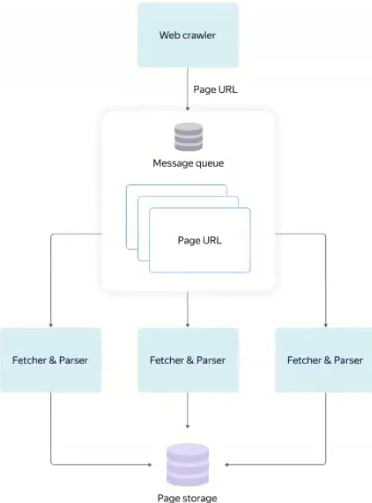

### Микросервисы посложнее

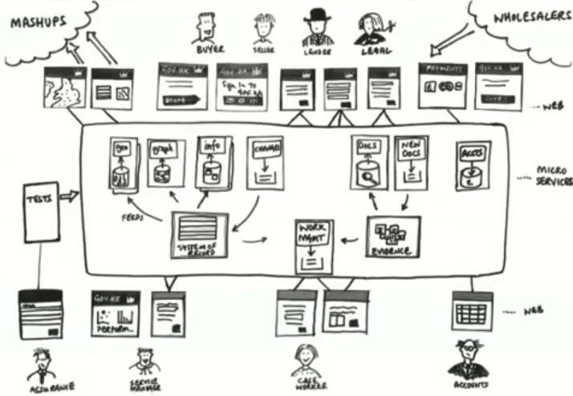

### Синхронные вызовы

- Синхронные вызовы — самый кототкий путь, но обычно **не самый производительный**
- Цепочка синхронных вызовов имеет сильную **зависимость от каждого взаимодейтсвия**
    - -> service #1 -> service #2 -> service #3 -> ... -> service #... ->
- Синхронные вызовы не возвращают системные ресурсы до завершения вызова, что может привести к отказу доступности
- **Решения**
    - Сокращать кол-во синхронных вызовов
    - Асинхронность взаимодействия на рискованных шагах


### Как выбрать тип взаимодействия?

- **Синхронное взаимодействие:**
  - Если нужен максимально быстрый ответ, задержки неприемлемы
  - Асинхронное взаимодействие сильно осложняет и замедляет работу
- **Асинхронное взаимодействие:**
  - Нет жестких требований к реакции ответа, однако следует избегать чрезмерного усложнения архитектуры
  - *Предпочтительно всегда*, когда нет требований по синхронному взаимодействию

## Брокеры сообщений

Брокеры сообщений — архитектурный шаблон посредника асинхронной передачи сообщений, реализующий следующие основные функции:
1. Валидация сообщений
2. Маршрутизация проверенных сообщений
3. Хранение сообщений, если принимающая сторона временно не готова их получить в данный момент

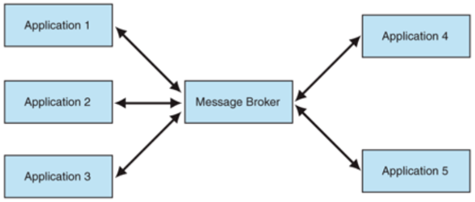

### Варианты реализации

- RabbitMQ
- Apache ActiveMQ
- Apache Kafka
- Yandex Message Queue
- Amazon Web Services (AWS) Simple Queue Service (SQS)
- Redis (pub/sub)
- NATS

### Плюсы

1. Слабое связывание
2. Масштабируемость*
3. Эластичность
4. Буферизация
5. Гарантировання доставка*
6. Гарантированный порядок доставки*
7. Асинхронное взаимодействие
8. Поддержка потоков данных

### Сценарии использования

#### **Point-to-Point**

Передача сообщения **через очередь с известным именем**

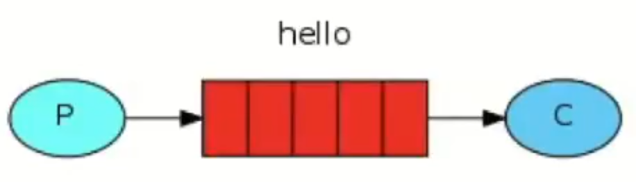

Можно использовать для распределения работы между несколькими потребителями.

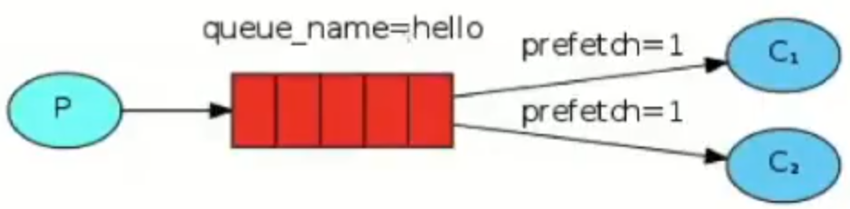

Point-to-Point (P2P) не определяется количеством публикантов (отправителей), а именно моделью доставки сообщений: **одно сообщение — одному получателю**.

Point-to-point (P2P) — это шаблон взаимодействия в системах обмена сообщениями, при котором **сообщение направляется от одного отправителя к одному получателю**.

Он часто используется в асинхронных системах для надёжной доставки сообщений.

✅ Что означает Point-to-Point (P2P)?
- Очередь (queue) — ключевое понятие.
- Несколько отправителей (producers) могут отправлять сообщения в очередь.
- Несколько получателей (consumers) могут быть подписаны на очередь.
- **Каждое сообщение из очереди доставляется только одному потребителю**.

#### **Publish/Subscribe**

Потребители явно выражают интерес к публикуемым данным. Одно сообщение может быть передано нескольким получателям.

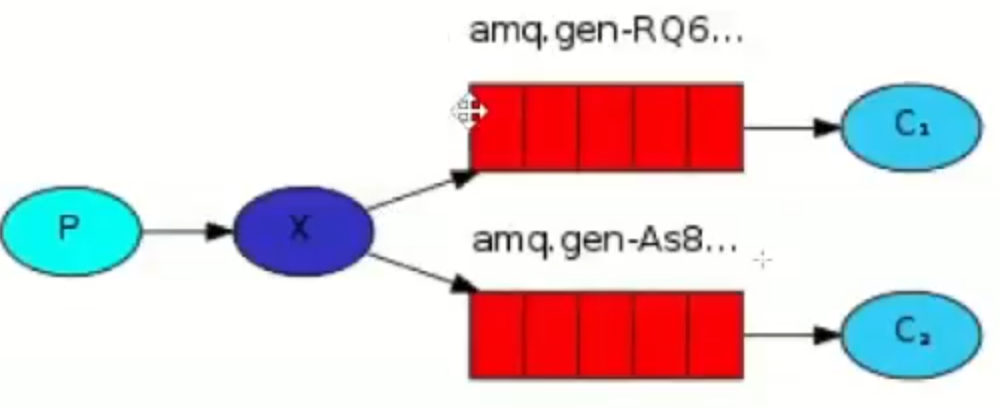

Модель Publish/Subscribe (Pub/Sub) — это шаблон обмена сообщениями, при котором отправитель (publisher) публикует сообщения в тему (topic), а все подписчики (subscribers), подписанные на эту тему, получают каждое сообщение.

| Характеристика            | Значение                                                                                 |
| ------------------------- | ---------------------------------------------------------------------------------------- |
| 💡 Модель                 | Тема (Topic), канал вещания                                                              |
| 📤 Отправитель            | Публикует сообщение в тему                                                               |
| 📥 Получатели             | Все подписанные потребители получают копию сообщения                                     |
| 👥 Подписчиков может быть | Сколько угодно                                                                           |
| 🔄 Динамика               | Подписчики могут подключаться и отключаться в любое время                                |
| 📦 Хранение сообщений     | В большинстве реализаций — нет гарантии хранения (если подписчик не онлайн — не получит) |
| 🔄 Направление            | Один → Многие                                                                            |

Тема — это "имя канала", в который публикуются сообщения, и на который подписчики оформляют подписку.

| Параметр              | Point-to-Point                            | Publish/Subscribe                  |
| --------------------- | ----------------------------------------- | ---------------------------------- |
| Модель                | Очередь (Queue)                           | Тема (Topic)                       |
| Получатели            | Одно сообщение — один получатель          | Одно сообщение — все подписчики    |
| Кол-во отправителей   | Один или много                            | Один или много                     |
| Кол-во получателей    | Один или много (но одно сообщение → один) | Один или много                     |
| Примеры использования | Обработка заказов, платёжные события      | Уведомления, логгирование, события |


#### Routing/Filtering

Потребитель получает сообщения в зависимости от логики/конфигурации брокера.

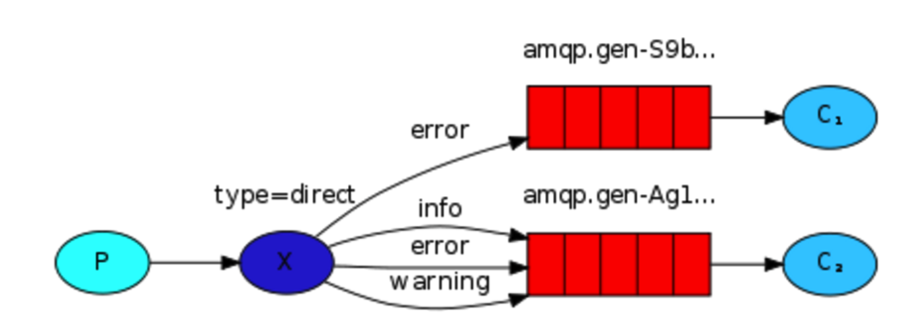

**🚦 Routing (Маршрутизация)**

Routing — это процесс определения, куда отправить сообщение, в зависимости от его ключа маршрутизации, типа или содержимого.

**🧲 Filtering (Фильтрация)**

Filtering — это отбрасывание неподходящих сообщений подписчиком после получения или во время подписки.

#### **Request/Replay**

Приложения обмениваются запросами и ответами через брокер.

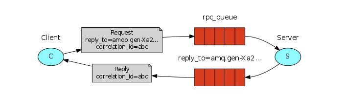

### Семантика доставки

- **at-least-once** (не менее одного раза) — сообщение не может потеряться, но может быть обработано несколько раз
- **at-most-once** (не более одного раза) — сообщение может потеряться, но никогда не будет обработано дважды
- **exactly-once** (ровно один раз) — сообщение не может потеряться и обрабатывается ровно один раз

## Событийно-ориентированная архитектура

**Событийно-ориентированная архитектура (Event-Driven Architecture, EDA)** — это стиль построения программных систем, при котором взаимодействие компонентов происходит через события. В такой архитектуре компоненты не вызывают друг друга напрямую, а реагируют на происходящие события, что обеспечивает гибкость, масштабируемость и слабую связанность системы.

**Основные идеи и принципы:**

- **Событие** — это сообщение о том, что что-то произошло (например, пользователь сделал заказ, товар добавлен в корзину, пришло новое сообщение).
- **Производитель событий (Event Producer)** — компонент, который генерирует события.
- **Потребитель событий (Event Consumer)** — компонент, который подписывается на события и реагирует на них.
- **Шина событий или брокер сообщений** — посредник, который передаёт события от производителей к потребителям.

**Как это работает:**
1. **Производитель создаёт событие** (например, "пользователь оплатил заказ").
2. Событие отправляется в **событийный канал или брокер сообщений**.
3. Один или несколько **потребителей подписаны на это событие** и получают уведомление.
4. Потребители реагируют на событие — обновляют базы данных, запускают бизнес-логику, отправляют уведомления и т.д.

### Паттерны: Event Notification

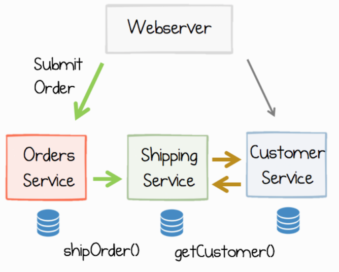

**Event Notification** — это паттерн взаимодействия сервисов, при котором один сервис уведомляет другие о произошедшем событии, не передавая полные данные. Получатели сами запрашивают нужную информацию при необходимости.

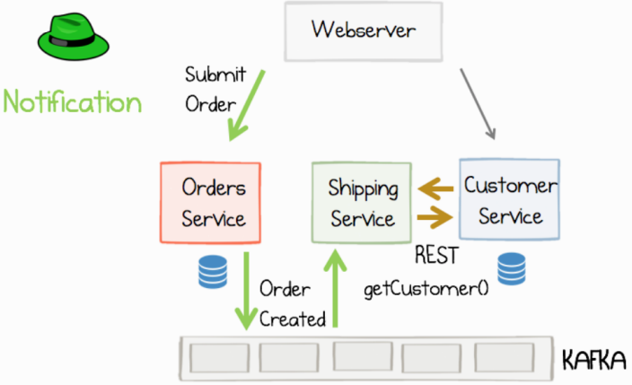

### Паттерны: State Transfer

**State Transfer** — это паттерн взаимодействия сервисов, при котором полное состояние данных передаётся вместе с событием, чтобы избежать дополнительных запросов к другим сервисам.

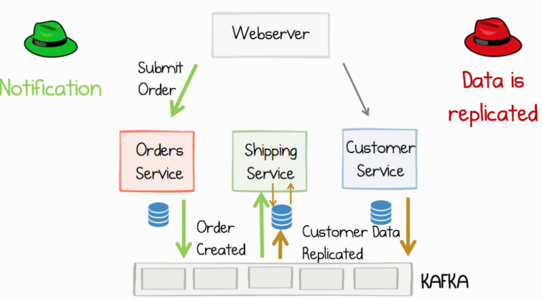

### Паттерны: Event Collaboration

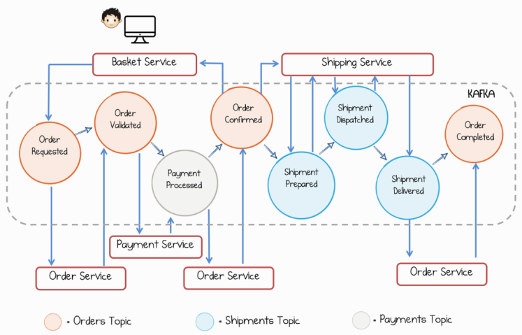

### Паттерны: Event Sourcing


### Паттерны: Команды, События, Запросы

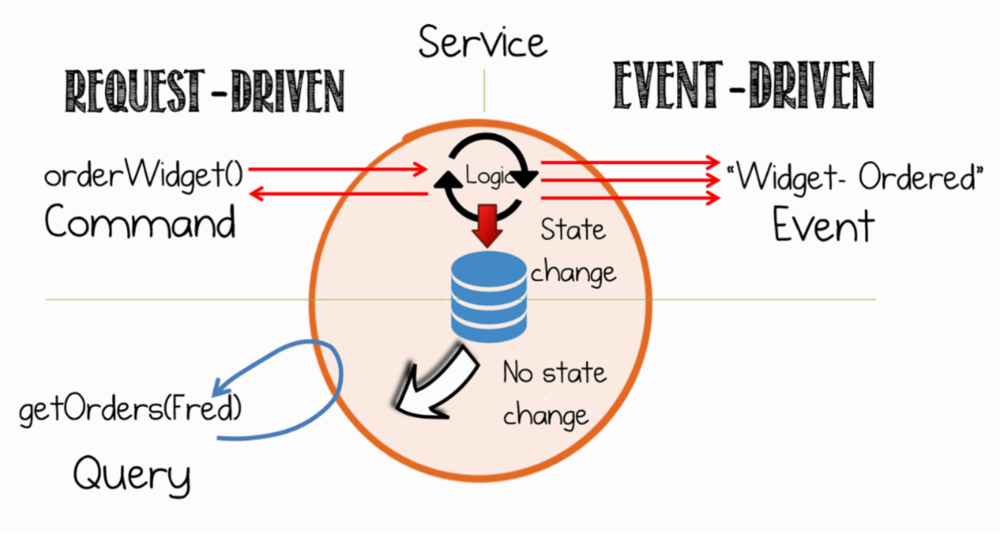

### Паттерны: CQRS

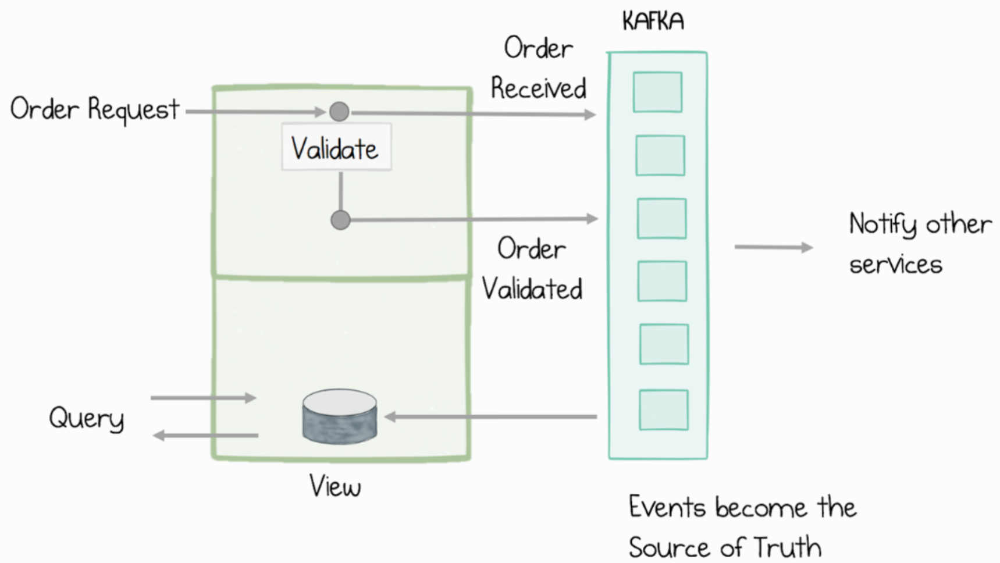

CQRS (Command Query Responsibility Segregation) — это архитектурный паттерн, который **разделяет операции чтения (Queries)** и **записи (Commands)** в системе на разные модели.

**🔹 Основная идея CQRS**
- Команды (Commands) отвечают за изменение состояния системы (запись данных).
- Запросы (Queries) отвечают за получение данных (чтение без изменений).
- Модели для чтения и записи могут быть разными, даже использовать разные БД или структуры.

**🔹 Как работает CQRS?**

Команда (Command)

- Выполняет действия: создание, обновление, удаление.
- Пример: CreateOrderCommand, UpdateUserProfileCommand.
- Может использовать Event Sourcing (сохранение изменений как цепочки событий).

Запрос (Query)

- Только возвращает данные, не изменяя их.
- Пример: GetUserOrdersQuery, FindProductByIdQuery.
- Часто оптимизирован под быстрые чтения (кеширование, денормализованные данные).

Разделение моделей
- Write Model (для команд): строгая валидация, бизнес-логика.
- Read Model (для запросов): оптимизирован под отображение (например, SQL-вид или документная БД).

- [Разработка транзакционных микросервисов с помощью Агрегатов, Event Sourcing и CQRS](https://habr.com/ru/company/nix/blog/322214/)
- [Основы CQRS](https://habr.com/ru/company/simbirsoft/blog/329970/)

## RabbitMQ

**RabbitMQ** — это распределенная система управления очередью сообщений **Advanced Message Queuing Protocol (AMQP)**

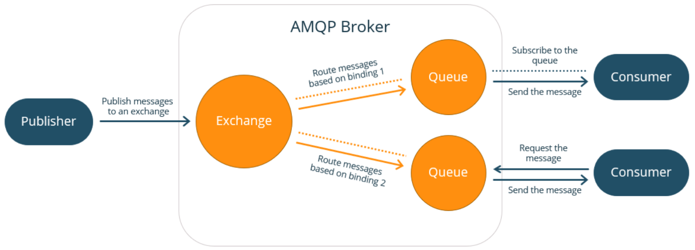

1. **Publisher (Издатель)**
- Роль: Отправляет сообщения в Exchange (точку распределения).
- Действия:
  - Публикует сообщения в Exchange.
  - Exchange определяет, куда направить сообщение, на основе привязок (bindings).
2. Exchange (Точка распределения)
- Типы (не указаны на схеме, но важны):
  - Direct (роутинг по ключу).
  - Fanout (всем подписанным очередям).
  - Topic (по шаблону ключа).
  - Headers (по атрибутам сообщения).

- На схеме:
  - Сообщения направляются в разные очереди на основе Binding 1 и Binding 2

3. Queue (Очередь)
- Роль: Хранит сообщения до их обработки Consumer.
- Действия на схеме:
  - Подписка на очередь (Subscribe to the queue).
  - Отправка/запрос сообщений (Send the message, Request the message).

- Важно:
  - Очередь гарантирует доставку, даже если Consumer временно недоступен.

4. Consumer (Потребитель)
- Роль: Получает и обрабатывает сообщения из очереди.

**Как это работает вместе?**
1. Publisher → Exchange:
  - Отправляет сообщение с `routing_key='order.new'`.
2. Exchange → Queue:
  - Направляет сообщение в очередь, связанную с этим ключом (например, Binding 1).
3. Queue → Consumer:
  - Сообщение хранится в очереди, пока Consumer его не запросит.

**Понятия**
- Сообщение (**message**) — единица передаваемых данных, основная его часть (содержание) никак не
интерпретируется сервером, к сообщению могут быть присоединены структурированные заголовки.
- Точка обмена (**Exchange**) — в неё отправляются сообщения. Точка обмена распределяет сообщения в одну или
несколько очередей. При этом в точке обмена сообщения не хранятся.
- Очередь (**queue**) — здесь хранятся сообщения до тех пор, пока не будут забраны клиентом. Клиент всегда забирает
сообщения из одной или нескольких очередей.
- Связки (**bindings**) - правила для роутинга сообщений

### Роутинг сообщений

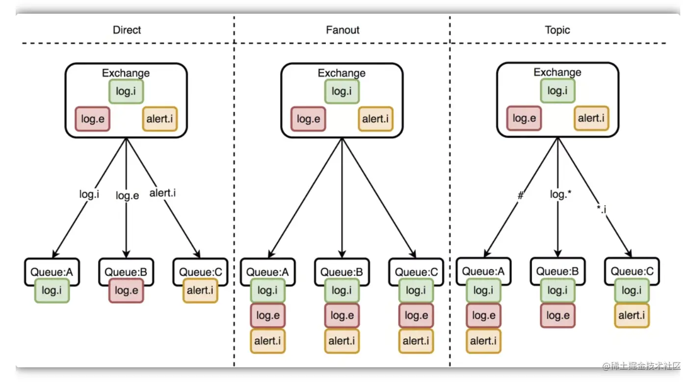


#### **Direct**

**Direct** — доставляет сообщения в очереди по ключам маршрутизации.

Ключи маршрутизации — это дополнительные данные, которые определяют, в какую очередь нужно отправить сообщение.

Обычно точки обмена такого типа используются в балансировке нагрузки round-robin.

Round-Robin (циклический алгоритм) — это метод распределения нагрузки или задач между несколькими обработчиками (например, серверами, worker’ами, очередями) поочередно, в равных долях.

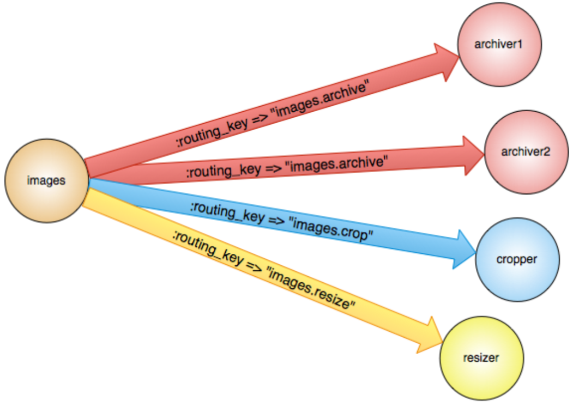

**🔹 Как работает Round-Robin?**
1. Циклический порядок:

- Каждый новый запрос/сообщение отправляется следующему обработчику в списке.
- После последнего — выбор начинается с первого (как в замкнутом круге).

2. Равномерное распределение:

- Все обработчики получают ~одинаковое количество задач.
- Нет приоритетов — все равны.

3. Без учета состояния:

- Алгоритм не учитывает:
  - Загруженность обработчика.
  - Время выполнения предыдущих задач.

#### **Fanout**

**Fanout** — полностью игнорирует ключи маршрутизации и отправляет сообщения во все привязанные очереди.

Точки обмена этого типа используются для распространения сообщений нескольким клиентам (рассылки уведомлений, обновлений, конфигураций и т.п.)

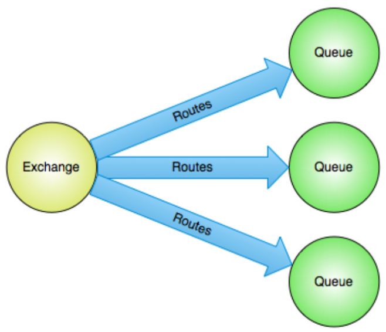

#### **Topic**

**Topic** — используется в шаблонах pub/sub. В этом случае ключ маршрутизации используется вместе с привязкой очередей к точке обмена, например, `app.notification.sms.#` — в очередь будут доставлены все сообщения, отправленные с ключами, начинающимися с `app.notification.sms.`

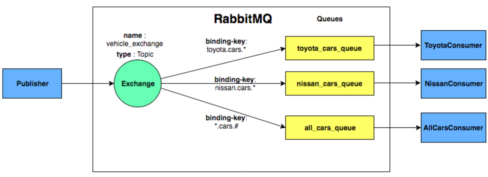

### Dead Letter Exchange

При возникновении ошибок при обработке входящих сообщений осуществляется nack, и сообщение направляется в Dead Letter Queue (DLQ) для последующего анализа и обработки вручную.

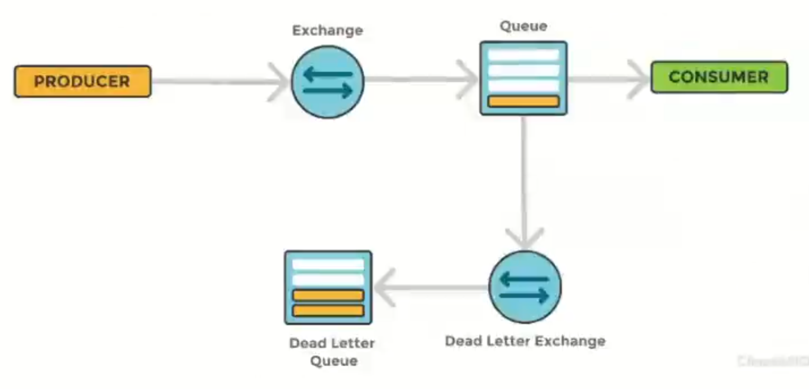

**🔄 Общий процесс обработки сообщений (например, в RabbitMQ, Kafka, SQS и др.):**
1. Сообщение поступает в очередь.
2. Консьюмер получает сообщение:
   - оно может быть автоматически удалено из очереди (например, в SQS — если включён auto-delete),
   - либо **ожидает явного подтверждения (ack)** или **отрицательного подтверждения (nack)**.
3. Попытка обработки:
   - если обработка успешна, вызывается ack — сообщение считается завершённым.
   - если при обработке возникает ошибка, вызывается nack или происходит исключение, и:
     - либо сообщение повторно ставится в очередь,
     - либо (если достигнут лимит повторных попыток или явно настроено) оно уходит в DLQ.

**📌 Значит, на каком этапе происходит nack и перемещение в DLQ:**

На этапе обработки сообщения консьюмером, если возникает ошибка и не удаётся корректно завершить обработку (например, из-за исключения, таймаута или ошибки бизнес-логики). После этого консьюмер отправляет nack, и брокер (или middleware) решает, отправлять ли сообщение в DLQ, согласно настройкам.

### Live

```sh
$ docker run -d --name rb -p 15672:15672 -p 5672:5672 rabbitmq:3-management
```
http://localhost:15672/ guest:guest

### Итоги

**Плюсы**

- Классическая очередь сообщений
- Можно работать быстрее, без сохранения на диск
- Проще обеспечивать строгую последовательность сообщений
- Удобно реализовать механизм DLQ
- Поддерживаются подходы к репликации данных

**Минусы**

- В режиме pub/sub идет избытичное хранение данных
- Сложнее обеспечивать гарантии доставки в сложных случаях
- Меньше гибкости в нагруженной обработке данных

## Apache Kafka

**Apache Kafka** — это система, реализующая распределенный реплицируемый лог сообщений

- **Распределенный** — лог(топик) не целиком хранится на однйо машине, а разбит на несколько (партиций), которые лежат на разных машинах.
- **Реплицируемый** — логи хранятся в нескольких копиях, на случай отказов оборудования
- **Лог** — (топик) это упорядоченная последовательность сообщений

### Topic

- Топик — это некоторый аналог таблички в БД
  - Топик — это обычно набор событий одного типа (customerCreated, notificatiomSent и т.д.)
  - Если вам нужно получить гарантии порядка, относящиеся к одному бизнес процессу, то в топик можно записывать сообщения (события) разных типов: customerCreated, customerInvoicePaid и т.д.
- Слишком большое количество (больше 1000) топиков (и партиций) в одном брокере приводит к снижению производительности. Поэтому сильно дробить на топики не стоит.
- Топик — это набор неструктурированных сообщений (без схемы)
- Для кафки сообщение — это просто набор байт. Поверх которых можно использовать разные протоколы JSON, Avro, Protobuf и т.д.
- Чтобы появилась схема, используют внешние инструменты типа SchemaRegistry и StreamProcessing KTable, KStream

### Очереди

Kafka нре имеет понятия очереди
- Отправитель добавляет сообщение в распределенный лог сообщений
- Получатель (подписчик) читает из этого лога непрочитанные с прошлого раза записи

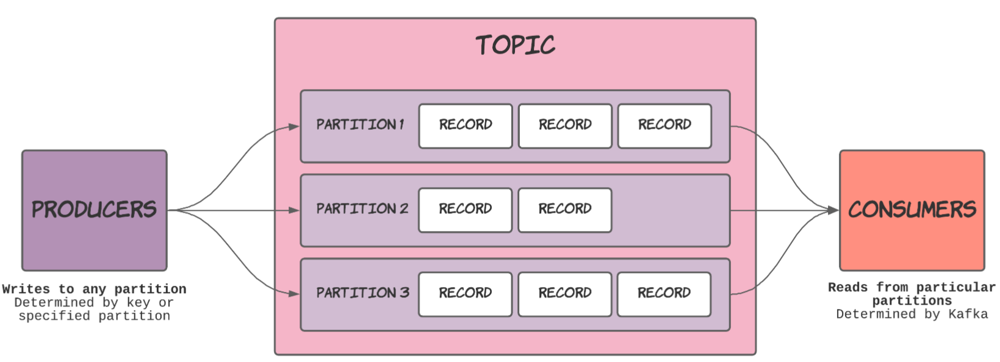


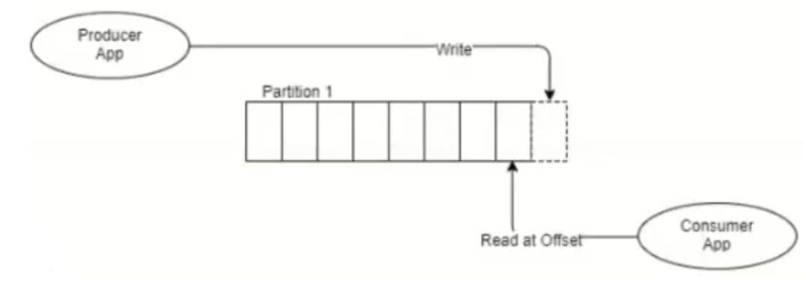


### Offset

Каждый получатель (consumer) хранит у себя offset указатель на сообщение, которое он прочитал последним.


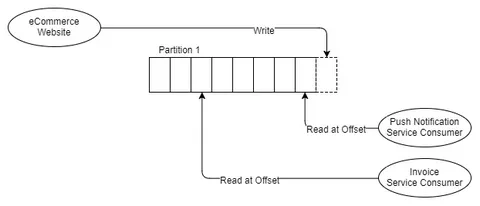


### Partition

Топик разделен на несколько партиций


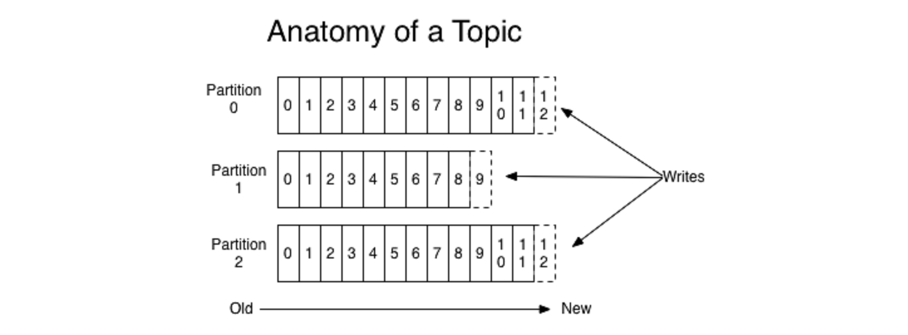


У сообщения в **Apache Kafka** может быть ключ **key**. Если есть ключ, то тогда партиционирование происходит таким образом, чтобы сообщения с одним ключом попадали в одну партицию.


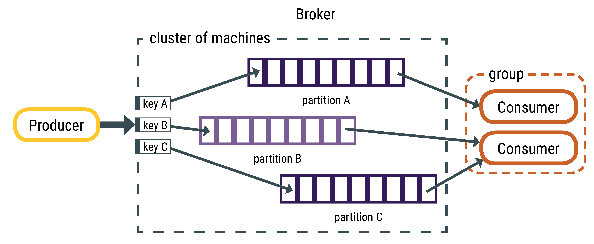


### Consumer groups

У каждой партици должен быть только один конкурирующий consumer. Один consumer может читать из нескольких партиций.

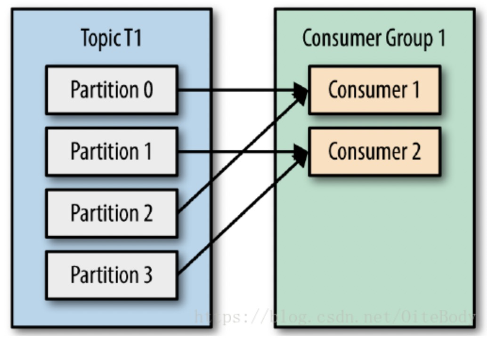

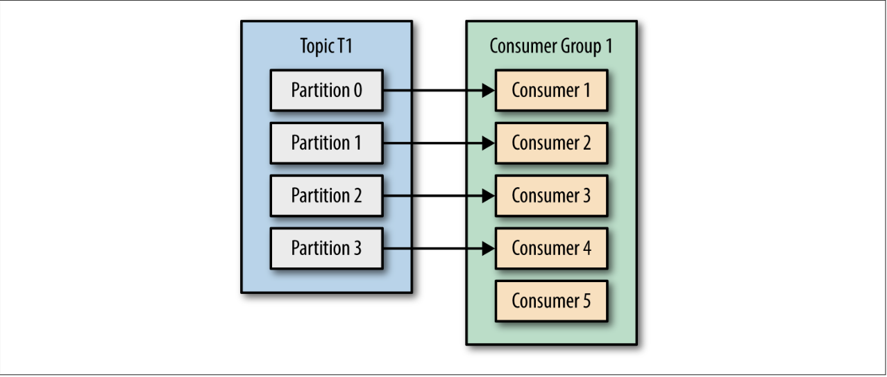

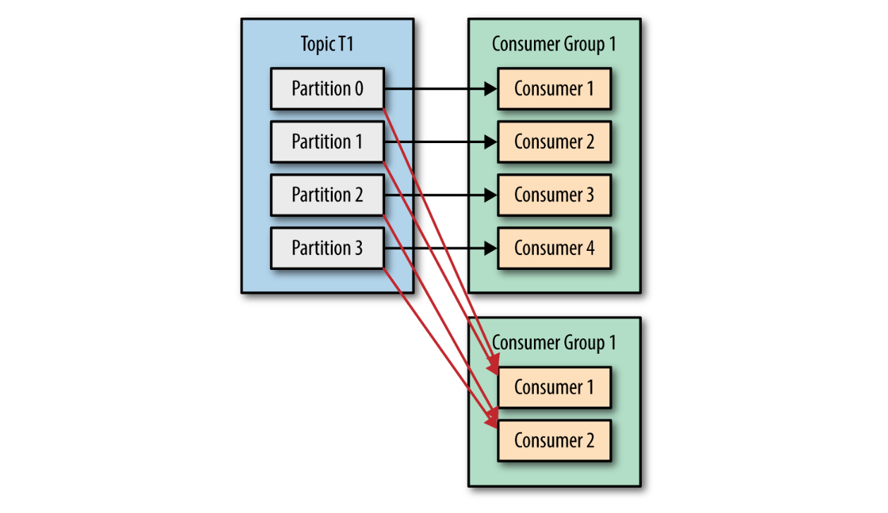


### Commit offsets

**offsets** — метка, сообщения, которое consumer прочитал

Для того, чтобы понимать какие сообщения consumer обработал используются commit offsets (последняя обработнная запись)

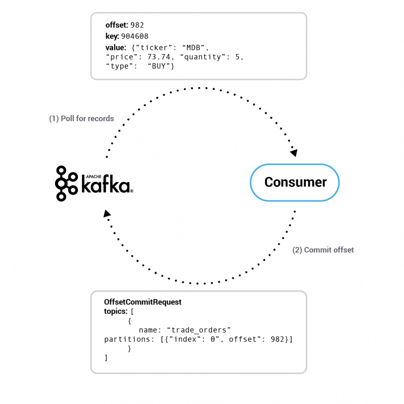


### Перебалансировка

Изменение кол-ва consumer (добавление, удаление, падение и т.п.) приводит к состоянию перебалансировки. В это время consumers не читают данные. Желательно такие ситуации минимизировать.

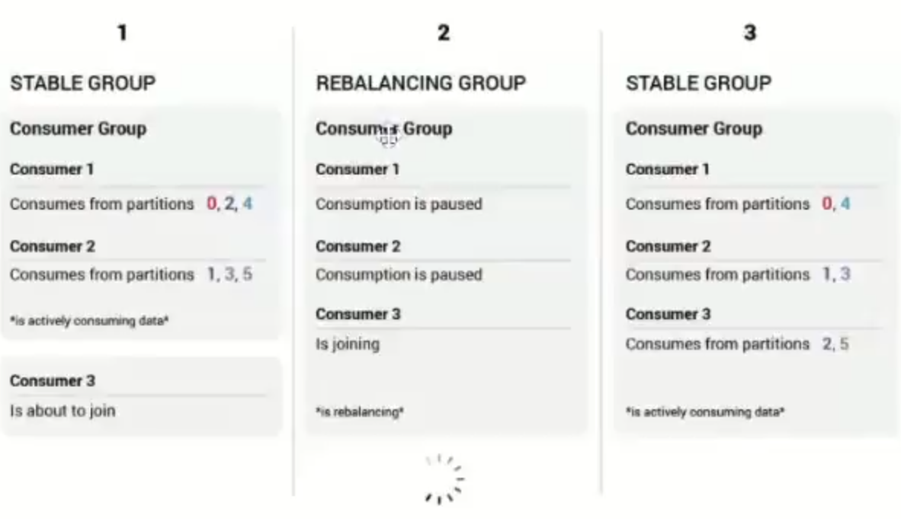


### Репликация

В Apache Kafka поддерживается репликация партиций:
- Фактор репликации 1, если вы согласны с тем, что в случае падения брокера данные можно потерять
- Фактор репликации 2, на случай падения одного брокера вы ничего не потеряете и даже продолжите обслуживание

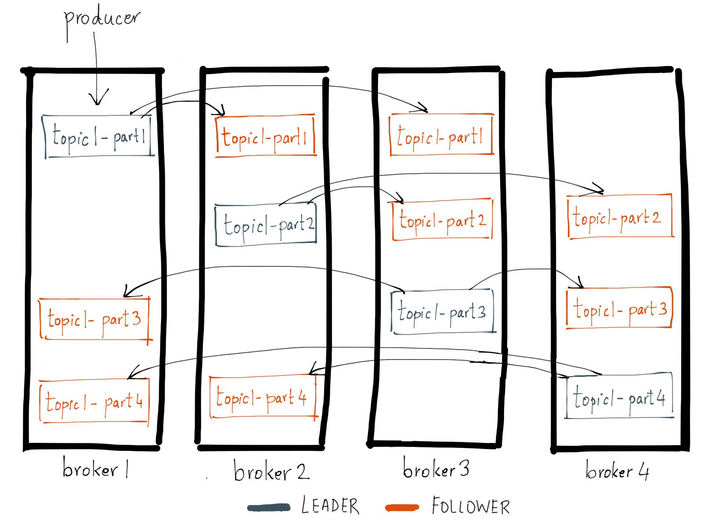


### Гарантии в Apache Kafka

- Если producer отправил сообщение B после сообщения A в тот же самый топик, в той же самой партиции, то offset B будет больше A
- Есди producer отправил сообщение и все in sync replica подтвердили, что они сохранили у себя, то тогда сообщение можно считать закоммиченным
- Закоммиченные сообщения не будут потеряны, пока хотя бы одна реплика жива
- Consumers могут читать только закоммиченные сообщения

При отправке сообщения producer может его отправить с параметром acks:
- acks=0 означает, что если произошла отправка по сети, то отправка считается успешной (например, сообщение может быт потеряно во время передачи)
- acks=1 означает, что отправка считается успешной, если лидер записал это сообщение на диск
- acks=all означает, что отправка считается успешной, если лидер и все in sync replica подтвердили приемку сообщения

### Live

[Симуляция работы Kafka](https://softwaremill.com/kafka-visualisation/)

### Итоги

Плюсы

- эффективная пакетная обработка, высокая пропускная способность
- высокая надежность работы с сообщениями в условиях вероятных отказов сети и приложений
- гибкая горизонтальная масшиабируемость
- оптимальные решения pub/sub

Минусы

- строгая последовательность только в рамках партиции
- DLQ режим нужно реализовать самим на прикладном уровне
- не самое реактивное решение
- нельзя работать только в оперативной памяти (но можно настроить хранение данных на RAM дисках)

### Kafka: что почитать

- Designing Event Driven Systems
http://www.benstopford.com/2018/04/27/book-designing-event-driven-systems/
- Kafka: The Definitive Guide
https://www.confluent.io/wp-content/uploads/confluent-kafka-definitive-guide-complete.pdf

RabbitMQ vs Kafka
- https://jack-vanlightly.com/blog/2017/12/4/rabbitmq-vs-kafka-part-1-messaging-topologies
- https://content.pivotal.io/blog/understanding-when-to-use-rabbitmq-or-apache-kafka


## Выбор решения между RabbitMQ и Kafka

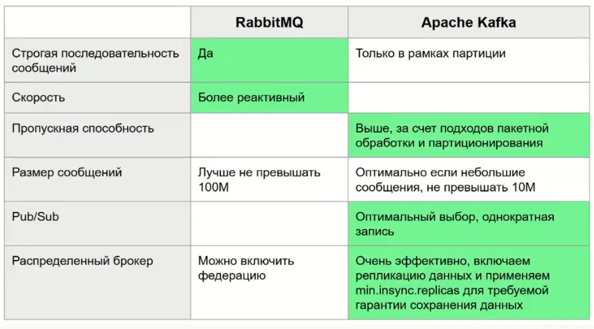

## Почитать

- RabbitMQ против Kafka: два разных подхода к обмену сообщениями
https://habr.com/ru/company/itsumma/blog/416629/
- Understanding When to use RabbitMQ or Apache Kafka
https://content.pivotal.io/blog/understanding-when-to-use-rabbitmq-or-apache-kafka
- Apache Kafka: обзор
http://habr.com/ru/company/piter/blog/352978/
- Kafka и микросервисы: обзор
https://habr.com/ru/company/avito/blog/465315/
- Apache Kafka и миллионы сообщений в секунду
https://habr.com/ru/company/tinkoff/blog/342892/
- Apache Kafka и RabbitMQ: семантика и гарантия доставки сообщений
https://habr.com/ru/company/itsumma/blog/437446/