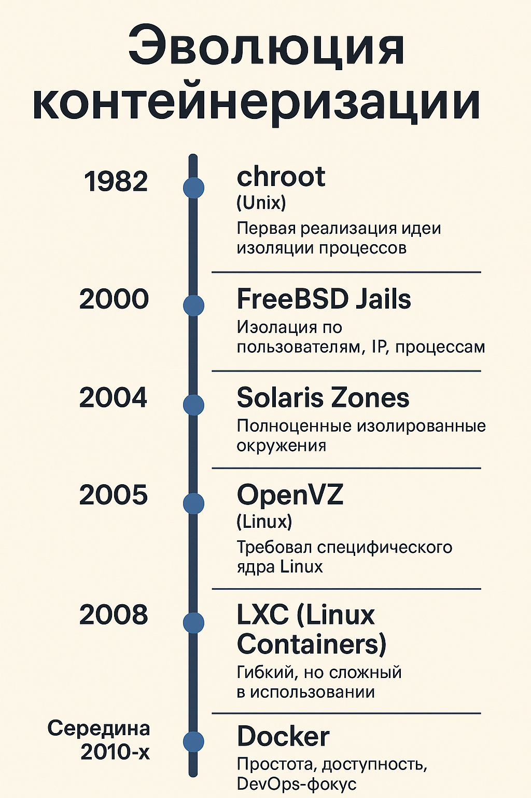
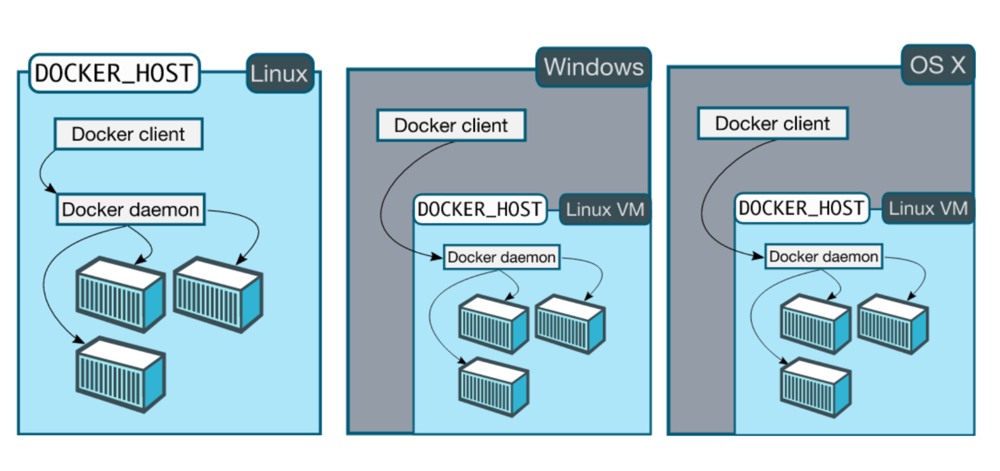
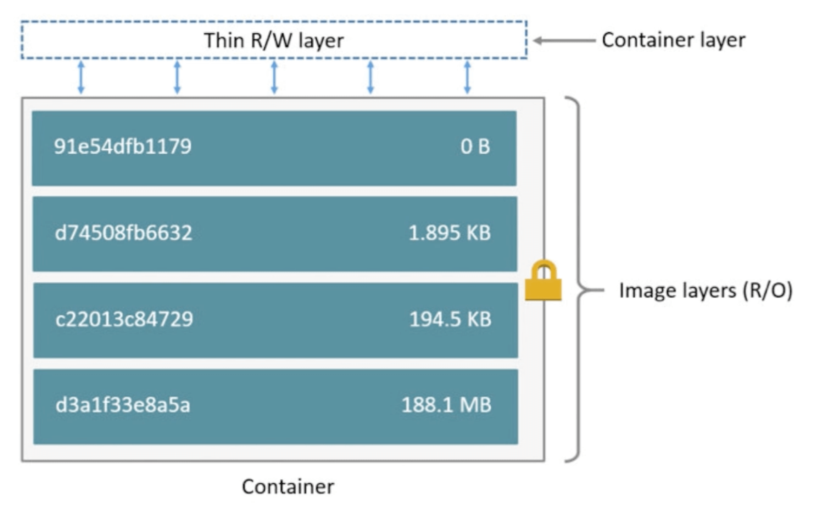
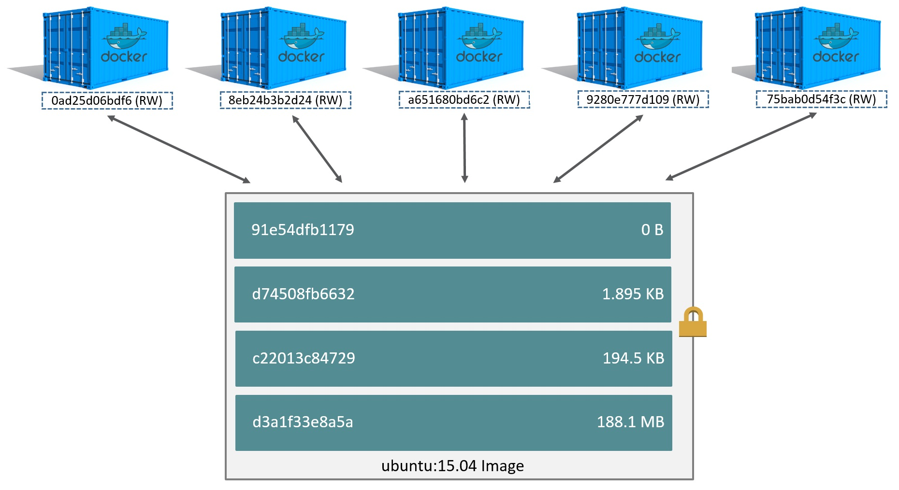
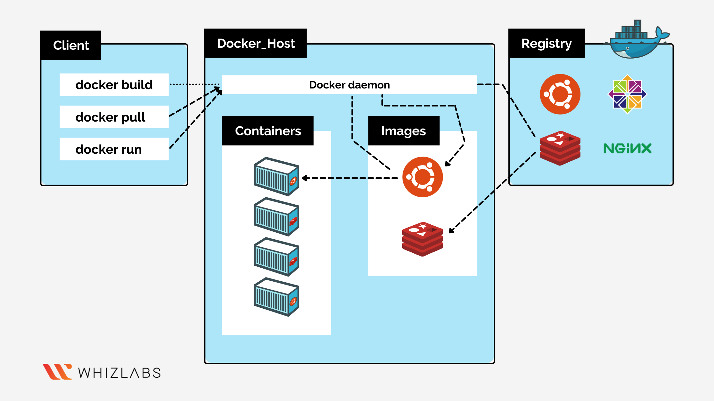
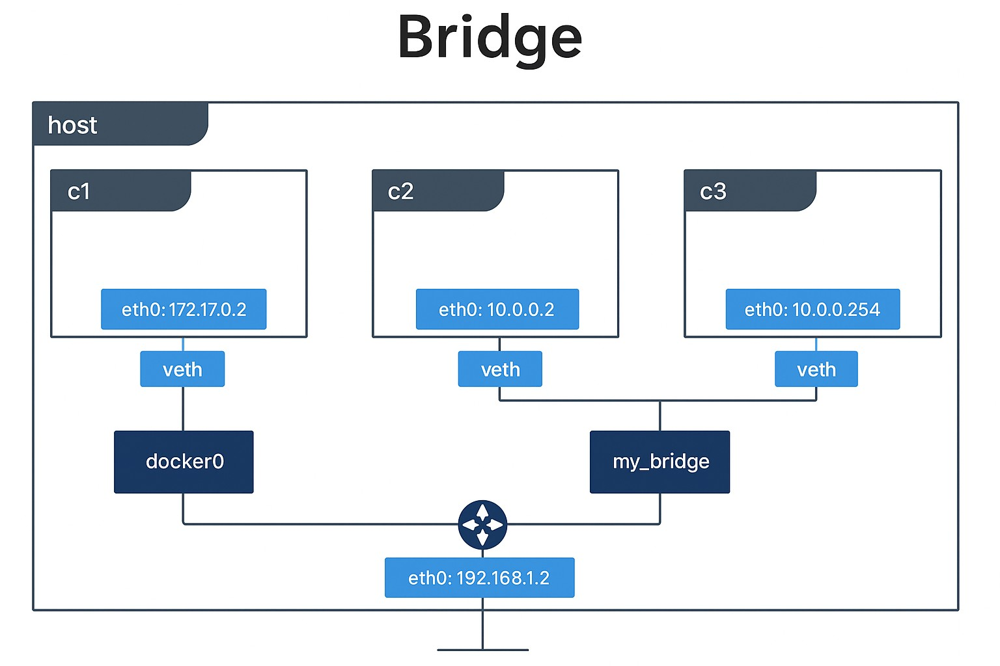

# Docker

## Маршрут вебинара
- История
- Основные компоненты
- Эко-система
- Много магии
- Много демо

## История

**Контейнеризация как идея — «существовало давно»**

Контейнеризация существовала задолго до Docker:
- `chroot` в UNIX (ещё в 1982 году);
- Solaris Zones;
- FreeBSD Jails;
- LXC (Linux Containers);
- OpenVZ и др.

Почему **не было широкого распространения**

- **Сложность использования**:
  
  Настроить LXC или Jails было непросто — требовались глубокие знания системы и ручная конфигурация.
- **Отсутствие унифицированных инструментов**:
  
  Не было понятной экосистемы — ни простого способа описывать окружение (как Dockerfile), ни реестров, ни единого CLI.
- **Меньший интерес DevOps и сообщества**:
  
  До Docker'а не было спроса на повсеместную автоматизацию и микросервисные архитектуры в том объёме, в котором это началось после 2013 года.

**Часто заменялась аппаратной виртуализацией**

- В 2000-х **аппаратная виртуализация (VMWare, VirtualBox, KVM)** стала основным инструментом для изоляции и масштабирования.

- Причины:
  - Легче понять: у тебя есть «полноценная машина».
  - Больше зрелости и доверия к гипервизорам.
  - Меньше рисков с точки зрения безопасности и изоляции.

**Почему всё изменилось с приходом Docker (в 2013 году)**

Docker **сделал контейнеризацию массовой** благодаря:
- простой упаковке приложений (Dockerfile);
- удобной CLI;
- репозиториям образов (Docker Hub);
- стандартизации (Open Container Initiative);
- интеграции с CI/CD, Kubernetes и DevOps-практиками.


### Краткая **историческая справка о развитии контейнеризации** — от истоков до современного Docker/Kubernetes-мира.




**🕰️ Эволюция контейнеризации**

1982 — `chroot` (Unix)

- Первая реализация идеи изоляции процессов.
- Команда `chroot` меняет корневую директорию для процесса, ограничивая доступ к остальной файловой системе.
- Не изолирует сеть, PID, память — лишь начальный шаг.

**2000 — FreeBSD Jails**
- Расширяет `chroot`: добавляет изоляцию по пользователям, IP, процессам.
- Первая зрелая реализация настоящих "контейнеров".

**2004 — Solaris Zones**
- Полноценные изолированные окружения внутри одного хоста.
- Продвинутый контроль ресурсов.
- Очень стабильная и безопасная технология, но ограниченная Solaris.

**2005 — OpenVZ (Linux)**
- Контейнеры на базе Linux.
- Использует одно ядро (в отличие от VM).
- Изоляция процессов, ресурсов, сетей.
- Требовал специфического ядра Linux — ограниченная совместимость.

**2008 — LXC (Linux Containers)**
- Первая "основная" технология контейнеров на Linux.
- Использует ядро Linux, namespaces и cgroups.
- Гибкий, но сложный в использовании: вручную писать конфиги, управлять сетью и безопасностью.

**🔥 Революция: Docker**

**2013 — Docker**
- Создан как удобная обёртка над LXC.
- Главное отличие — **фокус на разработчиках и DevOps**:
  - `Dockerfile` — декларативное описание образа;
  - `docker build/run/push` — простейшие CLI-команды;
  - Docker Hub — централизованный репозиторий;
  - Layered filesystem — экономия места и кэширование;
  - API и SDK для автоматизации.

**🌐 Стандарты и оркестрация**

**2015 — Open Container Initiative (OCI)**
- Стандартизация форматов образов и запуска контейнеров.
- Разделение: `runc` (исполнитель), `containerd` (демон управления).

**2014–2018 — Kubernetes**
- Оркестратор, созданный Google (вдохновлён Borg).
- Управляет контейнерами, их масштабированием, отказоустойчивостью, сетями, секретами и т.п.
- **Контейнеризация + оркестрация = основа cloud-native архитектуры**.

| Этап      | Ключевые технологии | Что изменилось                      |
| --------- | ------------------- | ----------------------------------- |
| 1982–2000 | chroot, Jails       | Первичные идеи изоляции             |
| 2000–2010 | Zones, OpenVZ, LXC  | Настоящие контейнеры, но сложные    |
| 2013      | **Docker**          | Простота, доступность, DevOps-фокус |
| 2015+     | **Kubernetes, OCI** | Масштабируемость и стандарты        |


## Docker предоставляет целый набор возможностей

- **✅ Абстракция от host-системы**
  
  Docker-контейнеры изолированы от хостовой ОС. Они включают всё необходимое для запуска приложения (библиотеки, зависимости, интерпретаторы), позволяя не зависеть от конфигурации хостовой системы.

- **✅ Легковесные изолированные окружения**
  
  Контейнеры запускаются в одном ядре с хост-системой, но при этом изолированы с помощью namespaces и cgroups. Это делает их легче и быстрее, чем виртуальные машины, и позволяет запускать множество контейнеров параллельно.

- **✅ Общие слои файловой системы**
  
  Docker использует copy-on-write файловую систему (например, OverlayFS). Разные контейнеры могут использовать общие базовые образы, экономя место и ускоряя сборку.

- **✅ Компоновка и предсказуемость**
  
  С помощью Dockerfile и docker-compose можно описывать всё окружение приложения как код. Это делает окружение предсказуемым и легко воспроизводимым на разных машинах.

- **✅ Простое управление зависимостями**
  
  Всё, что нужно приложению, упаковывается в контейнер. Не нужно устанавливать зависимости на каждый сервер вручную — всё уже внутри образа.

- **✅ Дистрибуцию и тиражируемость**
  
  Образ (images) можно отправить в реестр (например, Docker Hub, GitLab Registry, Harbor) и запустить на любой машине, где установлен Docker. Это упрощает CI/CD и масштабирование.

- **✅ Стандартизация описания окружения, сборки**
  
  Dockerfile, .dockerignore, docker-compose.yml дают единый стандарт описания: как собрать, как запустить, какие порты открыть и т.д.

- **✅ 100% консистентная среда приложения**
  
  Приложение в контейнере будет работать одинаково на всех этапах: разработка → тестирование → прод. Это исключает проблему "на моей машине работает".

- **✅ Воспроизводимость**
  
  Один и тот же Dockerfile всегда даст один и тот же образ (при фиксированных версиях). Это позволяет точно воспроизвести окружение спустя месяцы или даже годы.

## **Docker — это не виртуальная машина!**

Что такое Docker на самом деле?

**Docker — это платформа контейнеризации**. Она позволяет **упаковывать приложение и всё его окружение** (библиотеки, зависимости, конфигурации) в единый контейнер, который можно запускать в любом месте, где есть Docker.

**Чем отличается контейнер от виртуальной машины?**

| Особенность                 | Виртуальная машина (VM)                         | Docker (контейнер)                               |
| --------------------------- | ----------------------------------------------- | ------------------------------------------------ |
| **Изоляция**                | Полная, включая отдельную ОС                    | Лёгкая, изолирует процессы на уровне ядра        |
| **Наличие ОС внутри**       | Да, полная гостевая ОС                          | Нет, использует ядро хост-системы                |
| **Занимаемое место**        | Гигабайты (ОС + приложение)                     | Сотни мегабайт (только приложение и зависимости) |
| **Скорость запуска**        | Секунды или минуты                              | Почти мгновенно                                  |
| **Производительность**      | Ниже из-за гипервизора                          | Почти нативная, ближе к bare metal               |
| **Используемая технология** | Гипервизор (VirtualBox, VMware, Hyper-V и т.д.) | Контейнеризация (namespaces, cgroups в Linux)    |

**Простыми словами:**

- Виртуальная машина — это **тяжёлый ящик с собственной ОС**.
- Docker-контейнер — это **лёгкая капсула**, которая использует **ядро хост-системы**, но содержит всё остальное (библиотеки, код, зависимости), чтобы приложение было изолированным.

**Что делает Docker особенным?**

- Позволяет **одинаково запускать приложение в любой среде**.
- Упрощает **деплой и тестирование**.
- **Экономит ресурсы по сравнению с VM**.
- Идеально подходит для **микросервисной архитектуры**.

## Сow

| Компонент Docker              | Метафора                             | Пояснение                                                               |
| ----------------------------- | ------------------------------------ | ----------------------------------------------------------------------- |
| **Ядро ОС хоста**             | 🌾 Поле                              | Общее «пастбище» — одна среда, в которой все коровы пасутся.            |
| **Контейнер**                 | 🐄 Корова                            | Каждая корова — это отдельный контейнер. Она пасётся в пределах своего загона (namespace), жует траву (выполняет свой процесс), не подозревая о существовании других коров. Все коровы используют одну и ту же траву (одно и то же ядро ОС), но не мешают друг другу.         |
| **Образ (image)**             | 🧬 ДНК породы коровы                 | Шаблон, из которого создаются коровы: Ubuntu, Nginx, PostgreSQL и т.д.  |
| **Namespaces**                | 🧱 Забор                             | Обеспечивает изоляцию: каждая корова не видит других и их мир.          |
| **Cgroups**                   | 🐮 Ограничитель еды и воды           | Контроль над ресурсами: CPU, RAM и т.д. для каждой коровы.              |
| **Docker Daemon (`dockerd`)** | 👨‍🌾 Пастух                         | Он управляет коровами: запускает, останавливает, следит за здоровьем.   |
| **Docker CLI (`docker`)**     | 📣 Голос хозяина через рацию         | Это ты, владелец пастбища, даёшь команды пастуху: `docker run`, `stop`. |
| **Docker API**                | 📡 Радиоканал между тобой и пастухом | Интерфейс передачи команд (в виде HTTP-запросов).                       |


## Разные ОС

`DOCKER_HOST` — это переменная окружения, которая указывает, где находится **Docker-демон (Docker daemon)**, с которым должен работать клиент Docker (например, docker, docker-compose, или ваш код через Docker SDK).

**Где может использоваться DOCKER_HOST:**

- В CLI (docker, docker-compose)
- В скриптах и CI/CD пайплайнах
- В переменных окружения внутри терминала или .env файлов



Docker действительно работает по-разному в зависимости от операционной системы, потому что архитектура и системные возможности ОС различаются. Ниже — сравнение поведения Docker на Linux, macOS и Windows.

### 🐧 Docker на Linux

**✅ Прямая установка**

- Docker работает **нативно**, потому что использует ядро Linux и его возможности: cgroups, namespaces, iptables и пр.
- Docker Daemon (`dockerd`) запускается как системный сервис.

- Ключевой сокет:

```arduino
/var/run/docker.sock
```
- Тип подключения по умолчанию:

```perl
unix:///var/run/docker.sock
```

**Установка:**

```bash
sudo apt install docker.io
# или
curl -fsSL https://get.docker.com | sh
```

### 🍏 Docker на macOS

**🔧 Использует виртуализацию**
 
- Docker не может работать нативно, потому что **в macOS нет ядра Linux**.
- Вместо этого используется встроенная виртуальная машина (LinuxKit) внутри Docker Desktop.
- Docker CLI взаимодействует с `dockerd` внутри этой ВМ.

**Сокет работает через прокси:**

```perl
unix:///var/run/docker.sock (проксируется в ВМ)
```

Пример `DOCKER_HOST`:

```bash
unix:///Users/yourname/.docker/run/docker.sock
```

**Установка:**

Устанавливается через **Docker Desktop**

### 🪟 Docker на Windows

**Два режима:**
1. **Windows контейнеры** (редко используются, только если нужна Windows-среда)
2. **Linux контейнеры** (чаще всего)

**⚙ Linux-контейнеры на Windows**

- Используется **WSL2 (Windows Subsystem for Linux)** или встроенная ВМ.
- Docker CLI подключается к демону внутри WSL2 или LinuxKit.

**Сокет или Named Pipe:**

```perl
npipe:////./pipe/docker_engine
```

`DOCKER_HOST`:

```bash
npipe:////./pipe/docker_engine
```

**⚙ Windows-контейнеры**
Запускаются нативно, но только если переключить режим в Docker Desktop.

**🧭 Сравнительная таблица**

| ОС      | Docker Daemon     | Как работает                    | Протокол (DOCKER\_HOST)                     |
| ------- | ----------------- | ------------------------------- | ------------------------------------------- |
| Linux   | Нативно (systemd) | Прямой доступ к ядру            | `unix:///var/run/docker.sock`               |
| macOS   | Через LinuxKit ВМ | Docker Desktop с виртуализацией | `unix:///Users/.../.docker/run/docker.sock` |
| Windows | Через WSL2 или ВМ | Docker Desktop                  | `npipe:////./pipe/docker_engine`            |


## Основные компоненты

- Namespaces
- Cgroups
- UnionFS
- RunC

### Docker namespaces

**Namespaces** — это один из ключевых механизмов изоляции в Linux, который позволяет создавать отдельные пространства имён для процессов. Docker активно использует namespaces, чтобы изолировать контейнеры друг от друга и от хоста.

**Основные аспекты:**

- **Изоляция окружения**
    Каждый контейнер работает в своём отдельном пространстве имён. Это значит, что процессы, сеть, монтирование файловых систем и другие ресурсы контейнера не пересекаются с другими контейнерами или хостом.

- **Отдельный namespace для каждого контейнера**
    Для каждого контейнера создаются индивидуальные namespaces, которые полностью изолируют контейнер от других.

- **Виды namespace, которые используются Docker:**

    - **pid namespace** — изолирует процессы. В контейнере PID 1 — первый процесс внутри namespace. Он не видит процессы из других контейнеров или хоста.
    - **net namespace** — изолирует сетевые интерфейсы и стеки TCP/IP. Каждый контейнер имеет свои виртуальные сетевые интерфейсы.
    - **mount namespace** — изолирует точки монтирования файловой системы. Каждый контейнер может видеть свою файловую систему.
    - **uts namespace** — изолирует имя хоста и домен. Позволяет контейнеру иметь собственное имя хоста.
    - **ipc namespace** — изолирует межпроцессное взаимодействие (например, системные очереди сообщений).
    - **user namespace** — изолирует пользователей и группы, что позволяет переопределять UID/GID внутри контейнера.

- **Namespace прекращает существование после завершения PID 1**
    В каждом namespace есть процесс с PID 1 — главный процесс внутри контейнера. Когда он завершает работу, namespace уничтожается вместе со всеми процессами внутри него. Это означает, что жизненный цикл namespace строго привязан к жизненному циклу главного процесса контейнера.

### Docker cgroups

**Что такое cgroups?**

- **Control groups (cgroups)** — это механизм ядра Linux для управления и ограничения ресурсов, которые процессы (и контейнеры) могут использовать.
- Позволяет контролировать использование CPU, памяти, дискового ввода-вывода и других ресурсов.

**Основные функции cgroups в Docker**

- **Управление ресурсами**: CPU, память, диск (IO), сеть и т.д.
- **Ограничение ресурсов**: можно задать лимиты, чтобы контейнер не потреблял больше ресурсов, чем разрешено.
- **Изоляция**: контейнеры не влияют друг на друга, если заданы ограничения.
- **Приоритеты и квоты**: можно настроить распределение ресурсов между контейнерами (например, CPU shares).

**Кратко: основные общие ресурсы**

| Ресурс           | Особенности общего использования                                |
| ---------------- | --------------------------------------------------------------- |
| CPU              | Распределяется между контейнерами через cgroups                 |
| Память           | Общая память, ограничивается лимитами cgroups                   |
| Диск (I/O)       | Общий доступ к дискам, лимитируется для предотвращения тормозов |
| Сеть             | Используется общее физическое сетевое оборудование              |
| Файловая система | Общие тома и образы, доступные из нескольких контейнеров        |
| Процессы         | Ограничивается количеством в контейнере                         |
| IPC              | Могут быть общими, если не изолированы namespaces               |

### Docker unionFS





**Что такое UnionFS?**

- **UnionFS** — это файловая система, которая объединяет несколько файловых систем или слоёв в один виртуальный слой.

- Позволяет Docker создавать образы и контейнеры как набор слоёв (read-only слои образа + writable слой контейнера).

**Как это работает в Docker?**

- Docker-образ состоит из нескольких слоёв (layers), каждый — как слой UnionFS.
- Слои монтируются друг поверх друга, создавая единое файловое пространство:
    - Нижние слои — **только для чтения** (read-only) — базовые образы, зависимости, библиотеки.
    - Верхний слой — **записываемый** (read-write) — изменения контейнера (создание, изменение файлов).
- При изменении файлов Docker не меняет нижние слои, а записывает изменения только в верхний (writable) слой.


#### Как Docker кеширует слои и работает с хэшами

- **Docker-образ состоит из слоёв (layers)** — каждый слой содержит изменения в файловой системе.

- **Хэш слоя** — это уникальный идентификатор, вычисляемый по содержимому слоя после его создания.

- **Docker не вычисляет хэш слоя заранее**, потому что для этого нужно выполнить команду и получить содержимое слоя.

- Вместо этого Docker использует **cache key** — хэш, основанный на:

    - Тексте инструкции Dockerfile (например, RUN, COPY)
    - Входных данных команды (например, содержимое файлов для COPY)
    - Хэшах предыдущих слоёв (цепочка зависимостей)

- **Перед выполнением команды Docker сравнивает `cache key` с уже существующими** — если совпадает, команда не выполняется заново, и используется готовый слой из кеша.

- Если cache key не совпадает, команда выполняется, создаётся новый слой, по которому затем вычисляется настоящий хэш, и он сохраняется для будущих кеш-проверок.

- Это позволяет:
    - **Экономить время** — не выполнять повторно неизменные шаги
    - **Экономить место** — переиспользовать слои между образами и контейнерами
    - **Обеспечивать надёжность** — одинаковая команда с одинаковыми входными данными даёт одинаковый слой

### Live

В чем проблема этого docker-файла?

```docker
FROM alpine:3.12
RUN apk update && apk upgrade
RUN wget https://releases.hashicorp.com/terraform/0.12.28/terraform_0.12.28_linux_amd64.zip 
RUN unzip terraform_0.12.28_linux_amd64.zip 
RUN rm terraform_0.12.28_linux_amd64.zip 
RUN mv terraform /usr/local/bin/
RUN wget https://github.com/terraform-linters/tflint/releases/download/v0.16.2/tflint_linux_amd64.zip 
RUN unzip tflint_linux_amd64.zip 
RUN rm tflint_linux_amd64.zip
RUN mv tflint /usr/local/bin/
RUN apk add curl
CMD ["/bin/sh"]
```

Создаются слои, которые содержат бесполезные данные. Необходим более корректный подход с признаком законченности действий (скачиванием, распоковкой и удалинеием архива) — один слой.

Тут что не так?

```docker
FROM alpine:3.12
ARG tf_ver=0.12.28
ARG tflint_ver=0.16.2
RUN apk update && apk upgrade
RUN wget https://releases.hashicorp.com/terraform/${tf_ver}/terraform_${tf_ver}_linux_amd64.zip \
    && unzip terraform_${tf_ver}_linux_amd64.zip && rm terraform_${tf_ver}_linux_amd64.zip \
    && mv terraform /usr/local/bin/
RUN wget https://github.com/terraform-linters/tflint/releases/download/v${tflint_ver}/tflint_linux_amd64.zip \
    && unzip tflint_linux_amd64.zip && rm tflint_linux_amd64.zip \
    && mv tflint /usr/local/bin/
RUN apk add --no-cache curl
CMD ["/bin/sh"]
```

`apk upgrade` почти наверняка обновит `alpine` до последней версии, а нам важно работать именно с версией `3.12`.


## Основные инструкции (директивы) Dockerfile

| Инструкция            | Когда ставить               | Что делает (одно предложение)                                |
| --------------------- | --------------------------- | ------------------------------------------------------------ |
| *Базовый образ*     |                             |                                                              |
| **FROM** *image*      | первой строкой              | задаёт базовый образ; без неё Dockerfile не соберётся        |
| *Переменные*        |                             |                                                              |
| **ARG** *NAME*        | до шага, где нужна          | переменная **для сборки**; в готовый образ не попадает       |
| **ENV** *KEY=VAL*     | в любом месте               | переменная окружения, останется в контейнере при запуске     |
| *Файлы / каталоги*  |                             |                                                              |
| **COPY** *src dest*   | когда нужны локальные файлы | копирует из контекста в образ; ничего лишнего не делает      |
| **ADD** *src dest*    | редко (URL или tar)         | как `COPY`, но умеет скачивать URL и распаковывать tar-архив |
| **WORKDIR** *path*    | перед `RUN`/`CMD`           | задаёт рабочий каталог для следующих инструкций и контейнера |
| *Сборка*            |                             |                                                              |
| **RUN** *команда*     | в ходе сборки               | выполняет shell-команду и сохраняет результат в новый слой   |
| *Запуск контейнера* |                             |                                                              |
| **ENTRYPOINT** *...*  | вместо/вместе с `CMD`       | «жёсткая» точка входа; параметры из `CMD` добавляются к ней  |
| **CMD** *...*         | в самом конце               | команда по умолчанию для `docker run`; можно переопределить  |
| *Сеть*              |                             |                                                              |
| **EXPOSE** *port*     | по факту                    | декларация «контейнер слушает порт N»; сам порт не публикует |

Режимы работы:

**shell**

```docker
FROM alpine
ENTRYPOINT ping www.google.com
```

**exec**

```docker
FROM alpine
ENTRYPOINT ["ping", "www.google.com"]
```

| Что сравниваем                    | **Shell-форма**<br>`ENTRYPOINT ping www.google.com`                       | **Exec-форма**<br>`ENTRYPOINT ["ping", "www.google.com"]`          |
| --------------------------------- | ------------------------------------------------------------------------- | ------------------------------------------------------------------ |
| **Способ запуска**                | Docker оборачивает команду в `/bin/sh -c`.                                | Docker вызывает бинарник напрямую через `execve`.                  |
| **PID 1 внутри контейнера**       | `sh`; сам `ping` — дочерний процесс.                                      | Сразу `ping`, он же PID 1.                                         |
| **Сигналы (`SIGTERM`, `SIGINT`)** | Сначала получает `sh`; обязан переслать дальше — иногда делает это плохо. | Летят прямо в `ping`; нормальный graceful shutdown.                |
| **Подстановки, редиректы, пайпы** | Доступны «шельные» штуки — `$VAR`, `&&`, `>`, <code>\|</code>, `$(cmd)`.  | Никаких подстановок: каждый элемент массива — буквальный аргумент. |
| **Как добавляется `CMD`**         | `CMD echo 1 2` превращается в одну строку, добавленную после `sh -c "…"`  | `CMD ["-c", "4"]` → итог `["ping","www.google.com","-c","4"]`.     |
| **Замена при `docker run`**       | Достаточно `docker run image echo ok`.                                    | Нужно `--entrypoint`, иначе старый массив остаётся.                |
| **Когда выбирать**                | Удобно для скриптов, пайпов, быстрого прототипа.                          | Лучше для продакшна: корректные сигналы, минимум лишних процессов. |

**Как работает «сцепка» `ENTRYPOINT` + `CMD`**

```docker
FROM alpine
ENTRYPOINT ["ls", "/usr"]
CMD ["/var"]
```

1. `ENTRYPOINT` задан в exec-форме — это фиксированное начало команды:
["ls", "/usr"]

2. CMD тоже в exec-форме — Docker трактует его как аргументы, которые нужно
добавить в конец массива `ENTRYPOINT`:
["/var"]

3. Итоговая команда, которую получит контейнер при `docker run imagename`:

```docker
ls /usr /var
```

**Как переопределять**

| Сценарий                                                   | Что получить   | Команда запуска                                                                      |
| ---------------------------------------------------------- | -------------- | ------------------------------------------------------------------------------------ |
| **Оставить `ls /usr`, но заменить аргументы**              | `ls /usr /bin` | `docker run imagename /bin`                                                          |
| **Полностью заменить точку входа**                         | `bash`         | `docker run --entrypoint bash imagename`                                             |
| **Не добавлять ничего** (использовать только `ENTRYPOINT`) | `ls /usr`      | `docker run imagename ""`<br> *(передаём пустой аргумент, тем самым «затираем» CMD)* |


## Верхний уровень

| Слой                  | Компонент             | Роль                                                                                                                                                 |
| --------------------- | --------------------- | ---------------------------------------------------------------------------------------------------------------------------------------------------- |
| **CLI**               | `docker`              | Консольная утилита, формирует HTTP-запросы к демону.                                                                                                 |
| **API**               | REST/Unix-socket      | Простой HTTP API; именно его используют GUI-клиенты, CI-системы, SDK.                                                                                |
| **Демон**             | `dockerd`             | Главное «сердце»: обрабатывает API-запросы, оркестрирует контейнеры и плагины.                                                                       |
| **Container runtime** | `containerd` → `runc` | С 1.11+ Docker делегирует операции контейнеров в `containerd`, а тот вызывает `runc`, который напрямую разговаривает с kernel (namеspaces, cgroups). |


Простыми словами: **CLI ⇒ API ⇒ dockerd ⇒ containerd ⇒ runc ⇒ ядро**.



## Сеть

### Bridge-сеть (Docker bridge network)

- **Логическая «песочница» на одном хосте**

  Хорошо подходит, когда нужно отделить отдельный контейнер или группу контейнеров от остальных процессов на машине, но при этом сохранить общий выход в интернет через NAT.

- **Один контейнер ⇾ несколько сетей**

  Любой запущенный контейнер можно «горячо» подключать к дополнительным bridge-сетям:

  ```bash
  docker network connect mynet container1
  docker network disconnect bridge container1
  ```
  перезапуск не требуется — достаточно вызвать `connect` / `disconnect`.

- **Встроенный service-discovery (только в user-defined bridge)**

  Docker-DNS автоматически резолвит имена контейнеров внутри сети:
  `curl http://db:5432` работает, пока `db` подключён к той же сети.

- **Произвольная подсеть и gateway**

  При создании можно задавать диапазон:
  ```bash
  docker network create \
      --subnet 10.42.0.0/24 \
      --gateway 10.42.0.1 \
      mynet
  ```
  Это упрощает работу в средах с жёсткой схемой IP-адресов или VPN.




**🧱 Объяснение схемы**

**🖥️ Хост**

Вся система размещена на одном хосте (например, Linux-машине).

**🐳 Контейнеры:**

- **c1**:
  - IP: `172.17.0.2`
  - Подключён к **стандартному мосту** `docker0`

- **c2** и **c3**:

  - IP: `10.0.0.2` и `10.0.0.254`
  - Подключены к **пользовательскому мосту** `my_bridge`

**🔗 Связь**:

- Каждый контейнер подключён через **veth**-пару (виртуальный Ethernet-интерфейс) к мосту:
  - Один конец в контейнере (`eth0`)
  - Второй на мосту (`docker0` или `my_bridge`)

**🌐 Маршрутизация**:

- Центральный **маршрутизатор** (иконка со стрелками) — это `iptables`/`ip route` на хосте, позволяющий передавать пакеты между подсетями:
  - `172.17.0.0/16` (docker0)
  - `10.0.0.0/24` (my_bridge)

- Интерфейс **eth0: 192.168.1.2** — внешний интерфейс хоста, выходящий в интернет/локальную сеть.

## Основные команды CLI

| Команда                   | Назначение                                                                 |        |                  |                                                                  |
| ------------------------- | -------------------------------------------------------------------------- | ------ | ---------------- | ---------------------------------------------------------------- |
| `docker ps`               | Показывает список **запущенных контейнеров**                               |        |                  |                                                                  |
| `docker df`               | Отображает информацию об использовании **дискового пространства Docker**   |        |                  |                                                                  |
| `docker stats`            | Выводит **реальное потребление ресурсов (CPU, RAM, сеть)** контейнерами    |        |                  |                                                                  |
| `docker logs <container>` | Показывает **логи** указанного контейнера                                  |        |                  |                                                                  |
| `docker inspect <object>` | Выводит **детальную информацию в JSON-формате** о контейнере, сети, и т.п. |        |                  |                                                                  |

## Полезности

1. Смотрим офф документацию
2. Не стесняемся пользоваться hadolint
3. Multistage наше все
4. Еще есть Dive
5. Поставим автокомплит для докера
6. Активно используем docker-compose
7. Смотрим что и как добавляем в образ
8. Не творим дичь!