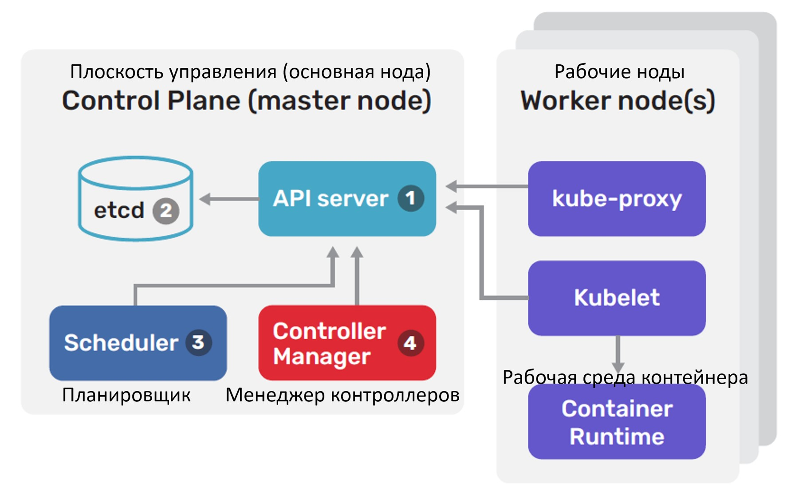
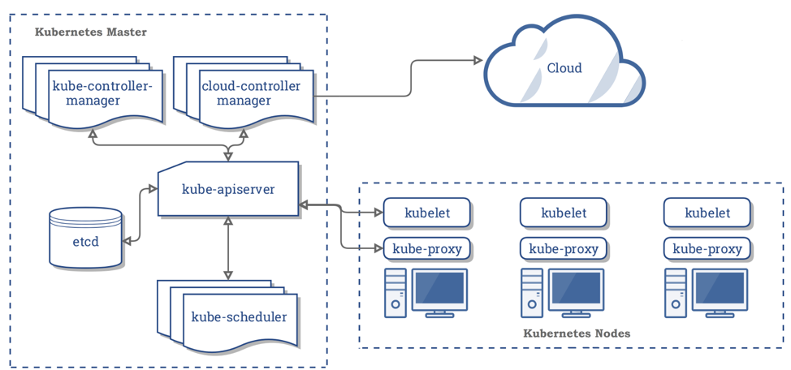
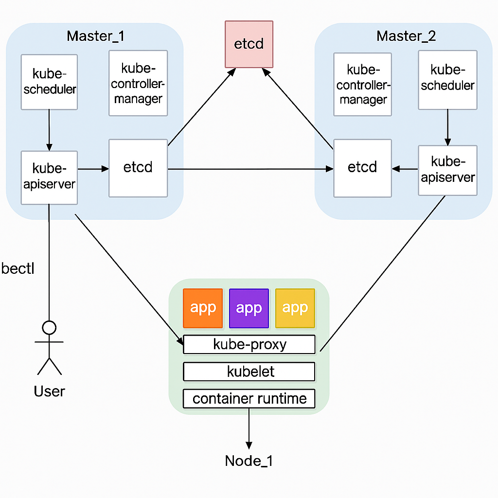
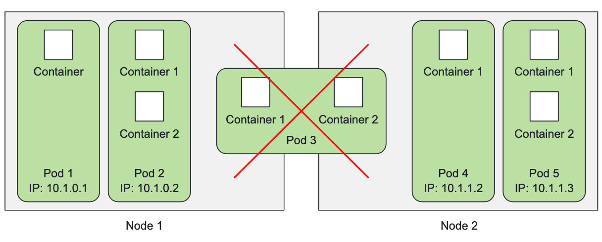
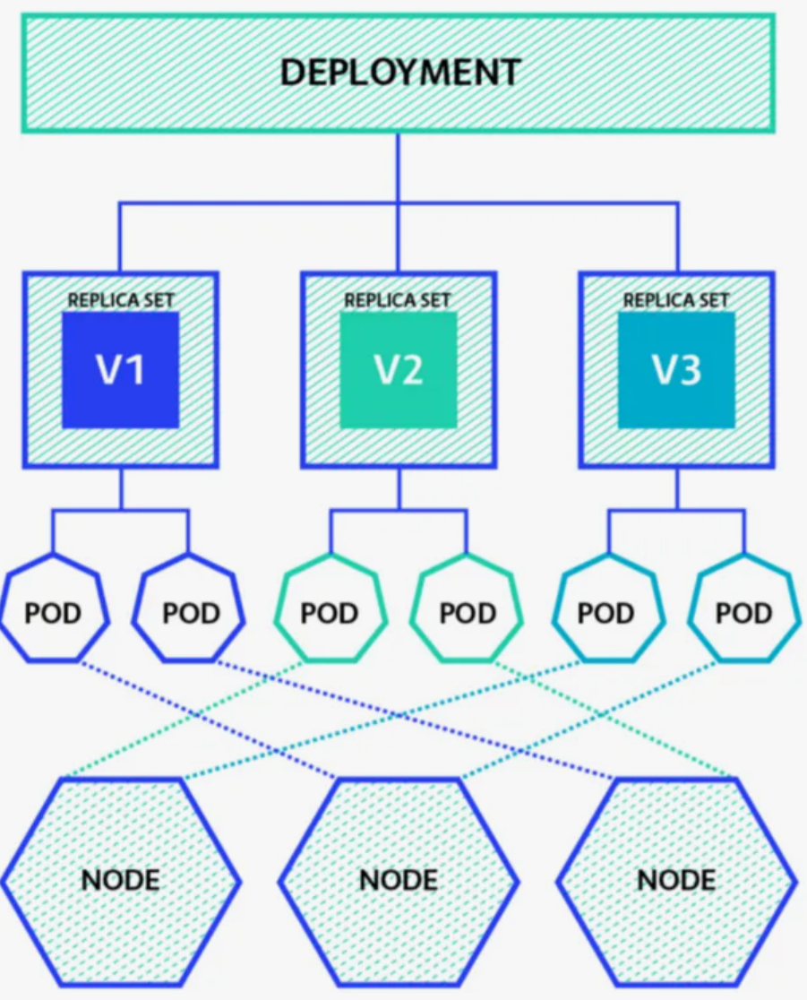

# Kubernetes

## Маршрут
- Что такое Kubernetes
- Архитектура
- Объекты Kubernetes: pod, replicaSet, deployment

## Kubernetes

- Kubernetes (k8s) — инструмент контейнерной оркестрации со множеством встроенных сервисов.
- Разрабатывается Google и передан на поддержку в фонд CNCF, обладает большим комьюнити.
- Полностью бесплатен.

Де-факто стандарт индустрии по контейнерной оркестрации.

## kubectl

CLI утилита, распространяемая в виде бинарного файла

Объекты в кластере можно:
- создать (`kubectl create`)
- обновить (`kubectl apply`)
- получить (`kubectl get`)
- посмотреть (`kubectl describe`)
- удалить (`kubectl delete`)

## Компоненты кластера k8s

- Control Plane ноды
- Worker ноды



- etcd
- api-server
- controller-manager
- scheduler
- kubelet
- kube-proxy



## Компоненты мастер ноды

#### etcd

**etcd** — key/value база данных для хранения конфигурации кластера
- Работает по алгоритму raft (он обеспечивает надежность за счет поддержки кворума)
- Единственная база данных для хранения конфигурации, которую поддерживает k8s
- Единственный **stateful**-компонент
- На каждую master-ноду устанавливается по ноде **etcd**

#### api-server

**api-server** — центральный, главный компонент k8s
- **stateless** (в отличии от **etcd**)
- Взаимодействие через kubectl (но можно работать и просто curl'ом)
- Единственный компонент, который общается с **etcd**
- Работает по REST API
- Обеспечивает авторизацию и аутентификацию (разграничение прав доступа до содержимому кластера)

#### controller-manager

controller-manager — запускает процессы набора контроллеров

В состав controller-manager'a входят следующие контроллеры
- node-controller
- replicaset-controller
- endpoints-controller
- account-controller
- token-controller

#### scheduler

**scheduler** назначает поды на ноды с учетом множества факторов.

**controller-manager** генерирует манифесты подов, записывает данные в **api-server**, а **scheduler** назначает их на ноды, учитвая важные параметры:
- Affinity и Anti-affinity
- Requests и Limits

### Вспомогательные компоненты k8s

Помимо основных компонентов, установленных на мастер-нодах, для работы кластера необходимы дополнительные компоненты, которые устанавливаются на всех нодах (мастер и воркер):
- **kubelet**
- **kube-proxy**

#### kubelet

**kubelet** — агент, работающий на узле кластера
- Работает на каждой ноде (и мастер, и воркер)
- Не запускается в докере, работает как процесс на хосте (`systemctl status kubelet`)
- Отдает команду **docker daemon** через **docker api** (`docker run`, например)
- Фактически реализует запуск подов на узле
- Обеспечивает проверки *liveness probe*, *readiness probe*, *startup probe*

В Kubernetes **реконсилейшен луп** (**reconciliation loop**) — это основной принцип работы контроллеров. Это то, что делает Kubernetes самовосстанавливающимся и декларативным.

#### kube-proxy

**kube-proxy** — сетевой прокси, работающий на каждом узле в кластере

- Устанавливается на всех нодах
- Взаимодействует с api-server
- Управляет сетевыми правилами на нодах
- Запускается в контейнере

### Итог

Для работоспособоности кластера необходимы следующие компонент:
- etcd
- api-server
- controller manager
- scheduler
- kubelet
- kube-proxy



## Объекты

### Концепция Pod

- pod — это группа контейнеров (один или несколько)
- Минимальная сущность, управляемая K8s'ом



#### Контейнеры внутри одного Pod'a или разные Pod'ы?

- Сервисы должны масштабироваться вместе или по отдельности?
- Должны ли сервисы быть запущены вместе или могут быть разнесены на разные хосты?
- Это связанные сервисы или независимые компоненты?

### ReplicaSet

- Следит за тем, чтобы число подов соответствовало заданному
- Умеет пересоздавать Pod'ы при отказе узла (обычные "голые" поды умирают вместе с нодой)
- Умеет добавлять/удалять Pod'ы не пересоздавая всю группу
- НЕ проверяет соотвествие запущенных Pod'ов шаблону


#### Пора деплоить

Алгоритм:
- Создать второй ReplicaSet с новой конфигурацией
- Одновременно:
  - уменьшаем replicas в старом ReplicaSet
  - увеличиваем replicas в новом ReplicaSet
  
Когда-то давно так работал `kubectl rolling-update` в связке с `ReplicationController`.
Главное НО — приходится это делать руками.

### Deployment

- Это контроллер контроллеров, управляющий ReplicaSets
- Делает то, что описано на слайде выше, но без ручного вмешательства, внутри кластера K8s
- Соответственно, это "декларативный" способ развертывания
- И рекомендованный способ запуска Pod'ов (даже если нужна только одна реплика)

### Связь Deployment, ReplicaSet, Pod




#### Деплойменты (deployments)

За счет гарантированного поддержания определенного количества идентичных Pod'ов, Deployment позволяет выполнять следующие операции в кластере:
- Обновление (rolling update)
- Просматривать информацию о текущем обновлении (rollout status)
- Откат обновлений (rollout undo)
- История ревизий обновлений (rollout history)
- Откат (rollback) до конкретной ревизии обновления (rollout undo to revision)
- Скалирвоание рабочих нагрузок (scaling)

## Live

[Kind](https://kind.sigs.k8s.io/) 

[Быстрый старт](https://kind.sigs.k8s.io/docs/user/quick-start/)

```
kind: Cluster
apiVersion: kind.x-k8s.io/v1alpha4
nodes:
  - role: control-plane
  - role: worker
```

Создание кластера

```sh
kind create cluster --config kind-config.yaml
```

Получить Pod'ы в текущем **namespace** (`default`)
```sh
kubectl get po
```

поулчить все **namespace**
```sh
kubectl get ns
```

получить Pod'ы **namespace** `kibe-system`
```sh
kubectl -n kibe-system get po
```

подробная информация
```sh
kubectl -n kube-system get po -o wide
```

Применить манифест
```sh
kubectl apply -f pod.yaml
```

Подробное описание Pod'а
```sh
kubectl desribe po nginx-otus
```

Удалить объекты, созданные манифестом
```sh
kubectl delete -f pod.yaml
```

Посмотерть логи
```sh
kubectl logs nginx-otus
```

Выполнить команду в Pod'е (вход в первый контейнре)
```sh
kubectl exec -it nginx-otus -- bash
```

Выполнить команду в Pod'е (указан конкретный контейнер)
```sh
kubectl exec -it two-containers -c redis -- bash
```

Получить Deployments'ы в текущем **namespace** (`default`)
```sh
kubectl get deploy
```

подробная информация
```sh
kubectl get deploy -o wide
```

Подробное описание Deployments'а
```sh
kubectl describe deploy nginx-deployment-otus
```

Удаление не через манифест
```sh
kubectl delete deploy nginx-deployment-otus
```

События в текущем **namespace** (`default`)
```sh
kubectl get events
```

Удаление кластера
```sh
kind delete cluster
```