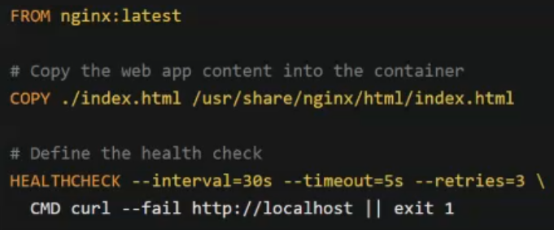
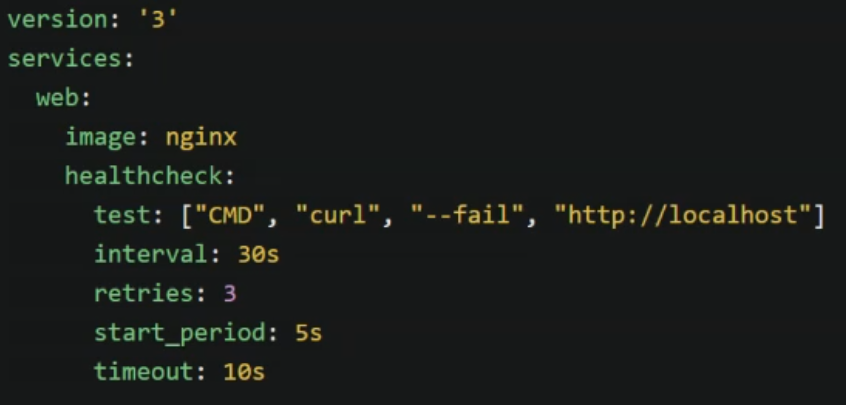
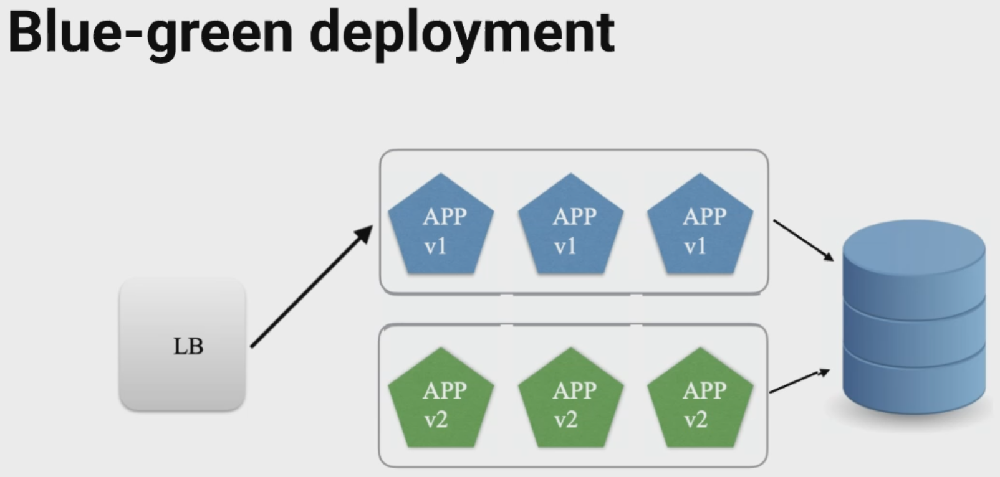
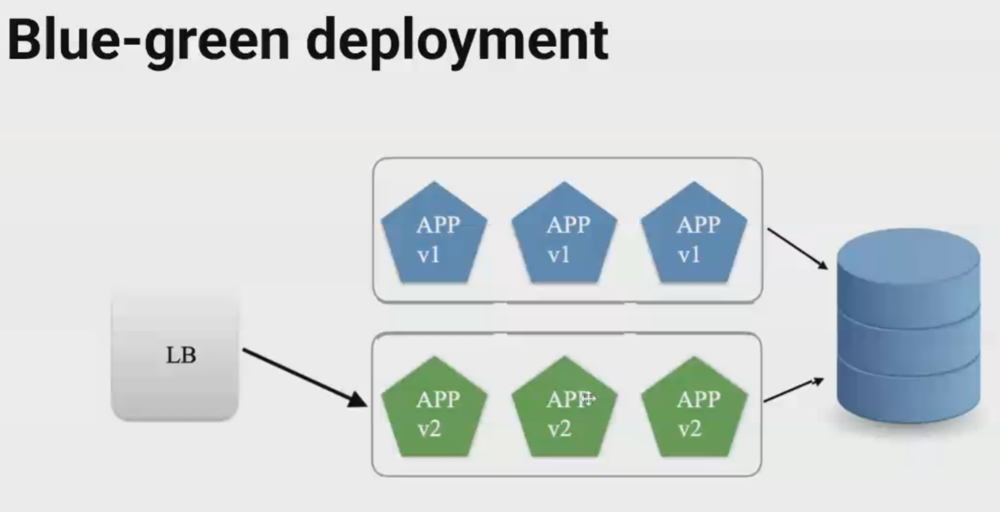
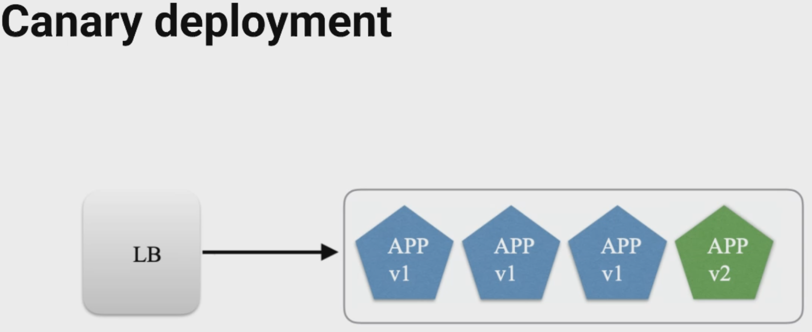
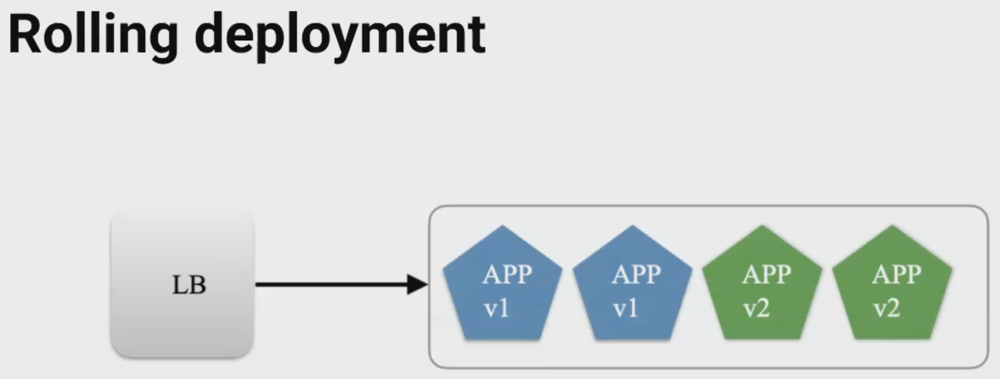
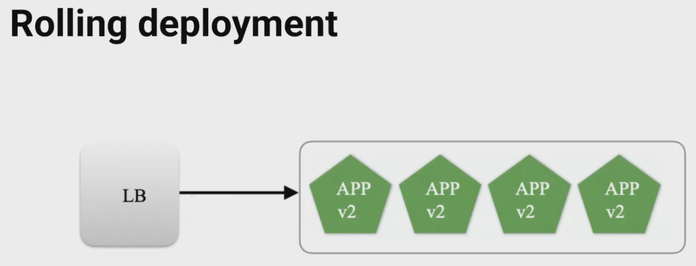
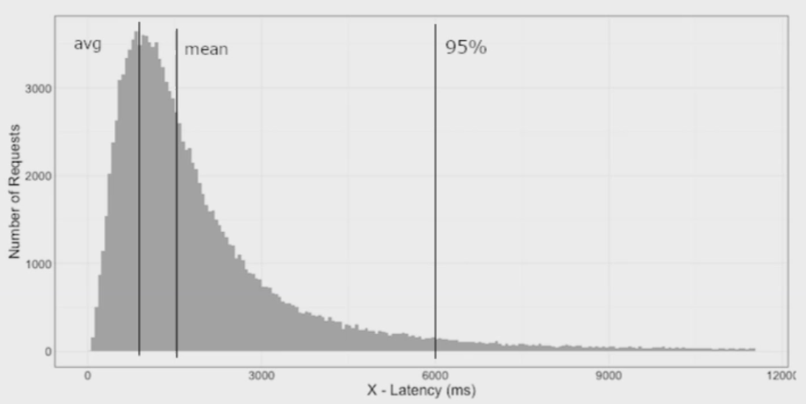
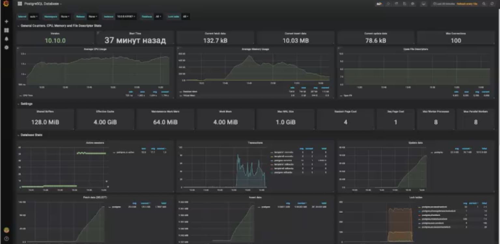
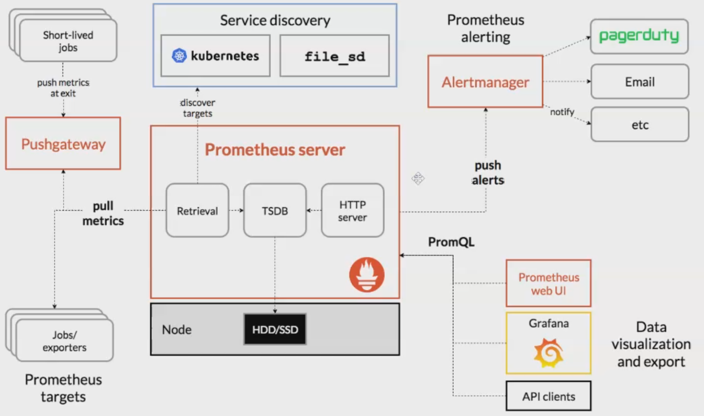

# Мониторинг

## Маршрут

- Observability и Operability
- Метрики и мониторинг
- Мониторинг ресурсов

## Observability и Operability

### Observability

Observability (наблюдаемость) — мера того, насколько по выходным данным можно восстановить информацию о состоянии системы.

Примеры:
- логирование (zap, slog -> fluentd -> elastick -> kibana)
- мониторинг (zabbix, prometheus)
- алертинг (chatops, pagerduty, opsgenie)
- трейсинг (jaeger, zipkin, opentracing, datadog apm, signoz.io)
- профилирование (pprof)
- сбор ошибок и аварий (sentry, hawk-tracker.ru)

### Operability

Operability (работоспособность) — мера того, насколько приложение умеет сообщать о своем состоянии здоровья, а инфраструктура управлять этим состоянием.

Примеры:
- простейшие хелсчеки
- liveness и readiness в Kubernetes

### Docker Health Check





Ключом `--restart` можно управлять восстановлением работоспособности контейнера

### Зачем нужен мониторинг?

- отладка, решение текущих проблем
- SRE мир:
  - SLA (Service Level Agreement)
  - SLO (Service Level Objective)
  - SLI (Service Level Indicator)
- Отправка уведомлений
- Технические и безнесовые A/B эксперименты
- Анализ трендов, прогнозирование

оффтоп

### Blue-green deployment





### Canary deployment



### Rolling deployment





## Метрики и мониторинг 

### Виды мониторинга

- Количественный / Событийный
- Whitebox / Blackbox
- Push / Pull


## Push vs Pull

*Push* — агент, работающий на окружении (например, сайдкар), подключается к серверу мониторинга и отправляет данные.

Особенности:
- мониторинг специфических/одноразовых задач
- может работать за NAT
- не нужно открывать никакие URL'ы/порты на стороне приложения
- из приложения нужно конфигурировать подключение

Примеры: `graphite`, `statsd`

*Pull* — сервис мониторинга сам опрашивает инфраструктуры/сервисы и агрегирует статистику, ...


### Load Average

LA — сложная метрика, ее можно интерпретировать как количество процессов (потоков) в OC, находящихся в ожидании какого-либо ресурса (чаще всего CPU или диск).

*Нормальной* считается загрузка когда LA ~ числу ядер процессоар.

Как посмотреть:
- top,
- iostat, dstat

```sh
$ top
```

### CPU

- **User** (`usr`, `us`) — процессор выполняет код программ.
- **System** (`sys`, `sy`) — процессор выполняет код ядра.
- **Wait** (`wai`, `wa`) — процессор находится в ожидании ввода/вывода.
- **Idle** (`id`) — процессор бездействует
- **Steal time** (`st`) — переподписка в VM

Как посмотреть: **top**, **htop**

```sh
$ top
```

### Memory

- **Resident** (`Res`/`RSS`) — память, занятая данными программ (как правило кучей).
- **Shared** (`Shr`) — память, разделяемая между разными процессами


### IO

### Troubleshppting

Алгоритм:
- индентифицировать проблему
- найти причину (?)
- решить проблему

Расширенный алгоритм: управление инцидентами.
Гуглить по фразам `incident management` и `blameless postmortem`

Инструменты:
- `top`, `htop` 


### Мониторинг Web/API серверов

- RPC (request per second)
- Response time
- Задержка между компонентами приложения (latency)
- Код ответа (HTTP status 200/500/5xx/4xx)
- Разделение по методам API

Для детального анализа: трейсинг, например, https://opentracing.io

### Распределение значений



Среднее значение (`avg`, `mean`) или даже медиана (`median`) не отражает всей картины!

Полезно измерять *процентили* (percentile): время в которое укладываются 95% или, например, 99% запросов


### Мониторинг баз данных

- TPS (transactions per second)
- QPS (queries per second)
- IO usage 
- CPU usage
- Replication Lag
- Wait Events
- Active connections



### Основные группы метрик

- Latency — время задержки
- Traffic — количество запросов и объемов трафика
- Errors — 
- ываы

## Prometheus



