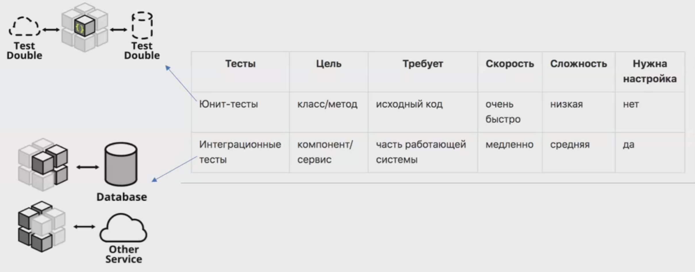
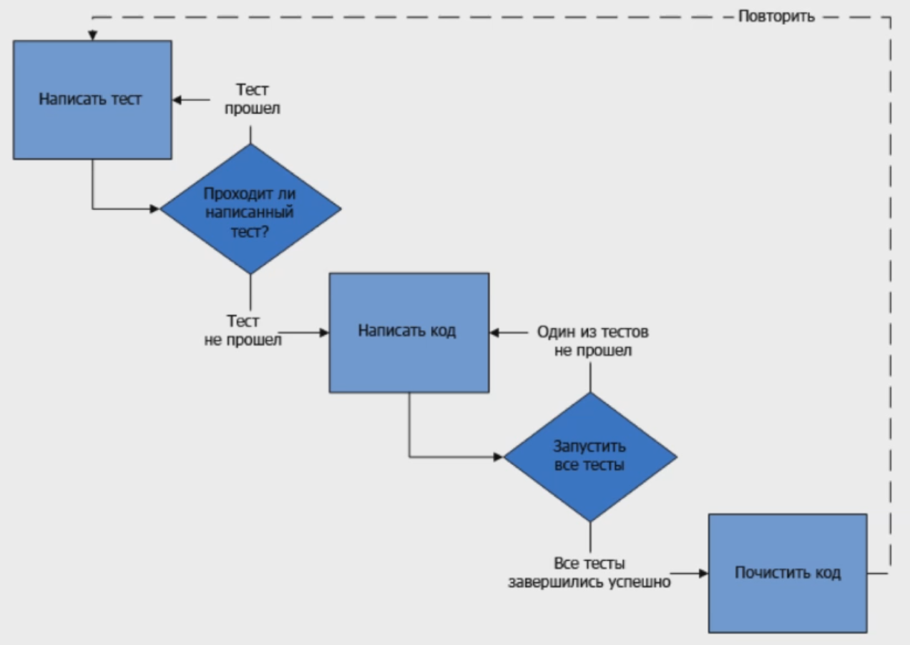
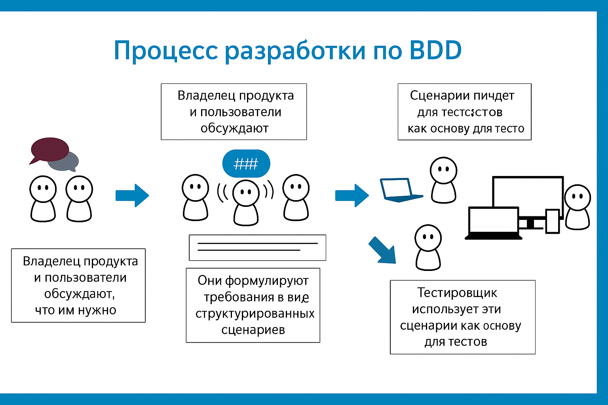
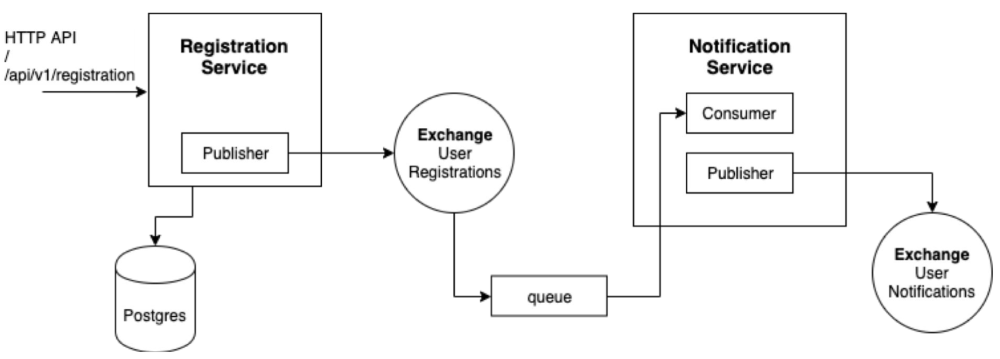
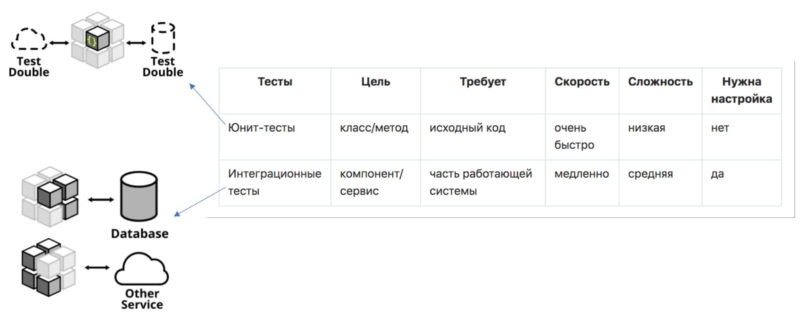
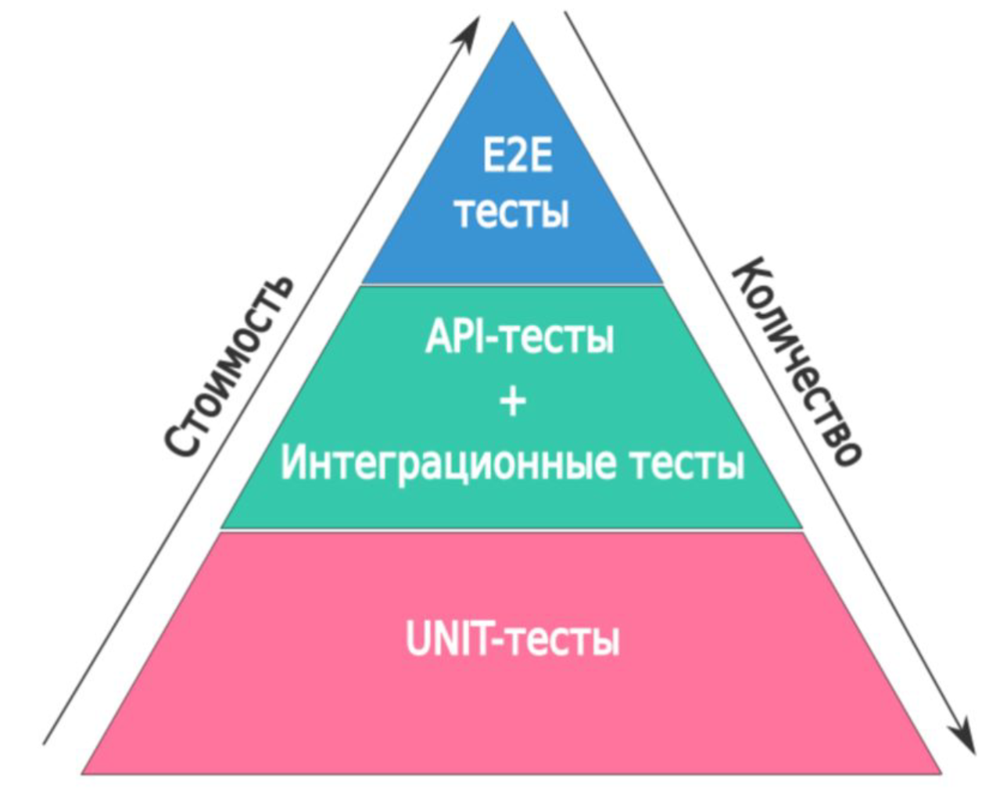
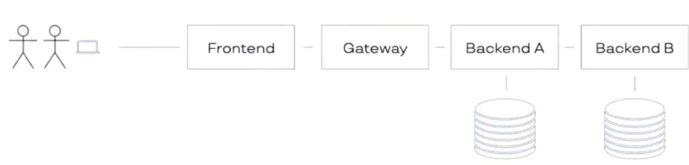
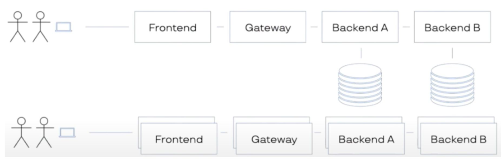
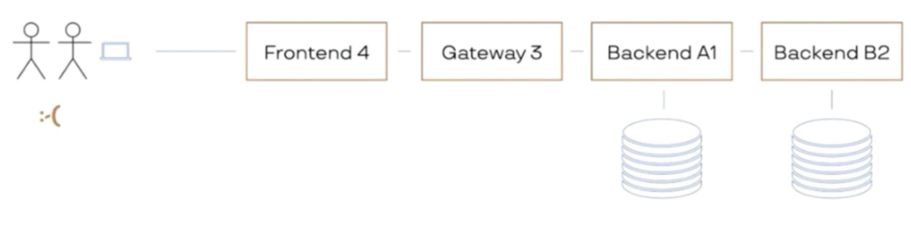
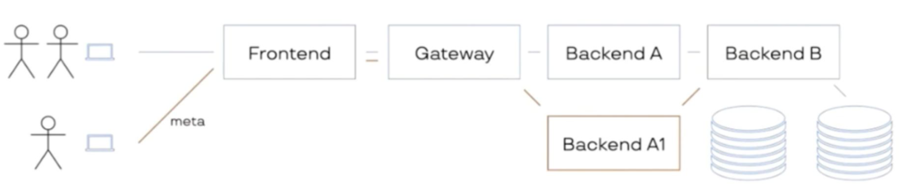

# Тестирование микросервисов

## Маршрут

- Юнит-тестирование vs интеграционное
- Подходы к теситрованию (TDD, BDD)
- Примеры

## Зачем нужны тесты

- **Упрощают рефакторинг**  
Тесты позволяют свободно изменять внутреннюю реализацию кода без страха нарушить его поведение. Если тесты зелёные после изменений — значит, система продолжает работать как ожидается.

- **Документируют код**  
Хорошо написанные тесты показывают, как должен использоваться модуль, функция или класс. Это живая, проверяемая документация, особенно полезная при входе новых разработчиков в проект.

- **Отделение интерфейса от реализации (mocks), менее связный код**  
Для написания тестов часто требуется использовать моки. Это стимулирует отделять интерфейс от конкретной реализации, снижает связанность компонентов и улучшает архитектуру.

- **Помогают найти неактуальный код**  
Если при удалении кода никакие тесты не "падают", возможно, этот код уже не используется. Тесты помогают выявлять и безопасно удалять мёртвый или устаревший функционал.

- **Помогают найти новые кейсы**  
При написании тестов разработчик думает о крайних, граничных и исключительных ситуациях. Это выявляет скрытые кейсы, которые могли быть упущены при разработке.

- **Считают метрику для менеджмента (покрытие)**  
Покрытие кода тестами (code coverage) — полезная метрика, показывающая, насколько система проверена автоматическими тестами. Это помогает оценивать технический долг и зоны риска.

- **Определяют контракт**  
Тесты формализуют ожидаемое поведение кода. Особенно важно при командной разработке или в API, где тесты становятся гарантией соблюдения контракта между модулями.

- **Повышают качество кода**  
Тестируемый код, как правило, более модульный, читаемый и понятный. Наличие тестов помогает находить и предотвращать ошибки на ранней стадии.

- **Придают уверенности при деплое в продакшн**  
Запуск полного набора тестов перед релизом снижает риск поломок в продакшене. Тесты дают уверенность, что всё работает как нужно после изменений.

## Подходы к тестированию

### Думай как тестировщик

- Как хотелось бы, чтобы работало? (На что это похоже? Как бы я мог это использовать?) Не лазить в кишки.
- Как не должно работать? (Неправильные параметры, неправильный порядок вызовов) Негативные тест-кейсы.
- Что там на краю обрыва? (Самое маленькое/большое число, граница, на которой меняется состояние). Граничные условия.
- А что если? Странные сценарии использования.

### Модульные vs Интеграционные



Термины **модульные** и **интеграционные** чаще всего используются в контексте **тестирования программного обеспечения**, хотя могут встречаться и в других сферах. Давайте разберём их значения, отличия и когда они применяются.

---

#### 📦 Модульные тесты (Unit Testing)

**Что это:**

* Тестируют **отдельные модули** (функции, методы, классы) программы.
* Фокус на **единице кода** — изолированно от других компонентов.
* Цель: проверить, работает ли код как ожидается на уровне одного модуля.

**Примеры:**

* Тест функции расчёта налога.
* Тест метода, проверяющего корректность email.

**Инструменты:**

* Go: Встроенный пакет `testing`, `testify`

**Плюсы:**

* Легко писать и запускать.
* Обнаруживают ошибки рано.
* Быстрые.

**Минусы:**

* Не охватывают взаимодействие между модулями.
* Не находят ошибки интеграции.

---

## 🔗 Интеграционные тесты (Integration Testing)

**Что это:**

* Тестируют **взаимодействие между модулями** или компонентами системы.
* Цель: убедиться, что **части системы корректно работают вместе**.

**Примеры:**

* Тест, где функция получения данных из БД передаёт их в API.
* Тест взаимодействия frontend и backend.

**Инструменты:**

* Go: `testing` + `net/http/httptest`, `testcontainers-go`, `Ginkgo`, `GoConvey`
* Postman (для API)
* Selenium (если с UI)

**Плюсы:**

* Выявляют проблемы на границах модулей.
* Проверяют реальную совместную работу компонентов.

**Минусы:**

* Медленнее.
* Сложнее в поддержке.
* Может быть трудно локализовать ошибку.

---

## 🔍 Сравнение: Модульные vs Интеграционные

| Характеристика  | Модульные тесты               | Интеграционные тесты            |
| --------------- | ----------------------------- | ------------------------------- |
| Уровень         | Один модуль                   | Несколько связанных модулей     |
| Цель            | Проверка логики модуля        | Проверка взаимодействия модулей |
| Изоляция        | Полная (с мока́ми/заглушками) | Частичная или отсутствует       |
| Скорость        | Очень быстрые                 | Медленнее                       |
| Написание       | Простое                       | Сложнее                         |
| Отладка         | Проста                        | Сложнее выявить источник ошибки |
| Частота запуска | Часто (CI/CD, каждый коммит)  | Реже, на этапах сборки/релиза   |

---

### TDD Test-Driven Development

**Test-Driven Development (TDD)** — это подход к разработке программного обеспечения, при котором **сначала пишутся тесты**, а **потом пишется код**, удовлетворяющий этим тестам.



---

#### 📌 Суть TDD

1. **Напиши тест, который должен провалиться.**

   * Нет реализации — тест "красный".

2. **Напиши минимальный код, чтобы тест прошёл.**

   * Реализуешь только то, что нужно для прохождения теста — тест "зелёный".

3. **Рефакторинг.**

   * Улучшаешь структуру кода без изменения поведения.
   * Убедись, что тест всё ещё проходит.

Этот цикл называют **Red → Green → Refactor**.

---

#### 🔄 Цикл TDD

```
1. Red      → Написать тест (падает)
2. Green    → Написать минимальный код (проходит)
3. Refactor → Улучшить код (тест всё ещё проходит)
```

---

#### ✅ Пример TDD на Go

Допустим, ты хочешь реализовать функцию `Sum(a, b int) int`.

##### 1. Тест (падает)

```go
// sum_test.go
package main

import "testing"

func TestSum(t *testing.T) {
	result := Sum(2, 3)
	expected := 5

	if result != expected {
		t.Errorf("Expected %d but got %d", expected, result)
	}
}
```

##### 2. **Реализация (переходит в "зелёный")**

```go
// sum.go
package main

func Sum(a, b int) int {
	return a + b
}
```

```bash
go test
# PASS
```

##### 3. **Рефакторинг (если нужно)**

В данном случае код уже простой, но если был бы сложный — можно было бы улучшить структуру.

---

#### 🎯 Преимущества TDD

| Преимущество                       | Описание                                                              |
| ---------------------------------- | --------------------------------------------------------------------- |
| ✅ Надёжный код                     | Ты уверен, что код работает — его "защищают" тесты.                   |
| 📉 Меньше багов                    | Ошибки ловятся ещё до завершения разработки.                          |
| 🔁 Упрощение рефакторинга          | Можешь менять код с уверенностью — тесты скажут, если что-то сломано. |
| 🧩 Улучшает дизайн кода            | Заставляет думать о **интерфейсах** и **структуре** до реализации.    |
| 📖 Автоматизированная документация | Тесты объясняют, как должна работать функция.                         |

---

#### ⚠️ Недостатки TDD

| Недостаток                  | Описание                                                          |
| --------------------------- | ----------------------------------------------------------------- |
| 🕒 Больше времени на старте | Требует дисциплины и усилий вначале.                              |
| ❌ Не всегда применимо       | В UI, многопоточности или интеграциях сложно заранее писать тест. |
| 🤯 Поддержка тестов         | Тесты тоже нужно сопровождать, особенно при изменении требований. |

---


#### Исправление багов

Ситуация:
- вам сообщили о проблеме и вы экстренно ее решили
- написали тест на решение и он прошел
- через какое-то вермя проблема повторилась

Проблема:
- решили только конкретную проблему
- глобально проблема может остаться и появиться в будущих кейсах

Решение:
- разобрать суть проблемы
- написать тесты на все случаи (или на макс. возможные)
- написать код с решением глобальной проблемы

### BDD Behavior-Driven Development



**Behavior-Driven Development (BDD)** — это методология разработки программного обеспечения, ориентированная на поведение системы с точки зрения пользователя. Она расширяет идеи тестирования через поведение (TDD) и делает акцент на сотрудничестве между разработчиками, тестировщиками и бизнес-представителями.

#### Основные принципы BDD:

1. **Сотрудничество всех участников**: BDD поощряет постоянную коммуникацию между техническими и нетехническими участниками проекта.
2. **Человеко-понятные сценарии**: Требования записываются в виде сценариев на естественном языке (часто на английском), обычно в формате **Given-When-Then**.
3. **Сценарии как основа для тестов**: Эти сценарии автоматически проверяются как часть тестов, обеспечивая живую документацию.
4. **Сосредоточенность на ценности для пользователя**: Сценарии описывают поведение системы с точки зрения пользователя, что помогает команде сосредоточиться на бизнес-ценности.

#### Пример сценария (Gherkin-синтаксис):

```gherkin
Функциональность: Поиск книг
  Как посетитель сайта
  Я хочу искать книги по названию
  Чтобы быстро находить нужные книги

Сценарий: Поиск книги по точному названию
  Допустим, я нахожусь на странице поиска
  Когда я ввожу "Война и мир"
  Тогда я должен увидеть книгу "Война и мир" в результатах
```

#### Преимущества:

* Улучшает понимание требований всеми участниками.
* Повышает качество кода за счёт автоматизации тестирования.
* Упрощает адаптацию новых членов команды благодаря читаемой документации.

Если хочешь, могу показать инструменты, которые используют BDD, или помочь создать собственный сценарий.

Отлично! Для **Behavior-Driven Development на Go**, один из популярных инструментов — это **Godog**.

---

#### 🐶 **Godog** — BDD для Go

**Godog** — это фреймворк для BDD, аналог Cucumber, но для языка Go. Он использует Gherkin-сценарии и позволяет привязывать шаги к функциям Go-кода.

---

##### 📦 Установка Godog:

```bash
go install github.com/cucumber/godog/cmd/godog@latest
```

(убедись, что `$GOPATH/bin` в `$PATH`)

---

##### 📝 Пример проекта: **авторизация пользователя**

#### 1. `features/login.feature`

```gherkin
Функциональность: Вход в систему

  Сценарий: Успешный вход
    Допустим, пользователь на странице входа
    Когда он вводит правильные логин и пароль
    Тогда он должен быть перенаправлен на главную страницу
```

---

##### 2. `login_test.go` — реализация шагов на Go

```go
package main

import (
    "fmt"
    "github.com/cucumber/godog"
)

var loggedIn bool

func iAmOnTheLoginPage() error {
    fmt.Println("Открыта страница входа")
    return nil
}

func iEnterCorrectLoginAndPassword() error {
    loggedIn = true // упрощённо, обычно — вызов auth-функции
    return nil
}

func iShouldBeRedirectedToHomePage() error {
    if !loggedIn {
        return fmt.Errorf("пользователь не авторизован")
    }
    fmt.Println("Переход на главную страницу")
    return nil
}

func InitializeScenario(ctx *godog.ScenarioContext) {
    ctx.Step(`^пользователь на странице входа$`, iAmOnTheLoginPage)
    ctx.Step(`^он вводит правильные логин и пароль$`, iEnterCorrectLoginAndPassword)
    ctx.Step(`^он должен быть перенаправлен на главную страницу$`, iShouldBeRedirectedToHomePage)
}
```

---

#### ▶️ Запуск тестов:

```bash
godog
```

---

#### 🧠 Полезное:

* Godog **интегрируется с Go тестами**, можно запускать `go test` + `godog`.
* Можно генерировать скелеты шагов командой `godog` — он подскажет, какие шаги не реализованы.

---

Если хочешь, могу:

* помочь с шаблоном проекта на Go с BDD,
* сгенерировать Docker-образ для запуска Godog,
* интегрировать Godog с CI/CD.

Что бы ты хотел сделать дальше?


#### Язык Gherkin

- Функциональность: Угадай слово
  - Сценарий: Создатель начинает игру
    - Когда Создатель начинает игру
    - Тогда Создатель ждёт, когда Противник подключится

Сценарий: Противник подключается к игре
  - Допустим, что Создатель начал игру со словом "silky"
    - Когда Противник подключается к игре Создателя
    - Тогда Противник должен угадать слово из 5 букв

- Похож на TDD
- Описание идет через спецификацию поведения
- Стандарт для спецификации de facto — язык Gherkin
- Наиболее известная компания, продвигающая фреймворки для BDD — Cucumber
- BDD придуман, чтобы бизнес был ближе к программистам

#### Пример

1. Клиент API посылает запрос на регистрацию пользователя в **RegistrationService**
2. **RegistrationService** сохраняет пользователя в базу и публикует событие, что
произошла новая регистрация
3. **NotificationService** уведомляет пользователя о регистрации (например смс, email
и пр.) и публикует событие, что такой-то пользователь был проинформирован.



#### Реализация

Реализация примера:

https://github.com/OtusGolang/webinars_practical_part/tree/master/31-integration-testing

Для BDD используем godog (читайте внимательно README):

https://github.com/cucumber/godog

#### Плюсы и минусы

**Плюсы**

- Позволяет взглянуть со стороны (мышление тестировщика)
- Тулинг для тестов отличается от тулинга для продукта

**Минусы**
- Сложно писать нетривиальные кейсы
- Неудобный рефакторинг


## Интеграционные тесты



### Окружение

Варианты:
- Поднимаем сервисы, базу, кеши и пр. локально
- У нас есть виртуалка или тестовое окружение, куда мы можем раскатиться
- **Docker** (`docker-compose` или `kubernetes`)

Что делать с сервисами, которые ходят во внешнюю сеть (стороннее API и пр.)?

#### `docker-compose`: полезные команды

```sh
docker-compose [-f file] up [–d] [–build] [--exit-code-from service]
docker-compose [-f file] down
docker-compose logs [–f service]
docker-compose ps [–a]
docker-compose [-f file] run service [command]
docker-compose [-f file] exec service [command]
```

### Примеры

live-кодинг сессия по написанию интеграционных тестов

https://www.youtube.com/watch?v=AV6xAeHQVl4
https://github.com/kulti/otus_ol_int_tests

Пример с общим сьютом для юнит и интеграционных тестов

https://github.com/kulti/task-list


### Резюме

- Используйте окружение максимально похожее на прод
- Не используйте тестируемый код
- Используйте спецификации и кодогенеренных клиентов
- Мокайте ненужные сервисы
- Пишите интеграционные тесты на том языке, на каком удобнее

## e2e

### Пирамида тестирования



### e2e

- Покрывают все функции приложения с точки зрения клиента
- Могут эмулировать действия клиента (нажатие на кнопки, открытие страниц и тп) - например selenium
- Довольно сложные в написании

### e2e для монолита

- Фактически представляет интеграционные тесты
- API
- СУБД
- Может усложнится если используем selenium для автоматизации тестирования фронта


### e2e для микросервисов




- расписание
- стенды



### Ограничения от DevOPs

- сложность поддержки
- много ресурсов



### Решение

- service-mesh, istio, consul
- маршрутизация трафика по меткам в http заголовков



## Итоги занятия

Список материалов для изучения
1. [Пирамида тестов на практике / Хабр](https://habr.com/ru/post/358950/)
2. [Антипаттерны тестирования ПО / Хабр](https://habr.com/ru/post/358178/)
3. https://ru.wikipedia.org/wiki/Разработка_через_тестирование
4. https://en.wikipedia.org/wiki/Behavior-driven_development
5. https://cucumber.io/docs/gherkin/reference/