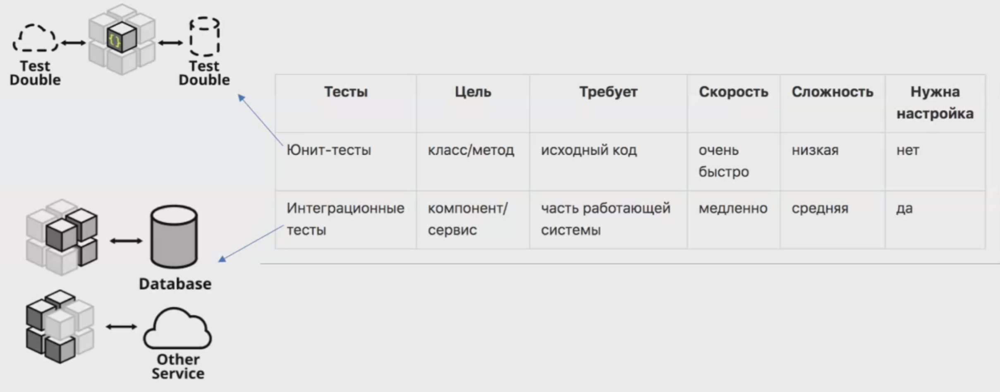
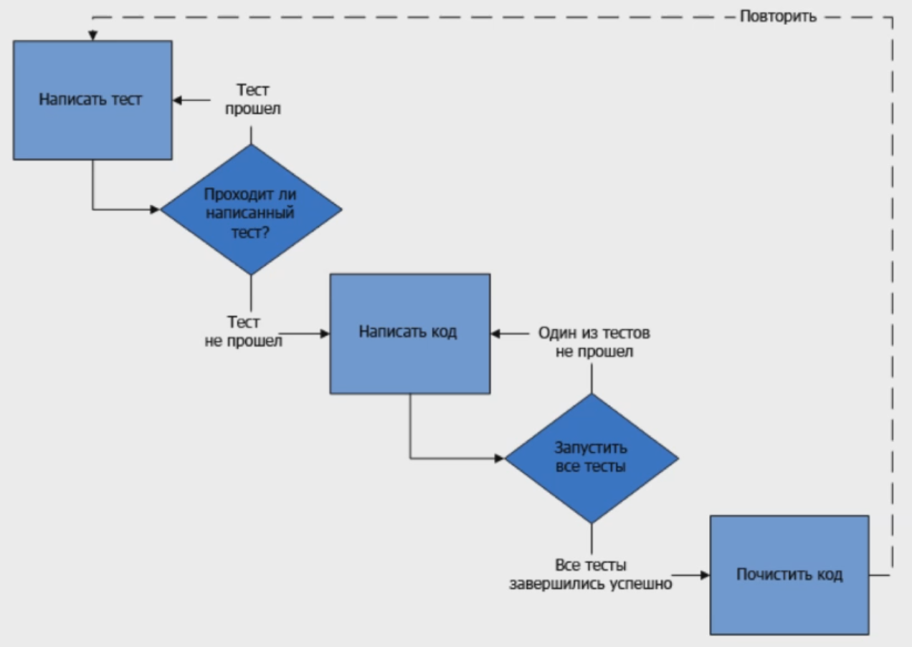

# Тестирование микросервисов

## Маршрут

- Юнит-тестирование vs интеграционное
- Подходы к теситрованию ()

## Подходы к тестированию

### Зачем нужны тесты

- Упрощают рефакторинг
- Документируют код
- Отделение интерфейса от реализации (mocks), менее связный код
- Помогают найти неактуальный код
- Помогают найти новые кейсы
- Считают метрику для менеджмента (покрытие)
- Определяют контракт
- Повышают качество кода
- Придают уверенности при деплое в продакшн

### Думай как тестировщик

- Как хотелось бы, чтобы работало? (На что это похоже? Как бы я мог это использовать?) Не лазить в кишки.
- Как не должно работать? (Неправильные параметры, неправильный порядок вызовов) Негативные тест-кейсы.
- Что там на краю обрыва? (Самое маленькое/большое число, граница, на которой меняется состояние). Граничные условия.
- А что если? Странные сценарии использования.

### Модульные vs Интеграционные

### TDD Test-Driven Development

#### Исправление багов

Ситуация:
- вам сообщили о проблеме и вы экстренно ее решили
- написали тест на решение и он прошел
- через какое-то вермя проблема повторилась

Почему?

### BDD Behavior-Driven Development

#### Язык Gherkin

