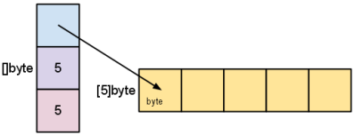

# Особенности языка и типовые ошибки

## Преподаватель  
**Рубаха Юрий**  

## Содержание занятия  
- Затенения и ошибки связанные с областью видимости
- Замыкания и ошибки связанные с именованными значениями
- Устройство слайсов
- Мапы
- Ошибки при использовании слайсов и мап

---

## Области видимости и блоки

```go
var a = 1                       // <- уровень пакета

func main() {
    fmt.Println("1: ", a)
    a := 2                      // <-- уровень блока функции
    fmt.Println("2: ", a)
    {
        a := 3                  // <-- уровень пустого блока
        fmt.Println("3: ", a)
    }
    fmt.Println("4: ", a)       // <-- a = 2
    f()
}
func f() {
    fmt.Println("5: ", a)       // <-- a = 1
}

```

### Неявные блоки: if, for, switch, case, select

#### **if**
```go
func classicIf() {
	if x := 10; x > 5 { // x создаётся в неявном блоке
		fmt.Println("x больше 5")
	} // Здесь x уничтожается
}

func withNeyavnyBlockIf() {
	{ // Неявный блок if
		x := 10    // x создаётся
		if x > 5 { // Используется x
			fmt.Println("x больше 5")
		}
	} // Здесь x уничтожается
}
```

#### **for**

```go
func classicFor() {
	for i := 0; i < 3; i++ { // i создаётся в неявном блоке
		x := i * 2
		fmt.Println(x)
	} // Здесь i уничтожается
}

func withNeyavnyBlockFor() {
	{ // Неявный блок for
		i := 0 // i создаётся в неявном блоке
	tuta: // метка для goto
		if i < 3 {
			// начало тела функции
			x := i * 2
			fmt.Println(x)
			// конец тела функции
			i++
			goto tuta // возвращаемся на метку
		}
	} // Здесь i уничтожается
}
```

#### **switch**

```go
func classicSwitch() {
	switch x := 2; x { // x создаётся в неявном блоке
	case 1:
		fmt.Println("Один")
	case 2:
		fmt.Println("Два")
	} // Здесь x уничтожается
}

func withNeyavnyBlockSwitch() {
	{ // Неявный блок for
		x := 2 // x создаётся в неявном блоке
		if x == 1 {
			fmt.Println("Один")
		}
		if x == 2 {
			fmt.Println("Два")
		}
	} // Здесь x уничтожается
}
```

#### **select**

```go
select {
case msg := <-ch1:
    fmt.Println(msg) // msg доступен только в этом блоке
case msg := <-ch2:
    fmt.Println(msg) // msg объявляется заново
}
```

#### **Примеры**

```go
for i := 0; i < 5; i++ {
    fmt.Println(i)
}
```

```go
if v, err := doSmth(); err != nil {
    fmt.Println(err)
} else {
    process(v)
}
```

```go
switch i := 2; i * 4 {
case 8:
    j := 0
    fmt.Println(i, j)
default:
    // "j" is undefined here
    fmt.Println(i)
}
```

#### Вопрос: сколько раз объявлен x?

```go
package main

import "fmt"

func f(x int) {                 // <-- 1-ое объявление 
    for x := 0; x < 10; x++ {   // <-- 2-ое объявление
        fmt.Println(x)
    }
}

var x int                       // <-- 3-ое объявление

func main() {
    var x = 200                 // <-- 4-ое объявление
    f(x)
}
```

> **4-е раза**

### Опасное затенение

```go
func main() {
    data, err := callServer()
    if err != nil {
        fmt.Println(err)
        return
    }
    defer func() {
        if err != nil {
        fmt.Println(err)
        }
    }()
    if err := saveToDB(data); err != nil {  // <-- тут затенение
        fmt.Println(err)
        return
    }
    return
}

func callServer() (int, error) {return 0, nil}
func saveToDB(a int) error {return fmt.Errorf("save error")}
```

## Функции: именованные возвращаемые значения

```go
func sum(a, b int) (s int) {
    s = a + b
    return
}
```

### Опасный `defer`

```go
func main() {
    if err := DoDBRequest(); err != nil {
        fmt.Println(err)
    }
}

func DoDBRequest() (err error) {
    defer func() {
        if err = close(); err != nil {
            return
        }
    }()
    
    err = request()
    return
}

func request() error {return fmt.Errorf("request error")}
func close() error {return nil}
```

### Замыкания


```go
func intSeq() func() int {
    i := 0
    return func() int {
        i++
        return i
    }
}
func main() {
    nextInt := intSeq()
    fmt.Println(nextInt()) // <-- 1
    fmt.Println(nextInt()) // <-- 2
    fmt.Println(nextInt()) // <-- 3
    newInts := intSeq()
    fmt.Println(newInts()) // <-- 1
}
```

### Замыкания: middleware

```go
package main

import (
    "fmt"
    "net/http"
    "time"
)

func main() {
    http.HandleFunc("/hello", timed(hello))
    http.ListenAndServe(":3000", nil)
}

func timed(f func(http.ResponseWriter, *http.Request)) func(http.ResponseWriter, *http.Request) {
    return func(w http.ResponseWriter, r *http.Request) {
    start := time.Now()
    f(w, r)
    end := time.Now()
    fmt.Println("The request took", end.Sub(start))
    }
}

func hello(w http.ResponseWriter, r *http.Request) {
    fmt.Fprintln(w, "<h1>Hello!</h1>")
}
```

### Опасное замыкание

```go
func main() {
    s := "hello"
    defer fmt.Println(s)    // <-- вызывается вторым (замыкания нет)
    defer func() {          // <-- вызывается первым (есть замыкание)
        fmt.Println(s)
    }()
    s = "world"
}
```
## Слайсы

### Как они устроены?

```go
// runtime/slice.go
type slice struct {
    array unsafe.Pointer
    len int
    cap int
}
```

```go
l := len(s) // len — вернуть длину слайса
c := cap(s) // cap — вернуть емкость слайса
```

```go
s := make([]int, 3, 10) // s == {0, 0, 0}
```


[Хороший источник про slice](https://go.dev/blog/slices-intro)

### Добавление элементов


#### **Авто-увеличение слайса**


Если `len < cap` — увеличивается `len`

Если `len == cap` — увеличивается `cap`, выделяется новый кусок памяти (данные копируются).

```go
func main() {
    s := []int{1}
    for i := 0; i < 10; i++ {
        fmt.Printf("ptr %0x len: %d \tcap %d \t\n",
        &s[0], len(s), cap(s))
        s = append(s, i)
    }
}
```

### Получение под-слайса (нарезка)

`s[i:j]` — возвращает под-слайс, с `i`-ого элемента включительно, по `j`-ы не влючительно.

Длинна нового сласа будет `j-i`.

```go
s := []int{0, 1, 2, 3, 4, 5, 6, 7, 8, 9}
s2 := s[3:5] // [3, 4]
s2 := s[3:] // [3, 4, 5, 6, 7, 8, 9]
s2 := s[:5] // [0, 1, 2, 3, 4]
s2 := s[:] // копия s (shallow)
```

```go
s := []byte{1, 2, 3, 4, 5}
s2 := s[2:5]
```




### Неочевидные следствия

```go
arr := []int{1, 2}
arr2 := arr // копируется только заголовок, массив остался общий
arr2[0] = 42
fmt.Println(arr[0]) // [42, 2]
arr2 = append(arr2, 3, 4, 5, 6, 7, 8) // реаллокация
arr2[0] = 1
fmt.Println(arr[0]) // [1, 2, 3, 4, 5, 6, 7, 8]
```


### Правила работы со слайсами

Функции, изменяющие слайс

- принимают shalow копии
- возвращают новый слайс

```go
func AppendUniq(slice []int, slice2 []int) []int {
 ...
}
s = AppendUniq(s, s2)
```

Копирование слайса

```go
s := []int{1,2,3}
s2 := make([]int, len(s))
copy(s2, s)
```

### Сортировка

```go
s := []int{3, 2, 1}
sort.Ints(s) 
```

```go
s := []string{"hello", "cruel", "world"}
sort.Strings(s)
```

### Типы
```go
type User struct {
    Name string
    Age int
}
func main() {
    s := []User{
        {"vasya", 19},
        {"petya", 18},
    }
    sort.Slice(s, func(i, j int) bool {
        return s[i].Age < s[j].Age
    })
    fmt.Println(s)
}
```

### Итерирование

```go
// Индекс и значение
for i, v := range s {
 ...
}
```

```go
// Только индекс
for i := range s {
 ...
}
```

```go
// Только значение
for _, v := range s {
 ...
}
```

### Задачка

Написать функцию `Concat`, которая получает несколько слайсов и склеивает
их в один длинный. `{{1, 2, 3}, {4,5}, {6, 7}} => {1, 2, 3, 4, 5, 6, 7}`

```go
func Concat(sls ...[]int) []int {
	sumLen := 0

	for _, v := range sls {
		sumLen += len(v)
	}

	resSlice := make([]int, sumLen)

	currPos := 0
	for _, v := range sls {
		copy(resSlice[currPos:], v)
		currPos += len(v)
	}

	return resSlice
}
```

#### Тест

```go
package main

import (
	"reflect"
	"testing"
)

// Напишите функцию `Concat`, которая получает несколько слайсов
// и склеивает их в один длинный.
// { {1, 2, 3}, {4, 5}, {6, 7} }  => {1, 2, 3, 4, 5, 6, 7}

func Concat(sls [][]int) []int {
	sumLen := 0

	for _, v := range sls {
		sumLen += len(v)
	}

	resSlice := make([]int, sumLen)

	currPos := 0
	for _, v := range sls {
		copy(resSlice[currPos:], v)
		currPos += len(v)
	}

	return resSlice
}

func TestConcat(t *testing.T) {
	test := []struct {
		slices   [][]int
		expected []int
	}{
		{[][]int{{1, 2}, {3, 4}}, []int{1, 2, 3, 4}},
		{[][]int{{1, 2}, {3, 4}, {6, 5}}, []int{1, 2, 3, 4, 6, 5}},
		{[][]int{{1, 2}, {}, {6, 5}}, []int{1, 2, 6, 5}},
	}

	for _, tc := range test {
		assertEqual(t, tc.expected, Concat(tc.slices))
	}
}

func assertEqual(t *testing.T, expected, actual []int) {
	if !reflect.DeepEqual(expected, actual) {
		t.Errorf("Not equal\nExpected: %v\nActual:   %v\n", expected, actual)
	}
}
```

## Словари (map)

- Отображение **ключ** `=>` **значение**.
- Реализованы как хэш-таблицы.
- Аналогичные типы в других языках: в Python — `dict`, в JavaScript — `Object`, в Java — `HashMap`, в C++ — `unordered_map`.

### Создание

```go
var cache map[string]string     // не-инициализированный словарь, nil
cache := map[string]string{}    // с помощью литерала, len(cache) == 0
cache := map[string]string{     // литерал с первоначальным значением
    "one": "один",
    "two": "два",
    "three": "три",
}
cache := make(map[string]string)        // тоже что и map[string]string{}
cache := make(map[string]string, 100)   // заранее выделить память
 // на 100 ключей
```

### Операции

```go
value := cache[key]     // получение значения,
value, ok := cache[key] // получить значение, и флаг того что ключ найден
_, ok := cache[key]     // проверить наличие ключа в словаре
cache[key] = value      // записать значение в инициализированный(!) словарь
delete(cache, key)      // удалить ключ из словаря, работает всегда
```
[Подробное описание](https://blog.golang.org/go-maps-in-action)

### Внутреннее устройство


[Про устройство мапы (1)](https://www.ardanlabs.com/blog/2013/12/macro-view-of-map-internals-in-go.html)

[Про устройство мапы (2)](https://dave.cheney.net/2018/05/29/how-the-go-runtime-implements-maps-efficiently-without-generics)


### Итерирование

```go
// Ключ и значение
for key, val := range cache {
 ...
}
```

```go
// Только ключ
for key := range cache {
 ...
}
```

```go
// Только значение
for _, val := range cache {
 ...
}
```

###  Cписки ключей и значений

В Go нет функци, возвращающих списки ключеq и значениq словаря.

Получить ключи:
```go
var keys []string
for key, _ := range cache {
    keys = append(keys, key)
}
```

Получить значения:

```go
values := make([]string, 0, len(cache))
for _, val := range cache {
    values = append(values, val)
}
```

### Требования к ключам

Ключом может быть любо типа данных, для которого определена операция сравнения `==`:
- строки, числовые типы, bool каналы (chan);
- интерфесы;
- указатели;
- структуры или массивы содержащие сравнимые типы.

```go
type User struct {
    Name string
    Host string
}
var cache map[User][]Permission
```

[Подробнее](https://golang.org/ref/spec#Comparison_operators)

### Порядок ключей

- Какой порядок итерирования по словарю?
- Что будет, если удалить ключ во время итерирования?
- Что будет, если добавить ключ во время итерирования?

[Обязательно](https://goplay.tools/snippet/SmisQCUpCGb)

## Использование Zero Values

Для сласов и словаре, zero value — это nil.

С таким значением будут работать функции и операции читающие данные, например:

```go
var seq []string            // nil
var cache map[string]string // nil
l := len(seq)               // 0
c := cap(seq)               // 0
l := len(cache)             // 0
v, ok := cache[key]         // "", false
```

Для слайсов будет так же работать `append`

```go
var seq []string            // nil
seq = append(seq, "hello")  // []string{"hello"}
```

Вместо

```go
hostUsers := make(map[string][]string)
for _, user := range users {
    if _, ok := hostUsers[user.Host]; !ok {
        hostUsers[user.Host] = make([]string)
    }
    hostUsers[user.Host] = append(hostUsers[user.Host], user.Name)
}
```


Корректнее

```go
hostUsers := make(map[string][]string)
for _, user := range users {
    hostUsers[user.Host] = append(hostUsers[user.Host], user.Name)
}
```