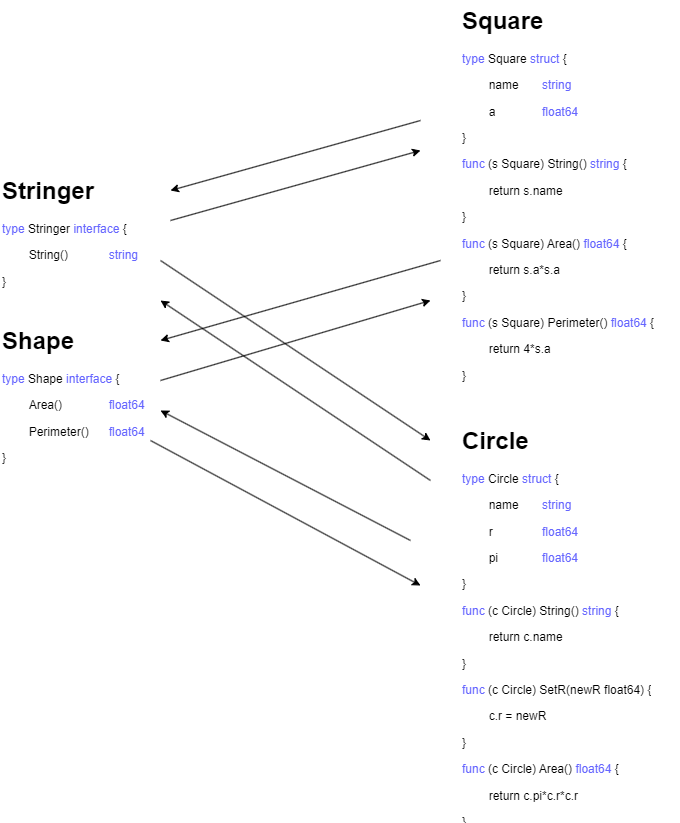
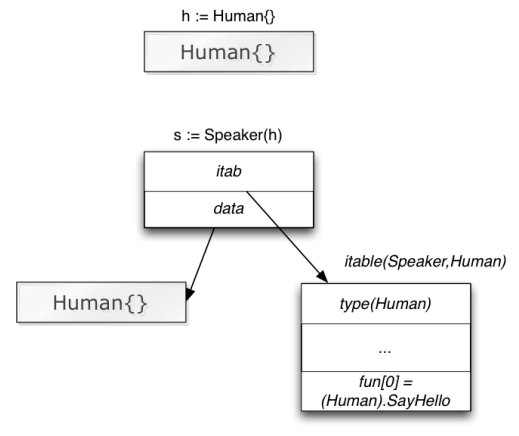

# Интерфейсы изнутри

[Доп. статья](https://research.swtch.com/interfaces)


## Преподаватель  
**Рубаха Юрий**  

## Содержание занятия  
- определение и реализация интерфейсов;
- композиция интерфейсов;
- пустой интерфейс (`interace{}`).
- внутреннее устройство интерфейса;
- влияние использования интерфейсов на производительность программы;
- значение типа интерфейс и ошибки, связанные с `nil`;
- правила присваивания значений переменным типа интерфейс;
- опасное и безопасное приведение типов (`type cast`);
- использование `switch` в контексте интерфейсов;
- слайсы и словари с интерфейсами.

---

## Определение

Интерфейс — перечень методов, который **не должен отсутствовать у типа**, чтобы тот удовлетворял интерфейсу.

Ключевое слово: `interface`.

```go
type Stringer interface {
    String() string
}

type Shape interface {
    Area() float64
    Perimeter() float64
}
```
- Одному интерфейсу могут соответствовать много типов
- Тип может реализовать несколько интерфейсов



## Интерфейсы реализуются неявно

[Пример](https://goplay.space/#GWYHjaDPnLG)

```go
type Duck interface {
	Talk() string
	Walk()
	Swim()
}

type Dog struct {
	name string
}

func (d Dog) Talk() string {
	return "AGGGRRRR"
}

func (d Dog) Walk() {}

func (d Dog) Swim() {}

func quack(d Duck) {
	fmt.Println(d.Talk())
}

func main() {
	quack(Dog{})
}
```


[Пример](https://goplay.space/#ppTH6Ya-fX5)

```go
type MyVeryOwnStringer struct { s string}

func (s MyVeryOwnStringer) String() string {
    return "my string representation of MyVeryOwnStringer"
}

func main() {
    // my string representation of MyVeryOwnStringer{}
    fmt.Println(MyVeryOwnStringer{"hello"})
}
```

```go
type Stringer interface {
    String() string
}
```

## Композиция

```go
type Reader interface {
    Read(p []byte) (n int, err error)
}
type Closer interface {
    Close() error
}
type ReadCloser interface {
    Reader
    Closer
}
```

```go
import "fmt"

type Greeter interface {
    hello()
}

type Stranger interface {
    Bye() string
    Greeter
    fmt.Stringer
}
```

### Имена методов

Имена методов **не должны повторяться**:

[Пример](https://goplay.space/#H4eJdwqD_kJ)

```go
type Hound interface {
    destroy()
    bark(int)
}
type Retriever interface {
    Hound
    bark() // duplicate method
}
```

```
./prog.go:6:2: duplicate method bark
```

## `interface{}` says nothing

[Афоризмы](https://go-proverbs.github.io/)


Пустой интерфейс не содержит методов

```go
type Any interface{}
```

```go
func Fprintln(w io.Writer, a ...interface{}) (n int, err error) {
    ...
}
```

[Пример](https://goplay.space/#1w7ksGW0uXh)

```go
func PrintAll(vals []interface{}) {
    for _, val := range vals {
        fmt.Println(val)
    }
}
func main() {
    names := []string{"stanley", "david", "oscar"}
    PrintAll(names)
}
```

## Интерфейсы изнутри

[Пример](https://goplay.space/#_P52r1iyTxj)

```go
type Speaker interface {
    SayHello()
}
type Human struct {
    Greeting string
}
func (h Human) SayHello() {
    fmt.Println(h.Greeting)
}

...

var s Speaker
h := Human{Greeting: "Hello"}
s = Speaker(h)
s.SayHello()
```




