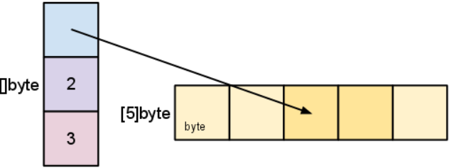

# Slice Go


## **Введение**

Тип срезов в Go обеспечивает удобное и эффективное средство работы с последовательностями типизированных данных. Срезы аналогичны массивам в других языках, но обладают некоторыми необычными свойствами. В этой статье мы рассмотрим, что такое срезы и как они используются.

## Использование и внутренние компоненты

### **Arrays**

> Тип **slice** — это абстракция, построенная на основе типа массива в Go, поэтому, чтобы понять срезы, мы должны сначала разобраться в массивах.

Определение типа массива указывает его длину и тип элементов. Например, тип `[4]int` представляет собой массив из четырёх целых чисел. Размер массива фиксирован; **его длина является частью его типа** (`[4]int` и `[5]int` — разные, несовместимые типы). Массивы можно индексировать обычным способом, поэтому выражение `s[n]` обращается к `n`-му элементу, начиная с нуля.

```go
var a [4]int
a[0] = 1
i := a[0]
// i == 1
```

***Массивы не нужно инициализировать явно***; нулевое значение массива — это готовый к использованию массив, элементы которого сами по себе нулевые:

```go
// a[2] == 0, the zero value of the int type
```

Представление в памяти `[4]int` — это просто четыре последовательных целочисленных значения:


Массивы в Go являются значениями. **Переменная массива обозначает весь массив, а не указатель на первый элемент массива** (как в C). Это означает, что при присвоении или передаче значения массива вы создаёте копию его содержимого. (Чтобы избежать копирования, **вы можете передать указатель на массив, но тогда это будет указатель на массив, а не сам массив**.) Массивы можно рассматривать как своего рода структуры, но с индексированными, а не именованными полями: составное значение фиксированного размера.

Литерал массива может быть указан следующим образом:
```go
b := [2]string{"Penn", "Teller"}
```

Или вы можете попросить компилятор подсчитать элементы массива за вас:
```go
b := [...]string{"Penn", "Teller"}
```

В обоих случаях тип `b` имеет тип `[2]string`.

#### Slices

Массивы имеют своё применение, но они немного негибкие, поэтому вы нечасто встречаете их в коде Go. Срезы же используются повсеместно. Они основаны на массивах и обеспечивают большую мощность и удобство.

Спецификация типа для среза — это `[]T`, где `T` — тип элементов среза. В отличие от типа массива, тип среза не имеет заданной длины.

Литерал среза объявляется так же, как литерал массива, за исключением того, что вы не указываете количество элементов:
```go
letters := []string{"a", "b", "c", "d"}
```

Срез можно создать с помощью встроенной функции, которая называется `make` и имеет следующий синтаксис:

```go
func make([]T, len, cap) []T
```

где `T` обозначает тип элемента создаваемого среза. Функция `make` принимает **type**, **length** и **необязательную capacity**. При вызове `make` выделяет массив и возвращает срез, ссылающийся на этот массив.

```go
var s []byte
s = make([]byte, 5, 5)
// s == []byte{0, 0, 0, 0, 0}
```

Если аргумент **capacity** не указан, ***по умолчанию используется указанная длина***. Вот более лаконичная версия того же кода:

```go
s := make([]byte, 5)
```

Длину и вместимость среза можно проверить с помощью встроенных `len` и `cap` функций.

```go
len(s) == 5
cap(s) == 5
```

В следующих двух разделах обсуждается взаимосвязь между **length** и **capacity**.

Нулевое значение среза — это `nil`. Функции `len` и `cap` возвращают **0** для нулевого среза.

Срез также может быть сформирован **путем «нарезания» существующего среза или массива**. Нарезание выполняется путем указания полуоткрытого диапазона с двумя индексами, разделенными двоеточием. Например, выражение `b[1:4]` создает срез, включающий элементы с **1** по **3** из `b` (индексами результирующего среза будут **0-2**).

```go
b := []byte{'g', 'o', 'l', 'a', 'n', 'g'}
// b[1:4] == []byte{'o', 'l', 'a'}, использует то же хранилище, что и b
```

> *Начальный и конечный индексы выражения среза являются необязательными; **по умолчанию они равны нулю и длине среза** соответственно*:

```go
// b[:2] == []byte{'g', 'o'}
// b[2:] == []byte{'l', 'a', 'n', 'g'}
// b[:] == b
```

Это также синтаксис для создания slice с заданным массивом:

```go
x := [3]string{"Лайка", "Белка", "Стрелка"}
s := x[:] // a slice referencing the storage of x
```

### "Внетренности" slice


**Slice** — это дескриптор сегмента массива. Он состоит из указателя на **первый элемент сегмента**, **длины сегмента** и **его ёмкости** (максимальной длины сегмента).


Наша переменная `s`, созданная ранее с помощью `make([]byte, 5)`, имеет следующую структуру:


**Длина** — это ***количество элементов, на которые ссылается срез***.

**Ёмкость** — это ***максимально возможное количество элементов в срезе (от начала сегмента до конца массива)***. Различие между длиной и ёмкостью станет понятно из следующих примеров.

По мере нарезки `s` наблюдайте за изменениями в структуре данных среза и их связью с базовым массивом:

```go
s = s[2:4]
```



**При нарезке данные среза не копируются.** Создаётся новое значение среза, которое указывает на исходный массив. Это делает операции со срезами такими же эффективными, как и манипуляции с индексами массива. Таким образом, **изменение элементов** (а не самого среза) *при повторной нарезке* **изменяет элементы исходного среза**:

```go
d := []byte{'r', 'o', 'a', 'd'}
e := d[2:]
// e == []byte{'a', 'd'}
e[1] = 'm'
// e == []byte{'a', 'm'}
// d == []byte{'r', 'o', 'a', 'm'}
```

> Ранее мы нарезали `s` на отрезки, длина которых меньше его вместимости. Мы можем увеличить длину, снова нарезав его:

```go
s = s[:cap(s)]
```

.png)

> **Срез не может быть расширен за пределы своей ёмкости**. Попытка сделать это вызовет панику во время выполнения, точно так же, как при индексации за пределами фрагмента или массива.

> Аналогично, **срезы не могут быть повторно разрезаны ниже нуля**, чтобы получить доступ к более ранним элементам массива.


### Растущие slices (функции копирования и добавления)

Чтобы увеличить ёмкость среза, нужно создать новый срез большего размера и скопировать в него содержимое исходного среза. Именно так за кулисами работают динамические массивы в других языках. В следующем примере размер среза `s` удваивается за счёт 
1. создания нового среза, `t`,
2. копирования содержимого среза `s` в `t`,
3. а затем присвоения значения среза `t` срезу `s`:

```go
t := make([]byte, len(s), (cap(s)+1)*2) // +1 in case cap(s) == 0
for i := range s {
        t[i] = s[i]
}
s = t
```

Циклическая часть этой распространенной операции упрощается благодаря встроенной функции копирования. Как следует из названия, функция копирования копирует данные из исходного фрагмента в целевой фрагмент. Она возвращает количество скопированных элементов.

```go
func copy(dst, src []T) int
```

Функция `copy` поддерживает копирование между срезами разной длины (она будет копировать только до меньшего количества элементов). Кроме того, `copy` может обрабатывать исходный и целевой срезы, которые используют один и тот же базовый массив, корректно обрабатывая перекрывающиеся срезы.

Используя `copy`, мы можем упростить приведенный выше фрагмент кода:

```go
t := make([]byte, len(s), (cap(s)+1)*2)
copy(t, s)
s = t
```

Распространенной операцией является добавление данных в конец slice. Эта функция добавляет байтовые элементы в slice байтов, при необходимости увеличивая slice, и возвращает обновленное значение slice:

```go
func AppendByte(slice []byte, data ...byte) []byte {
    m := len(slice)
    n := m + len(data)
    if n > cap(slice) { // if necessary, reallocate
        // allocate double what's needed, for future growth.
        newSlice := make([]byte, (n+1)*2)
        copy(newSlice, slice)
        slice = newSlice
    }
    slice = slice[0:n]
    copy(slice[m:n], data)
    return slice
}
```

Можно было бы использовать `AppendByte` вот так:

```go
p := []byte{2, 3, 5}
p = AppendByte(p, 7, 11, 13)
// p == []byte{2, 3, 5, 7, 11, 13}
```

Такие функции, как `AppendByte`, полезны, потому что они обеспечивают полный контроль над тем, как увеличивается срез. В зависимости от характеристик программы может быть желательно выделять меньшие или большие срезы или устанавливать максимальный размер перераспределения.

Но большинству программ не нужен полный контроль, поэтому Go предоставляет встроенную `append` функцию, которая подходит для большинства целей; она имеет сигнатуру

```go
func append(s []T, x ...T) []T
```

Функция `append` добавляет элементы **x** в конец фрагмента **s**, и увеличивает размер фрагмента, если требуется большая емкость.

```go
a := make([]int, 1)
// a == []int{0}
a = append(a, 1, 2, 3)
// a == []int{0, 1, 2, 3}
```

Чтобы добавить один срез к другому, используйте `...` для преобразования второго аргумента в список аргументов.

```go
a := []string{"John", "Paul"}
b := []string{"George", "Ringo", "Pete"}
a = append(a, b...) // equivalent to "append(a, b[0], b[1], b[2])"
// a == []string{"John", "Paul", "George", "Ringo", "Pete"}
```

Поскольку нулевое значение среза (`nil`) действует как срез нулевой длины, вы можете объявить переменную среза, а затем добавить к ней в цикле:

```go
// Filter returns a new slice holding only
// the elements of s that satisfy fn()
func Filter(s []int, fn func(int) bool) []int {
    var p []int // == nil
    for _, v := range s {
        if fn(v) {
            p = append(p, v)
        }
    }
    return p
}
```

### Возможная "загвоздка'

Как упоминалось ранее, при повторном нарезке среза не создается копия базового массива. Полный массив будет храниться в памяти до тех пор, пока на него не перестанут ссылаться. Иногда **это может привести к тому, что программа будет хранить все данные в памяти, когда нужен только небольшой фрагмент**.

Например, эта `FindDigits` функция загружает файл в память и ищет в нём первую группу последовательных цифр, возвращая их в виде нового фрагмента.

```go
var digitRegexp = regexp.MustCompile("[0-9]+")

func FindDigits(filename string) []byte {
    b, _ := ioutil.ReadFile(filename)
    return digitRegexp.Find(b)
}
```

Этот код работает так, как заявлено, но возвращаемый `[]byte` указывает на массив, содержащий весь файл целиком. Поскольку срез ссылается на исходный массив, пока срез существует, сборщик мусора не может освободить массив; несколько полезных байт файла удерживают всё содержимое в памяти.

Чтобы решить эту проблему, можно скопировать интересующие данные в новый фрагмент перед его возвратом:

```go
func CopyDigits(filename string) []byte {
    b, _ := ioutil.ReadFile(filename)
    b = digitRegexp.Find(b)
    c := make([]byte, len(b))
    copy(c, b)
    return c
}
```

Более лаконичную версию этой функции можно создать с помощью `append`. Это оставлено в качестве упражнения для читателя.


## Трюки с slice

С момента появления встроенного модуля `append` большая часть функций пакета `container/vector`, который был удалён в Go 1, может быть воспроизведена с помощью `append` и `copy`.

С появлением дженериков в пакете **golang.org/x/exp/slices** стали доступны универсальные реализации некоторых из этих функций.

Вот векторные методы и их аналоги для манипулирования срезами:

### Добавление элементов

```go
a = append(a, b...)
```

### Копирование

```go
b := make([]T, len(a))
copy(b, a)

// These two are often a little slower than the above one,
// but they would be more efficient if there are more
// elements to be appended to b after copying.
b = append([]T(nil), a...)
b = append(a[:0:0], a...)

// This one-line implementation is equivalent to the above
// two-line make+copy implementation logically. But it is
// actually a bit slower (as of Go toolchain v1.16).
b = append(make([]T, 0, len(a)), a...)
```

Функция `copy(dst, src)` копирует элементы из `src` в `dst`, сохраняя порядок.

Когда `copy` выполняется, он сначала читает все элементы из `src` в промежуточный буфер, а потом записывает их в `dst`

### Cut (Вырезать)

```go
a = append(a[:i], a[j:]...)
```

### Delete (Удалить)

```go
a = append(a[:i], a[i+1:]...)
```

#### Удалить без сохранения порядка

```go
a[i] = a[len(a)-1] 
a = a[:len(a)-1]
```

**ВАЖНО** Если тип элемента — это ***указатель*** или структура с ***полями-указателями***, которые необходимо собирать в мусорную корзину, то приведенные выше реализации **Cut** и **Delete** могут привести к ***потенциальной утечке памяти***: на некоторые переменные со значениями все еще ссылается базовый массив слайса **а**, просто они не "видны" в slice. Поскольку ссылка на "удаленное" значение содержится в базовом массиве, удаленное значение по-прежнему "доступно" во время GC, даже если ваш код не может ссылаться на это значение. Если базовый массив является долгоживущим, это означает утечку.

> **От Жени**. Проблема в том, что после удаления (тоже самое при копировании) в конце сегмента массива остается содержимое, которое по идее переехало влево, но содержимое прошлого хранения не быстро очищено:
Например:

1. **Delete**: есть срез `a := []int{1,2,3,4,5,6,7}`, хотим удалить два значения с индексами от 2, 3, 4:

    `a = append(a[:2], a[5:]...)`  
    получим `a = [1, 2, 6, 7]`, но базовый массив будет `[1, 2, 6, 7, 5, 6, 7]` -- последние три значения не доступны из среза, но в базовом массиве они есть.  
    В `append(a[:2], a[5:]...)` последние три элемента (5, 6, 7) не просто остаются в базовом массиве, но ещё и могут быть переиспользованы при дальнейших изменениях среза, если он расширится.
1. **Copy**: есть срез `a := []int{1,2,3,4,5,6,7}`, хотим скопировать содержимое с 5-ого индекса до конца в начало среза:
    `copy(a[:2], a[5:])`  
    получим срез `a = [6, 7, 3, 4, 5, 6, 7]`, и в базовом массие будет также: `[6, 7, 3, 4, 5, 6, 7]`

Следующий код может устранить эту проблему:

### Cut (correct)

```go
copy(a[i:], a[j:])
for k, n := len(a)-j+i, len(a); k < n; k++ {
    a[k] = nil // or the zero value of T
}
a = a[:len(a)-j+i]
```

### Delete (correct)

```go
copy(a[i:], a[i+1:])
a[len(a)-1] = nil // or the zero value of T
a = a[:len(a)-1]
```

### Delete without preserving order (correct)

```go
a[i] = a[len(a)-1]
a[len(a)-1] = nil
a = a[:len(a)-1]
```

### Вставка (Expand)

Вставить `n` элементов в нужное положение `i`:
```go
a = append(a[:i], append(make([]T, n), a[i:]...)...)
```

### Расширить (Extend)

Добавление `n` элементов:
```go
a = append(a, make([]T, n)...)
```

### Увеличение объема

Убедитесь, что есть место для добавления `n` элементов без перераспределения памяти:

```go
if cap(a)-len(a) < n {
    a = append(make([]T, 0, len(a)+n), a...)
}
```

### Фильтр (на месте)

```go
n := 0
for _, x := range a {
    if keep(x) {
        a[n] = x
        n++
    }
}
a = a[:n]
```

### Вставка (Insert)
```go
a = append(a[:i], append([]T{x}, a[i:]...)...)
```

**ПРИМЕЧАНИЕ**: второй `append` создает новый срез с собственным базовым хранилищем и копирует элементы `a[i:]` в этот срез, а затем эти элементы копируются обратно в срез `a` (первым `append`). Создания нового среза (и, следовательно, мусора в памяти) и второй копии можно избежать, используя альтернативный способ:

```go
s = append(s, 0 /* use the zero value of the element type */)
copy(s[i+1:], s[i:])
s[i] = x
```

### InsertVector

```go
a = append(a[:i], append(b, a[i:]...)...)

// The above one-line way copies a[i:] twice and
// allocates at least once.
// The following verbose way only copies elements
// in a[i:] once and allocates at most once.
// But, as of Go toolchain 1.16, due to lacking of
// optimizations to avoid elements clearing in the
// "make" call, the verbose way is not always faster.
//
// Future compiler optimizations might implement
// both in the most efficient ways.
//
// Assume element type is int.
func Insert(s []int, k int, vs ...int) []int {
    if n := len(s) + len(vs); n <= cap(s) {
        s2 := s[:n]
        copy(s2[k+len(vs):], s[k:])
        copy(s2[k:], vs)
        return s2
    }
    s2 := make([]int, len(s) + len(vs))
    copy(s2, s[:k])
    copy(s2[k:], vs)
    copy(s2[k+len(vs):], s[k:])
    return s2
}

a = Insert(a, i, b...)
```

### Push

```go
a = append(a, x)
```

### Pop

```go
x, a = a[len(a)-1], a[:len(a)-1]
```

### Push Front/Unshift

```go
a = append([]T{x}, a...)
```

### Pop Front/Shift

```go
x, a = a[0], a[1:]
```

## Дополнительные приемы

### Фильтрация без выделения

Этот трюк использует тот факт, что срез имеет тот же базовый массив и ёмкость, что и исходный объект, поэтому хранилище повторно используется для отфильтрованного среза. Разумеется, исходное содержимое изменяется.

```go
b := a[:0]
for _, x := range a {
    if f(x) {
        b = append(b, x)
    }
}
```

Для элементов, которые необходимо освободить от мусора, можно добавить следующий код:

```go
clear(a[len(b):])
```

### Обращение вспять (Reversing)

Чтобы заменить содержимое фрагмента на те же элементы, но в обратном порядке:

```go
for i := len(a)/2-1; i >= 0; i-- {
    opp := len(a)-1-i
    a[i], a[opp] = a[opp], a[i]
}
```

То же самое (два индекса):
```go
for left, right := 0, len(a)-1; left < right; left, right = left+1, right-1 {
    a[left], a[right] = a[right], a[left]
}
```

### Shuffling

Алгоритм Фишера–Йейтса:

```go
for i := len(a) - 1; i > 0; i-- {
    j := rand.Intn(i + 1)
    a[i], a[j] = a[j], a[i]
}
```

