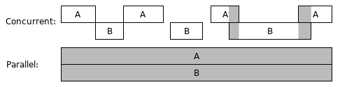
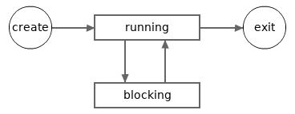
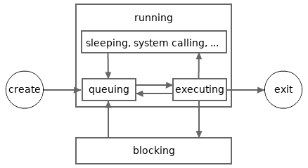

# Горутины, отложенные вызовы функций и Panic/Recover

[Статья](https://go101.org/article/control-flows-more.html#goroutine)

В этой статье мы познакомимся с goroutines и отложенными вызовами функций. Goroutine и отложенный вызов функции — это две уникальные особенности Go. В этой статье также объясняется механизм паники и восстановления. Не все знания, относящиеся к этим функциям, рассмотрены в этой статье, больше будет представлено в следующих статьях.

## Горутины

Современные процессоры часто имеют несколько ядер, и некоторые ядра процессора поддерживают технологию Hyper-Threading. Другими словами, современные процессоры могут обрабатывать несколько конвейеров инструкций одновременно. Чтобы в полной мере использовать мощь современных процессоров, нам необходимо заниматься конкурентным программированием (concurrent programming) при кодировании наших программ.

Конкурентные вычисления (Concurrent computing) — это форма вычислений, при которой несколько вычислений выполняются в течение перекрывающихся периодов времени. На следующем рисунке показаны два случая конкурентного вычисления. На рисунке А и В представляют собой два отдельных вычисления. Второй случай также называется параллельными (parallel) вычислениями, которые являются частным случаем конкурентных (special concurrent) вычислений. В первом случае А и В находятся параллельно только в течение небольшого отрезка времени.



Конкурентные вычисления могут выполняться внутри программы, на одном компьютере или в сети. В Go 101 рассматриваются только конкурентные вычисления в пределах программы. Goroutine — это способ создания конкурентных вычислений в Go.

Goroutine также часто называют «зелёными потоками» (green threads). Зелёные потоки управляются и планируются средой выполнения языка, а не операционной системой. Потребление памяти и стоимость переключения контекста у goroutine значительно ниже, чем у потока ОС. Поэтому для программы на Go не является проблемой поддерживать десятки тысяч goroutine одновременно, если хватает системной памяти.

Go не поддерживает создание системных потоков в пользовательском коде. Поэтому использование goroutine — единственный способ организации конкурентного программирования в рамках программы.

Каждая Go-программа начинается с одной goroutine, называемой main goroutine. Goroutine может создавать новые goroutine. Создать новую goroutine в Go очень просто: нужно использовать ключевое слово `go` перед вызовом функции. Эта функция начнёт выполняться в новой goroutine. Новая goroutine завершится вместе с завершением вызываемой функции.

Все возвращаемые значения вызова функции в goroutine (если функция возвращает значения) должны быть отброшены в месте вызова. Ниже приведён пример, в котором создаются две новые goroutine в main goroutine.

В этом примере `time.Duration` — это пользовательский тип, определённый в стандартном пакете `time`. Его базовый тип — встроенный тип `int64`. Базовые типы будут рассмотрены [в следующей статье](https://go101.org/article/type-system-overview.html#underlying-type).

```go
package main

import (
	"log"
	"math/rand"
	"time"
)

func SayGreetings(greeting string, times int) {
	for i := 0; i < times; i++ {
		log.Println(greeting)
		d := time.Second * time.Duration(rand.Intn(5)) / 2
		time.Sleep(d) // sleep for 0 to 2.5 seconds
	}
}

func main() {
	rand.Seed(time.Now().UnixNano()) // needed before Go 1.20
	log.SetFlags(0)
	go SayGreetings("hi!", 10)
	go SayGreetings("hello!", 10)
	time.Sleep(2 * time.Second)
}
```

Довольно просто, верно? Теперь мы занимаемся конкурентным программированием! В приведённой выше программе во время выполнения в пиковый момент могут одновременно работать три созданные пользователем goroutine. Давайте запустим её. Один из возможных результатов выполнения:

```go
hi!
hello!
hello!
hello!
hello!
hi!
```
Когда главная goroutine завершает работу, вся программа также завершается, даже если некоторые другие goroutine ещё не успели завершиться.

В отличие от предыдущих примеров, эта программа использует функцию `Println` из стандартного пакета `log`, а не аналогичную функцию из пакета `fmt`. Причина в том, что функции вывода в пакете `log` синхронизированы (в следующем разделе будет объяснено, что такое синхронизация), поэтому вывод текста двумя goroutine не перемешается в одной строке. Хотя в данной программе вероятность того, что текст перемешается при использовании функций вывода из пакета `fmt`, довольно мала.


## Синхронизация в конкурентных вычислениях

**Конкурентные вычисления могут делить ресурсы, чаще всего это ресурсы памяти.** Вот некоторые ситуации, которые могут возникнуть при конкурентном программировании:

- В тот момент, когда одна вычислительная задача записывает данные в сегмент памяти, другая вычислительная задача считывает данные из того же сегмента памяти. В таком случае целостность данных, считанных другой задачей, может быть нарушена.
- В тот момент, когда одна задача записывает данные в сегмент памяти, другая задача также записывает данные в тот же сегмент памяти. В таком случае целостность данных, хранимых в сегменте памяти, может быть нарушена.
 
Эти ситуации называются **гонками данных (data races)**. Одна из задач в конкурентном программировании — контролировать совместное использование ресурсов между вычислительными задачами, чтобы гонки данных не происходили. Механизмы, реализующие этот контроль, называются **синхронизацией в конкурентных вычислениях**, или синхронизацией данных, которые будут рассмотрены в следующих статьях Go 101.

Другие задачи конкурентного программирования включают:
- Определение, сколько вычислительных задач необходимо.
- Определение времени начала, блокировки, разблокировки и завершения вычислительных задач.
- Определение, как распределять нагрузку между конкурентными задачами.

Программа, показанная в предыдущем разделе, не является идеальной. Две новые goroutine должны были напечатать по десяти приветствий, однако главная goroutine завершится через две секунды, и многие приветствия не будут напечатаны. Как сделать так, чтобы главная goroutine узнала, когда обе новые goroutine завершат свою работу? Для этого нужно использовать технику синхронизации.

Go поддерживает несколько техник [синхронизации в конкурентных вычислениях](https://go101.org/article/concurrent-synchronization-overview.html). Среди них самая уникальная и популярная — это [техника каналов (the channel technique)] (https://go101.org/article/channel.html). Однако для простоты в этой статье мы будем использовать другую технику — тип `WaitGroup` из стандартного пакета `sync`, чтобы синхронизировать выполнение двух новых goroutine с главной goroutine.

Тип `WaitGroup` имеет три метода (специальные функции, которые будут объяснены позже):

- `Add`— используется для регистрации количества новых задач.
- `Done` — используется для уведомления о завершении задачи.
- `Wait` — заставляет вызывающую goroutine блокироваться до тех пор, пока не завершатся все зарегистрированные задачи.

В следующей статье будет объяснено, как работает `WaitGroup`.

Пример:

```go
package main

import (
	"log"
	"math/rand"
	"time"
	"sync"
)

var wg sync.WaitGroup

func SayGreetings(greeting string, times int) {
	for i := 0; i < times; i++ {
		log.Println(greeting)
		d := time.Second * time.Duration(rand.Intn(5)) / 2
		time.Sleep(d)
	}
	// Notify a task is finished.
	wg.Done() // <=> wg.Add(-1)
}

func main() {
	rand.Seed(time.Now().UnixNano()) // needed before Go 1.20
	log.SetFlags(0)
	wg.Add(2) // register two tasks.
	go SayGreetings("hi!", 10)
	go SayGreetings("hello!", 10)
	wg.Wait() // block until all tasks are finished.
}
```

Запустив его, мы можем обнаружить, что перед выходом из программы каждая из двух новых горутин выводит десять приветствий.

## Состояния Goroutine

Последний пример показал, что активная goroutine может находиться в двух состояниях: **работает (running)** и **блокируется (blocking)**. В этом примере главная goroutine переходит в состояние блокировки, когда вызывается метод `wg.Wait`, и снова переходит в состояние работы, когда другие две goroutine завершают свои задачи.

Следующее изображение иллюстрирует возможный жизненный цикл goroutine.



Важно отметить, что goroutine всё ещё считается «работающей», если она спит (после вызова функции `time.Sleep`), или ожидает ответ от системного вызова или сетевого соединения.

Когда создаётся новая goroutine, она автоматически переходит в состояние «работает». **Goroutine может выйти из состояния работы, но не может выйти из состояния блокировки.** Если по какой-либо причине goroutine остаётся в состоянии блокировки навсегда, она никогда не завершится. Такие случаи, за исключением редких, следует избегать в конкурентном программировании.

**Блокированную goroutine можно разблокировать только операцией, выполненной в другой goroutine.** Если все goroutine в программе Go находятся в состоянии блокировки, то все они будут оставаться в этом состоянии навсегда. Это можно рассматривать как **взаимную блокировку (deadlock)**. Когда это происходит, стандартная среда выполнения Go пытается завершить программу с ошибкой.

Следующая программа завершит работу через две секунды:

```go
package main

import (
	"sync"
	"time"
)

var wg sync.WaitGroup

func main() {
	wg.Add(1)
	go func() {
		time.Sleep(time.Second * 2)
		wg.Wait()
	}()
	wg.Wait()
}
```

Вывод:
```go
fatal error: all goroutines are asleep - deadlock!

...
```
Позже мы узнаем больше операций, которые переведут горутины в состояние блокировки.

## Планировщик Goroutine (Goroutine Schedule)

Не все goroutine в состоянии работы выполняются одновременно. **В любой момент времени максимальное количество выполняющихся goroutine не будет превышать количество логических процессоров (logical CPUs), доступных для текущей программы**. Мы можем использовать функцию `runtime.NumCPU`, чтобы узнать количество доступных логических процессоров для текущей программы. Каждый логический процессор может выполнять только одну goroutine в любой момент времени. Среда выполнения Go должна часто переключать контексты выполнения между goroutine, чтобы каждая из них имела шанс быть выполненной. Это похоже на то, как операционные системы переключают контексты выполнения между системными потоками.

Следующее изображение иллюстрирует более детализированный возможный жизненный цикл goroutine. В изображении состояние работы делится на несколько под-состояний. Горутин в под-состоянии очереди ждёт выполнения. Горутин в под-состоянии выполнения может снова попасть в под-состояние очереди, если он выполнялся какое-то время (даже если это был очень короткий отрезок времени).



В процессе выполнения Go использует планировщик, который эффективно управляет состояниями goroutine. Когда количество goroutine превышает доступные логические процессоры, планировщик будет управлять очередностью их выполнения, чтобы обеспечить каждому из них возможность работать.

Для простоты, под-состояния, показанные на предыдущем изображении, не будут упомянуты в других статьях Go 101. Также, в Go 101 под-состояния, связанные со сном и системными вызовами, не рассматриваются как под-состояния состояния блокировки.

Стандартная среда выполнения Go использует модель **M-P-G** для планирования goroutine, где:

- **M** представляет потоки ОС (OS threads),
- **P** — логические/виртуальные процессоры (не логические процессоры),
- **G** — goroutine.

Большинство задач по планированию выполняются логическими процессорами (**P**s), которые действуют как посредники, прикрепляя goroutine (**G**s) к потокам ОС (**M**s). Каждый поток ОС может быть прикреплен к не более чем одной goroutine в любой момент времени, и каждая goroutine может быть прикреплена к не более чем одному потоку ОС в любой момент времени. Goroutine может быть выполнена только тогда, когда она прикреплена к потоку ОС. Goroutine, которая уже некоторое время выполняется, попытается отсоединиться от соответствующего потока ОС, чтобы другие выполняющиеся goroutine могли получить шанс быть прикрепленными и выполненными.

Во время выполнения программы можно использовать функцию [`runtime.GOMAXPROCS`](https://pkg.go.dev/runtime#GOMAXPROCS), чтобы получить или установить количество логических процессоров (**P**s). Для стандартной среды выполнения Go, до версии Go Toolchain 1.5, начальное значение этого числа по умолчанию равно **1**. Но начиная с Go Toolchain 1.5, оно установлено в значение, равное количеству логических процессоров, доступных для текущей программы. Это значение по умолчанию (количество логических процессоров) является наилучшим выбором для большинства программ. Однако для некоторых программ, интенсивно использующих файловый ввод-вывод, значение `GOMAXPROCS`, большее чем `runtime.NumCPU()`, может быть полезным.

Начальное значение `runtime.GOMAXPROCS` также может быть установлено через переменную окружения `GOMAXPROCS`.

В любой момент времени количество goroutine в под-состоянии выполнения не может превышать меньшую величину из `runtime.NumCPU()` и `runtime.GOMAXPROCS`.

## Отложенные вызовы функций

Отложенный вызов функции — это вызов функции, который идет после ключевого слова `defer`. Ключевое слово `defer` и отложенный вызов функции вместе образуют оператор `defer`. Как и в случае с вызовами функций в goroutine, все результаты от вызова функции (если она возвращает значения) должны быть отброшены в самой строке вызова.

Когда выполняется оператор `defer`, отложенный вызов функции не выполняется немедленно. Вместо этого он помещается в стек отложенных вызовов, который поддерживается вызывающей goroutine. После того как вызов функции `fc(...)` возвращает результат (но ещё не завершился полностью) и переходит в фазу выхода, все отложенные вызовы, помещённые в стек отложенных вызовов во время выполнения функции, будут удалены из стека и выполнены в порядке «первым вошёл — последним вышел», то есть в обратном порядке относительно того, в котором они были помещены в стек отложенных вызовов. После выполнения всех этих отложенных вызовов функция `fc(...)` завершит своё выполнение.

Простой пример для демонстрации использования отложенных вызовов функций:

```go
package main

import "fmt"

func main() {
	defer fmt.Println("The third line.")
	defer fmt.Println("The second line.")
	fmt.Println("The first line.")
}
```

Вывод:
```go
The first line.
The second line.
The third line.
```

Вот более сложный пример, который выводит числа от 0 до 9, каждое на новой строке, в их естественном порядке, с использованием отложенных вызовов функций.

```go
package main

import "fmt"

func main() {
	defer fmt.Println("9")
	fmt.Println("0")
	defer fmt.Println("8")
	fmt.Println("1")
	if false {
		defer fmt.Println("not reachable")
	}
	defer func() {
		defer fmt.Println("7")
		fmt.Println("3")
		defer func() {
			fmt.Println("5")
			fmt.Println("6")
		}()
		fmt.Println("4")
	}()
	fmt.Println("2")
	return
	defer fmt.Println("not reachable")
}
```

## Отложенные вызовы функций могут изменять именованные возвращаемые результаты вложенных функций

Вот пример, где отложенная функция изменяет возвращаемое значение в функции с именованным результатом:

```go
package main

import "fmt"

func Triple(n int) (r int) {
	defer func() {
		r += n // изменяет возвращаемое значение
	}()

	return n + n // <=> r = n + n; return
}

func main() {
	fmt.Println(Triple(5)) // 15
}
```

В этом примере отложенная функция изменяет именованное возвращаемое значение `r` в функции `Triple`. Ожидаемый результат — `15`, так как возвращаемое значение `r` изначально равно `10` (это результат выражения `n + n`), но отложенная функция добавляет к нему `n`, что дает итоговое значение `15`.

## Момент оценки аргументов отложенных вызовов

**Аргументы отложенных вызовов функций оцениваются !!! в момент выполнения соответствующего оператора** `defer` (когда отложенный вызов помещается в стек отложенных вызовов). Эти результаты используются, когда отложенный вызов выполняется позднее, в фазе выхода окружающего вызова (вызова, который поместил отложенный вызов в стек).

Выражения внутри тела анонимной функции, будь то обычный вызов или отложенный/горутинный вызов, оцениваются во время выполнения анонимной функции.

```go
// eval-moment.go
package main

import "fmt"

func main() {
	func() {
		var x = 0
		for i := 0; i < 3; i++ {
			defer fmt.Println("a:", i + x)
		}
		x = 10
	}()
	fmt.Println()
	func() {
		var x = 0
		for i := 0; i < 3; i++ {
			defer func() {
				fmt.Println("b:", i + x)
			}()
		}
		x = 10
	}()
}
```
Используйте разные версии Go Toolchain для запуска кода ([gotv](https://go101.org/apps-and-libs/gotv.html) — это инструмент, используемый для управления и использования нескольких сосуществующих установок официальных версий Go Toolchain). На выходе:

```go
$ gotv 1.21. run eval-moment.go
[Run]: $HOME/.cache/gotv/tag_go1.21.8/bin/go run eval-moment.go
a: 2
a: 1
a: 0

b: 13
b: 13
b: 13
$ gotv 1.22. run eval-moment.go
[Run]: $HOME/.cache/gotv/tag_go1.22.1/bin/go run eval-moment.go
a: 2
a: 1
a: 0

b: 12
b: 11
b: 10
```
Обратите внимание на изменение поведения, вызванное [семантическим изменением (блоков цикла `for`), сделанным в Go 1.22](https://go101.org/article/control-flows.html#for-semantic-change).

Те же правила момента оценки аргументов также применимы к вызовам функций goroutine. Следующая программа выведет `123 789`.

```go
package main

import "fmt"
import "time"

func main() {
	var a = 123
	go func(x int) {
		time.Sleep(time.Second)
		fmt.Println(x, a) // 123 789
	}(a)

	a = 789

	time.Sleep(2 * time.Second)
}
```

Кстати, использование вызовов `time.Sleep` для синхронизации в официальных проектах — это не лучшая идея. Если программа работает на компьютере, где процессоры заняты другими программами, только что созданная горутина может не успеть выполниться до завершения программы. Для синхронизации в официальных проектах следует использовать техники синхронизации параллелизма, описанные в статье о [обзоре синхронизации параллелизма](https://go101.org/article/concurrent-synchronization-overview.html).


## Необходимость функции `defer`

В приведённых выше примерах вызовы отложенных (`defer`) функций не являются абсолютно необходимыми. Однако механизм defer играет важную роль в механизме panic и recover, который будет рассмотрен ниже.

Отложенные вызовы также помогают писать более чистый и надёжный код. Мы можем изучить больше примеров использования defer и узнать больше деталей об этом механизме в статье, [посвящённой отложенным функциям](https://go101.org/article/defer-more.html). Пока что рассмотрим, почему defer важен для обработки паники (panic) и восстановления (recover).

## panic и recover
Go не поддерживает механизм исключений с throw и catch, предпочитая явную обработку ошибок. Однако в Go есть механизм, аналогичный throw/catch, — это panic и recover.

Мы можем вызвать встроенную функцию `panic`, чтобы инициировать панику, из-за чего текущая горутина (goroutine) перейдёт в состояние паники.

Паника — это альтернативный способ завершения функции. Как только в функции возникает паника, она немедленно прекращает выполнение и начинает фазу выхода.

Если во время отложенного вызова (`defer`) вызвать встроенную функцию `recover`, то активная паника в текущей горутине будет погашена, и выполнение продолжится в обычном режиме.

Если паника не обработана (не вызван `recover`), то горутина завершится аварийно, и вся программа завершится с ошибкой (`crash`).

Встроенные функции `panic` и `recover` объявлены следующим образом:

```go
func panic(v interface{})
func recover() interface{}
```

Позже в статье о интерфейсах в Go будет подробно разобран [тип `interface`](https://go101.org/article/interface.html). Сейчас достаточно знать, что пустой интерфейс `interface{}` можно рассматривать как аналог типа `any` или `Object` в других языках программирования.

Другими словами, функция `panic` может принимать значение любого типа, а `recover` возвращает то же значение, которое было передано в panic.

В приведенном ниже примере показано, как вызвать панику и как оправиться от нее.

```go
package main

import "fmt"

func main() {
	defer func() {
		fmt.Println("exit normally.")
	}()
	fmt.Println("hi!")
	defer func() {
		v := recover()
		fmt.Println("recovered:", v)
	}()
	panic("bye!")
	fmt.Println("unreachable")
}
```

Вывод:

```go
hi!
recovered: bye!
exit normally.
```

Вот еще один пример, который показывает, что программа в панике завершает работу без восстановления. Таким образом, вся программа завершает работу с ошибкой.

```go
package main

import (
	"fmt"
	"time"
)

func main() {
	fmt.Println("hi!")

	go func() {
		time.Sleep(time.Second)
		panic(123)
	}()

	for {
		time.Sleep(time.Second)
	}
}
```

Вывод:

```go
hi!
panic: 123

goroutine 5 [running]:
...
```

При некоторых обстоятельствах, таких как деление целого числа на ноль, среда выполнения Go может вызвать панику. Например,

```go
package main

func main() {
	a, b := 1, 0
	_ = a/b
}
```

Вывод:

```go
panic: runtime error: integer divide by zero

goroutine 1 [running]:
...
```

Другие ситуации, вызывающие панику во время выполнения, будут рассмотрены в последующих статьях Go 101.

В целом, паника используется для логических ошибок, таких как неосторожные ошибки программиста. Логические ошибки никогда не должны возникать во время выполнения. Если они всё же происходят, это означает наличие багов в коде.

С другой стороны, нелогические ошибки (ошибки, возникающие в реальном мире) невозможно полностью избежать во время выполнения. Они не должны вызывать панику, а должны быть явно возвращены и корректно обработаны.

Позже мы рассмотрим х и углубимся в их механизм.
Позже мы рассмотрим [примеры использования panic/recover]() и [углубимся в их механизм](https://go101.org/article/panic-and-recover-more.html).

## Некоторые критические ошибки не являются паникой и не могут быть обработаны

В стандартном компиляторе Go некоторые критические ошибки, такие как переполнение стека (stack overflow) и нехватка памяти (out of memory), не подлежат восстановлению. Если они происходят, программа немедленно аварийно завершает работу (crash).