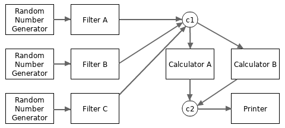

# Примеры использования каналов

[Статья](https://go101.org/article/channel-use-cases.html)


Перед прочтением этой статьи рекомендуется ознакомиться с материалом «[Каналы в Go](https://go101.org/article/channel.html)», где подробно объясняются типы и значения каналов. Новичкам в Go может потребоваться несколько раз перечитать обе статьи, чтобы лучше понять программирование с использованием каналов.

В оставшейся части статьи будут рассмотрены различные сценарии использования каналов. Надеюсь, что этот материал убедит вас в том, что:

- асинхронное и конкурентное программирование с каналами в Go — это просто и удобно;
- техника синхронизации с помощью каналов более универсальна и гибка, чем некоторые другие решения, используемые в других языках, такие как [модель акторов](https://en.wikipedia.org/wiki/Actor_model) или [паттерн async/await](https://en.wikipedia.org/wiki/Async/await).

Важно помнить, что цель данной статьи — продемонстрировать как можно больше вариантов использования каналов. Однако каналы — не единственный метод синхронизации в Go, и в некоторых случаях их использование может быть не самым эффективным решением. Чтобы изучить альтернативные подходы, ознакомьтесь со статьями о[ атомарных операциях](https://go101.org/article/concurrent-atomic-operation.html) и [других техниках синхронизации в Go](https://go101.org/article/concurrent-synchronization-more.html).

## Использование каналов как Future/Promise
В языках программирования, таких как JavaScript, Python и Java, широко применяются Future и Promise. Они используются для обработки асинхронных запросов и получения результатов после их выполнения.

### Возвращение каналов только для получения (`<-chan`) в качестве результата

Рассмотрим следующий пример. Функция `sumSquares` вычисляет сумму квадратов двух чисел, получаемых асинхронно. Операции получения значений из каналов блокируются до тех пор, пока в соответствующий канал не будет отправлено значение. В результате вычисление занимает всего три секунды, а не шесть, что позволяет значительно сократить время выполнения.

```go
package main

import (
	"time"
	"math/rand"
	"fmt"
)

func longTimeRequest() <-chan int32 {
	r := make(chan int32)

	go func() {
		// Simulate a workload.
		time.Sleep(time.Second * 3)
		r <- rand.Int31n(100)
	}()

	return r
}

func sumSquares(a, b int32) int32 {
	return a*a + b*b
}

func main() {
	rand.Seed(time.Now().UnixNano()) // needed before Go 1.20

	a, b := longTimeRequest(), longTimeRequest()
	fmt.Println(sumSquares(<-a, <-b))
}
```

### Передача каналов только для отправки (`chan<-`) в качестве аргументов

Как и в предыдущем примере, в следующем коде два аргумента функции `sumSquares` запрашиваются конкурентно. Однако, в отличие от прошлого примера, функция `longTimeRequest` принимает канал только для отправки (`chan<- int`) в качестве параметра, вместо того чтобы возвращать канал только для чтения (`<-chan int`).

```go
package main

import (
	"time"
	"math/rand"
	"fmt"
)

func longTimeRequest(r chan<- int32)  {
	// Simulate a workload.
	time.Sleep(time.Second * 3)
	r <- rand.Int31n(100)
}

func sumSquares(a, b int32) int32 {
	return a*a + b*b
}

func main() {
	rand.Seed(time.Now().UnixNano()) // needed before Go 1.20

	ra, rb := make(chan int32), make(chan int32)
	go longTimeRequest(ra)
	go longTimeRequest(rb)

	fmt.Println(sumSquares(<-ra, <-rb))
}
```

На самом деле, в указанном выше примере нам не нужно два канала для передачи результатов. Достаточно использовать один канал.

```go
...

	// The channel can be buffered or not.
	results := make(chan int32, 2)
	go longTimeRequest(results)
	go longTimeRequest(results)

	fmt.Println(sumSquares(<-results, <-results))
}
```

Это своего рода агрегация данных, о которой будет сказано дальше.


### Первый ответ побеждает

Это улучшенная версия варианта с использованием одного канала из предыдущего примера.

Иногда данные можно получить из нескольких источников, чтобы снизить задержки. Однако из-за различных факторов время отклика разных источников может значительно отличаться. Даже у одного источника время ответа не всегда одинаково.

Чтобы минимизировать задержку, можно отправить запрос ко всем источникам одновременно в отдельных горутинах. При этом будет использован только первый полученный ответ, а остальные (более медленные) будут проигнорированы.

Важное замечание
Если источников **N**, то ёмкость канала должна быть не менее **N-1**, чтобы избежать блокировки горутин, чьи ответы были отброшены.

```go
package main

import (
	"fmt"
	"time"
	"math/rand"
)

func source(c chan<- int32) {
	ra, rb := rand.Int31(), rand.Intn(3) + 1
	// Sleep 1s/2s/3s.
	time.Sleep(time.Duration(rb) * time.Second)
	c <- ra
}

func main() {
	rand.Seed(time.Now().UnixNano()) // needed before Go 1.20

	startTime := time.Now()
	// c must be a buffered channel.
	c := make(chan int32, 5)
	for i := 0; i < cap(c); i++ {
		go source(c)
	}
	// Only the first response will be used.
	rnd := <- c
	fmt.Println(time.Since(startTime))
	fmt.Println(rnd)
}
```

Существует несколько других способов реализовать сценарий «первый ответ побеждает», используя механизм `select` и буферизированный канал с ёмкостью 1. Другие методы будут рассмотрены ниже.

### Другие варианты запросов-ответов

Каналы параметров и результатов могут быть буферизированными, чтобы стороне, отправляющей ответ, не приходилось ждать, пока сторона, отправляющая запрос, заберёт переданные данные.

Иногда запрос может не вернуть корректный ответ. По разным причинам может возникнуть ошибка. В таких случаях можно использовать структуру вида `struct{ v T; err error }` или пустой интерфейс `interface{}` в качестве типа данных канала.

В некоторых случаях ответ может приходить гораздо дольше, чем ожидалось, или вовсе не приходить. В таких ситуациях можно использовать механизм тайм-аута, который будет рассмотрен далее.

Иногда ответ может представлять последовательность значений. Это своего рода механизм потока данных, который будет описан далее.

### Использование каналов для уведомлений

Уведомления можно рассматривать как особый вид запросов-ответов, в которых значение ответа не имеет значения.

Обычно в качестве типа данных используется пустая структура `struct{}`, так как её размер равен нулю, а значит, её значения не занимают память.

#### Уведомления 1-к-1 через отправку значения в канал

Если в канале нет доступных значений для чтения, следующая операция получения заблокируется, пока другая горутина не отправит туда данные.

Таким образом, можно отправлять значение в канал, чтобы уведомить другую горутину, которая ожидает данные из этого же канала.

В следующем примере канал `done` используется как сигнальный канал для отправки уведомлений.

```go
package main

import (
	"crypto/rand"
	"fmt"
	"os"
	"sort"
)

func main() {
	values := make([]byte, 32 * 1024 * 1024)
	if _, err := rand.Read(values); err != nil {
		fmt.Println(err)
		os.Exit(1)
	}

	done := make(chan struct{}) // can be buffered or not

	// The sorting goroutine
	go func() {
		sort.Slice(values, func(i, j int) bool {
			return values[i] < values[j]
		})
		// Notify sorting is done.
		done <- struct{}{}
	}()

	// do some other things ...

	<- done // waiting here for notification
	fmt.Println(values[0], values[len(values)-1])
}
```

#### Уведомление 1-к-1 через получение значения из канала

Если буфер значений канала заполнен (**VBQ**) (у небуферизированного канала буфер значений всегда считается заполненным), то операция отправки в канал заблокируется, пока другая горутина не получит значение из этого канала.

Таким образом, можно получать значение из канала, чтобы уведомить другую горутину, которая ожидает возможности отправить данные в этот же канал.

Как правило, для такого способа уведомления используется небуферизированный канал.

Этот метод реже используется, чем способ, рассмотренный в предыдущем примере.

```go
package main

import (
	"fmt"
	"time"
)

func main() {
	done := make(chan struct{})
		// The capacity of the signal channel can
		// also be one. If this is true, then a
		// value must be sent to the channel before
		// creating the following goroutine.

	go func() {
		fmt.Print("Hello")
		// Simulate a workload.
		time.Sleep(time.Second * 2)

		// Receive a value from the done
		// channel, to unblock the second
		// send in main goroutine.
		<- done
	}()

	// Blocked here, wait for a notification.
	done <- struct{}{}
	fmt.Println(" world!")
}
```

На самом деле, **фундаментальных различий** между уведомлением через отправку и получение значений нет. Оба подхода можно обобщить так: быстрые горутины уведомляются медленными.

#### Уведомления N-к-1 и 1-к-N

Небольшое расширение рассмотренных выше случаев позволяет легко реализовать механизмы уведомлений **N-к-1** и **1-к-N**.

```go
package main

import "log"
import "time"

type T = struct{}

func worker(id int, ready <-chan T, done chan<- T) {
	<-ready // block here and wait a notification
	log.Print("Worker#", id, " starts.")
	// Simulate a workload.
	time.Sleep(time.Second * time.Duration(id+1))
	log.Print("Worker#", id, " job done.")
	// Notify the main goroutine (N-to-1),
	done <- T{}
}

func main() {
	log.SetFlags(0)

	ready, done := make(chan T), make(chan T)
	go worker(0, ready, done)
	go worker(1, ready, done)
	go worker(2, ready, done)

	// Simulate an initialization phase.
	time.Sleep(time.Second * 3 / 2)
	// 1-to-N notifications.
	ready <- T{}; ready <- T{}; ready <- T{}
	// Being N-to-1 notified.
	<-done; <-done; <-done
}
``` 

На самом деле, методы 1-к-N и N-к-1 уведомлений, рассмотренные в этом разделе, редко используются на практике.

Как делают в реальных задачах:
Для N-к-1 уведомлений чаще применяют sync.WaitGroup.
Для 1-к-N уведомлений обычно закрывают канал.
Подробнее об этом читайте в следующем разделе.

#### Широковещательные (1-к-N) уведомления через закрытие канала

Метод 1-к-N уведомлений из предыдущего раздела практически не используется, так как существует более удобный способ.

Благодаря тому, что из закрытого канала можно бесконечно получать значения, можно просто закрыть канал, чтобы расслать уведомления всем горутинам.

Например, в предыдущем примере три операции отправки `ready <- struct{}{}` можно заменить одной операцией `close(ready)`, чтобы реализовать 1-к-N уведомление.

```go
...
	close(ready) // broadcast notifications
...
```


Конечно, закрытие канала можно использовать и для 1-к-1 уведомлений.
На практике это самый распространённый способ уведомлений в Go.

Особенность, что из закрытого канала можно бесконечно получать значения, используется во многих других сценариях, которые будут рассмотрены ниже.
Более того, эта особенность активно применяется в стандартной библиотеке Go.

Пример:
Пакет `context` использует этот механизм для обработки отмены операций.


### Таймер: Запланированное уведомление

С помощью каналов легко реализовать одноразовые таймеры.

Пример реализации кастомного одноразового таймера:


```go
package main

import (
	"fmt"
	"time"
)

func AfterDuration(d time.Duration) <- chan struct{} {
	c := make(chan struct{}, 1)
	go func() {
		time.Sleep(d)
		c <- struct{}{}
	}()
	return c
}

func main() {
	fmt.Println("Hi!")
	<- AfterDuration(time.Second)
	fmt.Println("Hello!")
	<- AfterDuration(time.Second)
	fmt.Println("Bye!")
}
```


Функция `After` из стандартного пакета `time` предоставляет ту же функциональность,
но с гораздо более эффективной реализацией.

Лучше использовать `time.After(aDuration)`,
так код будет выглядеть чище и понятнее.

Важно:
Выражение `<-time.After(aDuration)`
заблокирует выполнение текущей горутины,
в то время как вызов `time.Sleep(aDuration)` не создаёт блокирующей операции.

Механизм `<-time.After(aDuration)` часто используется для реализации таймаутов, о которых будет рассказано дальше.

## Использование каналов как мьютексов
Ранее уже упоминалось, что буферизированные каналы с ёмкостью 1 могут быть использованы как одноразовые [бинарные семафоры](https://en.wikipedia.org/wiki/Semaphore_(programming)).

На самом деле, такие каналы можно использовать и как мьютексы, но они менее эффективны, чем мьютексы из пакета `sync`.

Способы использования каналов как мьютексов:
- Блокировка через отправку (`send`), разблокировка через приём (`receive`).
- Блокировка через приём (`receive`), разблокировка через отправку (`send`).

Следующий пример демонстрирует вариант с блокировкой через отправку.

```go
package main

import "fmt"

func main() {
	// The capacity must be one.
	mutex := make(chan struct{}, 1)

	counter := 0
	increase := func() {
		mutex <- struct{}{} // lock
		counter++
		<-mutex // unlock
	}

	increase1000 := func(done chan<- struct{}) {
		for i := 0; i < 1000; i++ {
			increase()
		}
		done <- struct{}{}
	}

	done := make(chan struct{})
	go increase1000(done)
	go increase1000(done)
	<-done; <-done
	fmt.Println(counter) // 2000
}
```

Следующий пример демонстрирует вариант с блокировкой через приём (`receive`). Он показывает только изменённую часть по сравнению с предыдущим примером, где использовалась блокировка через отправку (`send`).

```go
...
func main() {
	mutex := make(chan struct{}, 1)
	mutex <- struct{}{} // this line is needed.

	counter := 0
	increase := func() {
		<-mutex // lock
		counter++
		mutex <- struct{}{} // unlock
	}
...
```

## Использование каналов как счётных семафоров
Буферизированные каналы можно использовать в качестве [счётных семафоров](https://en.wikipedia.org/wiki/Semaphore_(programming)). Счётные семафоры можно рассматривать как многопользовательские блокировки. Если ёмкость канала равна **N**, то его можно воспринимать как блокировку,
у которой в любой момент времени может быть не более **N** владельцев.

Бинарные семафоры (мьютексы) являются частным случаем счётных семафоров, где в каждый момент времени может быть не более одного владельца.

Счётные семафоры часто используются для ограничения количества одновременных запросов.

Способы использования каналов как семафоров:
Как и при использовании каналов в качестве мьютексов, есть два способа получения прав владения семафором:

- Получение права через **отправку** (**send**), освобождение через **приём** (**receive**).
- Получение права через **приём** (**receive**), освобождение через отправку (**send**).

Пример получения права владения через приём значений из канала:

```go
package main

import (
	"log"
	"time"
	"math/rand"
)

type Seat int
type Bar chan Seat

func (bar Bar) ServeCustomer(c int) {
	log.Print("customer#", c, " enters the bar")
	seat := <- bar // need a seat to drink
	log.Print("++ customer#", c, " drinks at seat#", seat)
	time.Sleep(time.Second * time.Duration(2 + rand.Intn(6)))
	log.Print("-- customer#", c, " frees seat#", seat)
	bar <- seat // free seat and leave the bar
}

func main() {

	// the bar has 10 seats.
	bar24x7 := make(Bar, 10)
	// Place seats in an bar.
	for seatId := 0; seatId < cap(bar24x7); seatId++ {
		// None of the sends will block.
		bar24x7 <- Seat(seatId)
	}

	for customerId := 0; ; customerId++ {
		time.Sleep(time.Second)
		go bar24x7.ServeCustomer(customerId)
	}

	// sleeping != blocking
	for {time.Sleep(time.Second)}
}
```

В приведённом выше примере только те клиенты, которые получили место, могут пить. Следовательно, в любой момент времени не более десяти клиентов могут пить.

Последний `for`-цикл в `main`-функции нужен, чтобы программа не завершилась раньше времени.
Существует более правильный способ решения этой задачи, который будет представлен далее.

Хотя одновременно пить могут не более десяти клиентов,
в баре может находиться большее количество клиентов.
Некоторые клиенты ждут свободного места.

Хотя каждая горутина клиента потребляет гораздо меньше ресурсов, чем системный поток, суммарные затраты ресурсов при большом количестве горутин могут быть значительными.

Поэтому лучше создавать горутину клиента только в том случае, если есть свободное место.

```go
... // same code as the above example

func (bar Bar) ServeCustomerAtSeat(c int, seat Seat) {
	log.Print("++ customer#", c, " drinks at seat#", seat)
	time.Sleep(time.Second * time.Duration(2 + rand.Intn(6)))
	log.Print("-- customer#", c, " frees seat#", seat)
	bar <- seat // free seat and leave the bar
}

func main() {
	bar24x7 := make(Bar, 10)
	for seatId := 0; seatId < cap(bar24x7); seatId++ {
		bar24x7 <- Seat(seatId)
	}

	for customerId := 0; ; customerId++ {
		time.Sleep(time.Second)
		// Need a seat to serve next customer.
		seat := <- bar24x7
		go bar24x7.ServeCustomerAtSeat(customerId, seat)
	}
	for {time.Sleep(time.Second)}
}
```


В оптимизированной версии программы в любой момент времени будет существовать **не более десяти активных** горутин клиентов (но за время работы программы все равно **будет создано много горутин клиентов**).

В более эффективной реализации, представленной ниже,
за всё время работы программы будет создано не более десяти обслуживающих горутин клиентов.


```GO
... // same code as the above example

func (bar Bar) ServeCustomerAtSeat(consumers chan int) {
	for c := range consumers {
		seatId := <- bar
		log.Print("++ customer#", c, " drinks at seat#", seatId)
		time.Sleep(time.Second * time.Duration(2 + rand.Intn(6)))
		log.Print("-- customer#", c, " frees seat#", seatId)
		bar <- seatId // free seat and leave the bar
	}
}

func main() {
	bar24x7 := make(Bar, 10)
	for seatId := 0; seatId < cap(bar24x7); seatId++ {
		bar24x7 <- Seat(seatId)
	}

	consumers := make(chan int)
	for i := 0; i < cap(bar24x7); i++ {
		go bar24x7.ServeCustomerAtSeat(consumers)
	}
	
	for customerId := 0; ; customerId++ {
		time.Sleep(time.Second)
		consumers <- customerId
	}
}
```

Не по теме: конечно, если нам не важны идентификаторы мест (что часто встречается на практике), то **семафор bar24x7 вообще не нужен**.

```go
... // same code as the above example

func ServeCustomer(consumers chan int) {
	for c := range consumers {
		log.Print("++ customer#", c, " drinks at the bar")
		time.Sleep(time.Second * time.Duration(2 + rand.Intn(6)))
		log.Print("-- customer#", c, " leaves the bar")
	}
}

func main() {
	const BarSeatCount = 10
	consumers := make(chan int)
	for i := 0; i < BarSeatCount; i++ {
		go ServeCustomer(consumers)
	}
	
	for customerId := 0; ; customerId++ {
		time.Sleep(time.Second)
		consumers <- customerId
	}
}
```


Способ получения владения семафором через отправку сравнительно проще. Шаг размещения мест **не требуется**.

```go
package main

import (
	"log"
	"time"
	"math/rand"
)

type Customer struct{id int}
type Bar chan Customer

func (bar Bar) ServeCustomer(c Customer) {
	log.Print("++ customer#", c.id, " starts drinking")
	time.Sleep(time.Second * time.Duration(3 + rand.Intn(16)))
	log.Print("-- customer#", c.id, " leaves the bar")
	<- bar // leaves the bar and save a space
}

func main() {
	// The bar can serve most 10 customers
	// at the same time.
	bar24x7 := make(Bar, 10)
	for customerId := 0; ; customerId++ {
		time.Sleep(time.Second * 2)
		customer := Customer{customerId}
		// Wait to enter the bar.
		bar24x7 <- customer
		go bar24x7.ServeCustomer(customer)
	}
	for {time.Sleep(time.Second)}
}
```

### Диалог (Пинг-Понг)
Две горутины могут взаимодействовать через канал. Ниже приведён пример, который выводит последовательность чисел Фибоначчи.

```go
package main

import "fmt"
import "time"
import "os"

type Ball uint64

func Play(playerName string, table chan Ball) {
	var lastValue Ball = 1
	for {
		ball := <- table // get the ball
		fmt.Println(playerName, ball)
		ball += lastValue
		if ball < lastValue { // overflow
			os.Exit(0)
		}
		lastValue = ball
		table <- ball // bat back the ball
		time.Sleep(time.Second)
	}
}

func main() {
	table := make(chan Ball)
	go func() {
		table <- 1 // throw ball on table
	}()
	go Play("A:", table)
	Play("B:", table)
}
```

## Канал, инкапсулированный в канал

Иногда мы можем использовать тип канала в качестве типа элементов другого канала. В следующем примере `chan chan<- int` — это тип канала, элементы которого представляют собой каналы только для отправки (`chan<- int`).

```go
package main

import "fmt"

var counter = func (n int) chan<- chan<- int {
	requests := make(chan chan<- int)
	go func() {
		for request := range requests {
			if request == nil {
				n++ // increase
			} else {
				request <- n // take out
			}
		}
	}()

	// Implicitly converted to chan<- (chan<- int)
	return requests
}(0)

func main() {
	increase1000 := func(done chan<- struct{}) {
		for i := 0; i < 1000; i++ {
			counter <- nil
		}
		done <- struct{}{}
	}

	done := make(chan struct{})
	go increase1000(done)
	go increase1000(done)
	<-done; <-done

	request := make(chan int, 1)
	counter <- request
	fmt.Println(<-request) // 2000
}
```

Хотя в данном случае использование инкапсуляции может быть не самым эффективным способом реализации, этот подход может быть полезен в других сценариях.

## Проверка длины и емкости каналов

Мы можем использовать встроенные функции `len` и `cap`, чтобы проверить длину и емкость канала. Однако на практике это делается редко.

Причина, по которой мы редко используем `len` для проверки длины канала, заключается в том, что длина канала может измениться после того, как вызов `len` вернет значение.
Причина, по которой мы редко используем `cap` для проверки емкости канала, состоит в том, что емкость канала обычно известна заранее или не имеет большого значения.

Однако существуют сценарии, в которых эти функции полезны. Например, если нам нужно получить все значения, находящиеся в буфере не закрытого канала `c`, в который больше не будут отправляться данные, мы можем использовать следующий код для получения оставшихся значений.

```go
// Assume the current goroutine is the only
// goroutine tries to receive values from
// the channel c at present.
for len(c) > 0 {
	value := <-c
	// use value ...
}
```

Мы также можем использовать механизм «**попытки получения**» (**try-receive**), который будет рассмотрен ниже, для выполнения той же задачи. Эффективность обоих подходов примерно одинаковая. Преимущество механизма **try-receive** заключается в том, что текущая горутина не обязана быть единственной получающей горутиной.

Иногда горутина может захотеть записывать значения в буферизированный канал `c` до его заполнения, при этом избегая блокировки в конце. Если эта горутина является единственным отправителем в канал, то для выполнения этой задачи можно использовать следующий код.

```go
for len(c) < cap(c) {
	c <- aValue
}
```

Конечно, мы также можем использовать механизм **try-send**, представленный ниже, для выполнения той же работы.

## Блокировка текущей горутины навсегда
Механизм `select` — это уникальная особенность Go, которая предоставляет множество паттернов и трюков для конкурентного программирования. О правилах выполнения кода с использованием select можно прочитать в статье [о каналах в Go](https://go101.org/article/channel.html#select).

Мы можем использовать пустой блок `select{}` для бесконечной блокировки текущей горутины. Это самый простой вариант использования механизма `select`. Фактически, некоторые случаи использования `for { time.Sleep(time.Second) }` в примерах выше можно заменить на `select{}`.

Обычно `select{}` применяется для предотвращения завершения главной горутины, так как если главная горутина завершится, завершится и вся программа.

Пример:

```go
package main

import "runtime"

func DoSomething() {
	for {
		// do something ...

		runtime.Gosched() // avoid being greedy
	}
}

func main() {
	go DoSomething()
	go DoSomething()
	select{}
}
```

Кстати, существуют и другие способы заблокировать горутину навсегда, но использование `select{}` — самый простой из них.

## Попытка отправки (**Try-Send**) и попытка получения (Try-Receive)

Блок `select` с одной ветвью `default` и одной ветвью `case` называется операцией `try-send` или `try-receive`, в зависимости от того, выполняется ли в `case` операция **отправки** или **получения** данных из канала.

- Если после ключевого слова `case` выполняется **операция отправки**, то такой блок `select` называется `try-send`. Если операция отправки привела бы к блокировке, выполняется `default` (отправка не удалась), иначе отправка проходит успешно, и выполняется `case`.
- Если после ключевого слова `case` выполняется операция получения, то такой блок `select` называется `try-receive`. Если операция получения привела бы к блокировке, выполняется `default` (получение не удалось), иначе получение проходит успешно, и выполняется `case`.

Операции `try-send` и `try-receive` никогда не блокируются.

Стандартный компилятор Go выполняет специальные оптимизации для таких блоков `select`, поэтому их эффективность гораздо выше, чем у блоков `select` с несколькими ветвями `case`.

Вот пример, демонстрирующий работу `try-send` и `try-receive`.

```go
package main

import "fmt"

func main() {
	type Book struct{id int}
	bookshelf := make(chan Book, 3)

	for i := 0; i < cap(bookshelf) * 2; i++ {
		select {
		case bookshelf <- Book{id: i}:
			fmt.Println("succeeded to put book", i)
		default:
			fmt.Println("failed to put book")
		}
	}

	for i := 0; i < cap(bookshelf) * 2; i++ {
		select {
		case book := <-bookshelf:
			fmt.Println("succeeded to get book", book.id)
		default:
			fmt.Println("failed to get book")
		}
	}
}
```

Вывод приведённой выше программы:

```go
succeed to put book 0
succeed to put book 1
succeed to put book 2
failed to put book
failed to put book
failed to put book
succeed to get book 0
succeed to get book 1
succeed to get book 2
failed to get book
failed to get book
failed to get book
```

## Проверка, закрыт ли канал, без блокировки текущей горутины

Если гарантируется, что в канал никогда не отправлялись (и не будут отправляться) значения, то мы можем использовать следующий код для безопасной (и конкурентной) проверки того, закрыт ли канал, без блокировки текущей горутины. Здесь `T` — это тип элементов соответствующего канала.

```go
func IsClosed(c chan T) bool {
	select {
	case <-c:
		return true
	default:
	}
	return false
}
```

Этот способ проверки, закрыт ли канал, широко используется в конкурентном программировании на Go для определения, была ли получена уведомление. Уведомление передаётся через закрытие канала в другой горутине.

## Ограничение пиковых значений/всплесков (Peak/Burst Limiting)

Мы можем реализовать ограничение пиковых значений, комбинируя [использование каналов как счётных семафоров](https://go101.org/article/channel-use-cases.html#semaphore) и операциями `try-send`/`try-receive`. Ограничение пиковых значений (или ограничение всплесков) часто используется для ограничения количества одновременных запросов без блокировки запросов.

Ниже приведена изменённая версия последнего примера из раздела [использования каналов как счётных семафоров](https://go101.org/article/channel-use-cases.html#semaphore).

```go
...
	// Can serve most 10 customers at the same time
	bar24x7 := make(Bar, 10)
	for customerId := 0; ; customerId++ {
		time.Sleep(time.Second)
		customer := Consumer{customerId}
		select {
		case bar24x7 <- customer: // try to enter the bar
			go bar24x7.ServeConsumer(customer)
		default:
			log.Print("customer#", customerId, " goes elsewhere")
		}
	}
...
```

## Другой способ реализации сценария "первый отклик побеждает" **first-response-wins**

Как упоминалось выше, мы можем использовать механизм select (`try-send`) с буферизированным каналом, ёмкость которого составляет хотя бы один, чтобы реализовать сценарий "первый отклик побеждает".

Например:

```go
package main

import (
	"fmt"
	"math/rand"
	"time"
)

func source(c chan<- int32) {
	ra, rb := rand.Int31(), rand.Intn(3)+1
	// Sleep 1s, 2s or 3s.
	time.Sleep(time.Duration(rb) * time.Second)
	select {
	case c <- ra:
	default:
	}
}

func main() {
	// The capacity should be at least 1.
	c := make(chan int32, 1)
	for i := 0; i < 5; i++ {
		go source(c)
	}
	rnd := <-c // only the first response is used
	fmt.Println(rnd)
}
```

Обратите внимание, что ёмкость канала, используемого в приведённом примере, должна быть как минимум равна одному, чтобы первый send не был пропущен, если сторона получателя/запроса не была готова вовремя.

### Третий способ реализации сценария "первый отклик побеждает"

Для сценария "первый отклик побеждает", если количество источников невелико, например, два или три, мы можем использовать блок select, чтобы одновременно получить отклики от источников.

Например,
```go
package main

import (
	"fmt"
	"math/rand"
	"time"
)

func source() <-chan int32 {
	// c must be a buffered channel.
	c := make(chan int32, 1)
	go func() {
		ra, rb := rand.Int31(), rand.Intn(3)+1
		time.Sleep(time.Duration(rb) * time.Second)
		c <- ra
	}()
	return c
}

func main() {
	var rnd int32
	// Blocking here until one source responses.
	select{
	case rnd = <-source():
	case rnd = <-source():
	case rnd = <-source():
	}
	fmt.Println(rnd)
}
```

Примечание
Если в приведённом выше примере используется небуферизованным (unbuffered) канал, то после выполнения блока `select` две горутины зависнут навсегда. Это приведёт [к утечке памяти](https://go101.org/article/memory-leaking.html#hanging-goroutine).

Оба способа, рассмотренные в текущем и предыдущем разделах, также могут использоваться для реализации уведомлений по схеме "N-к-1".

## Тайм-аут
В некоторых сценариях "запрос-ответ" по разным причинам выполнение запроса может занять слишком много времени или даже никогда не завершиться. В таких случаях необходимо вернуть клиенту сообщение об ошибке, используя механизм тайм-аута.

Такой механизм можно реализовать с помощью `select`.
Пример кода, показывающий, как выполнить запрос с тайм-аутом:

```go
func requestWithTimeout(timeout time.Duration) (int, error) {
	c := make(chan int)
	// May need a long time to get the response.
	go doRequest(c)

	select {
	case data := <-c:
		return data, nil
	case <-time.After(timeout):
		return 0, errors.New("timeout")
	}
}
```

## Таймер (Ticker)
Мы можем использовать механизм `try-send` для реализации тикера (ticker).

```go
package main

import "fmt"
import "time"

func Tick(d time.Duration) <-chan struct{} {
	// The capacity of c is best set as one.
	c := make(chan struct{}, 1)
	go func() {
		for {
			time.Sleep(d)
			select {
			case c <- struct{}{}:
			default:
			}
		}
	}()
	return c
}

func main() {
	t := time.Now()
	for range Tick(time.Second) {
		fmt.Println(time.Since(t))
	}
}
```

На самом деле, в стандартном пакете `time` есть функция `Tick`, которая предоставляет аналогичный функционал, но с гораздо более эффективной реализацией. Лучше использовать именно её, чтобы код был чище и работал быстрее.

## Ограничение скорости (Rate Limiting)
В одном из предыдущих разделов было показано, как использовать try-send для [ограничения пиковых нагрузок (peak limiting)](https://go101.org/article/channel-use-cases.html#peak-limiting). Мы также можем использовать try-send для ограничения скорости (rate limiting) с помощью тикера (ticker).

На практике ограничение скорости часто используется для предотвращения превышения квот и истощения ресурсов.

Ниже приведён пример, позаимствованный у jh из [официальной Go Wiki](https://github.com/golang/go/wiki/RateLimiting). В этом примере количество обработанных запросов в любой минутный интервал не превышает 200.

```go
package main

import "fmt"
import "time"

type Request interface{}
func handle(r Request) {fmt.Println(r.(int))}

const RateLimitPeriod = time.Minute
const RateLimit = 200 // most 200 requests in one minute

func handleRequests(requests <-chan Request) {
	quotas := make(chan time.Time, RateLimit)

	go func() {
		tick := time.NewTicker(RateLimitPeriod / RateLimit)
		defer tick.Stop()
		for t := range tick.C {
			select {
			case quotas <- t:
			default:
			}
		}
	}()

	for r := range requests {
		<-quotas
		go handle(r)
	}
}

func main() {
	requests := make(chan Request)
	go handleRequests(requests)
	// time.Sleep(time.Minute)
	for i := 0; ; i++ {requests <- i}
}
```

На практике часто используется сочетание ограничений скорости (rate-limit) и пиковых нагрузок (peak/burst-limit).

### Переключатели (Switches)
Из статьи [о каналах в Go](https://go101.org/article/channel.html) мы знаем, что отправка значения в nil-канал или получение значения из nil-канала — это блокирующие операции. Используя этот факт, мы можем динамически изменять каналы, участвующие в `case`-операциях блока `select`, чтобы влиять на выбор выполняемой ветви.

Ниже приведён ещё один пример с "пинг-понгом", реализованный с помощью `select`. В этом примере одна из двух переменных-каналов, участвующих в блоке `select`, равна nil. Ветка `case`, связанная с nil-каналом, никогда не будет выбрана. Можно считать, что такие ветки находятся в выключенном (off) состоянии. В конце каждой итерации статусы включения/выключения (on/off) двух веток переключаются.

```go
package main

import "fmt"
import "time"
import "os"

type Ball uint8
func Play(playerName string, table chan Ball, serve bool) {
	var receive, send chan Ball
	if serve {
		receive, send = nil, table
	} else {
		receive, send = table, nil
	}
	var lastValue Ball = 1
	for {
		select {
		case send <- lastValue:
		case value := <- receive:
			fmt.Println(playerName, value)
			value += lastValue
			if value < lastValue { // overflow
				os.Exit(0)
			}
			lastValue = value
		}
		// Switch on/off.
		receive, send = send, receive
		time.Sleep(time.Second)
	}
}

func main() {
	table := make(chan Ball)
	go Play("A:", table, false)
	Play("B:", table, true)
}
```

Ниже приведён ещё один (неконкурентный) пример, который намного проще и также демонстрирует эффект переключения.

При выполнении этот пример будет выводить `1212....` Он не имеет особого практического применения, но показан здесь в учебных целях.

```go
package main

import "fmt"
import "time"

func main() {
	for c := make(chan struct{}, 1); true; {
		select {
		case c <- struct{}{}:
			fmt.Print("1")
		case <-c:
			fmt.Print("2")
		}
		time.Sleep(time.Second)
	}
}
```

## Управление вероятностью выполнения кода
Мы можем дублировать ветку `case` в блоке `select`, чтобы увеличить вероятность выполнения соответствующего кода.

Пример:

```go
package main

import "fmt"

func main() {
	foo, bar := make(chan struct{}), make(chan struct{})
	close(foo); close(bar) // for demo purpose
	x, y := 0.0, 0.0
	f := func(){x++}
	g := func(){y++}
	for i := 0; i < 100000; i++ {
		select {
		case <-foo: f()
		case <-foo: f()
		case <-bar: g()
		}
	}
	fmt.Println(x/y) // about 2
}
```

Вероятность вызова функции `f` примерно в два раза выше, чем вероятность вызова функции `g`.

## Выбор из динамического количества case
Хотя количество ветвей в блоке `select` фиксировано, мы можем использовать возможности пакета `reflect`, чтобы создать блок `select` во время выполнения. Такой динамически созданный блок может иметь произвольное количество `case`-веток. Однако стоит отметить, что использование рефлексии менее эффективно, чем фиксированный вариант.

Стандартный пакет `reflect` также предоставляет функции `TrySend` и `TryRecv` для реализации блоков `select`, содержащих одну `case`-ветку и `default`.

## Манипуляции с потоками данных
В этом разделе будут рассмотрены примеры управления потоками данных с использованием каналов.

Обычно приложение, работающее с потоками данных, состоит из множества модулей, каждый из которых выполняет определённую задачу. Каждый модуль может содержать одного или несколько рабочих процессов (goroutine), которые параллельно выполняют заданную для модуля работу.

Примеры задач, выполняемых модулями:

- Генерация/сбор/загрузка данных
- Обслуживание/сохранение данных
- Вычисления/анализ данных
- Проверка/фильтрация данных
- Агрегация/разделение данных
- Композиция/декомпозиция данных
- Дублирование/распространение данных

Рабочий процесс (goroutine) модуля может получать данные из нескольких других модулей (входной поток) и передавать их в другие модули (выходной поток). Таким образом, модуль может быть как потребителем, так и производителем данных.

Модуль, который отправляет данные только некоторым другим модулям, но никогда не получает данные от других модулей, называется **модулем-производителем**. Модуль, который получает данные только от некоторых других модулей, но никогда не отправляет данные другим модулям, называется **модулем-потребителем**.

Несколько модулей вместе формируют систему обработки потоков данных.

### Генерация/сбор/загрузка данных
Существует множество модулей, которые являются только производителями данных. Рабочий процесс такого модуля может создавать поток данных различными способами:

- загружая данные из файла, базы данных или веб-ресурсов,
- собирая метрики из программных систем и аппаратных устройств,
- генерируя случайные числа и т. д.

В качестве примера рассмотрим генератор случайных чисел. Функция генератора возвращает одно значение и не принимает аргументов.

```go
import (
	"crypto/rand"
	"encoding/binary"
)

func RandomGenerator() <-chan uint64 {
	c := make(chan uint64)
	go func() {
		rnds := make([]byte, 8)
		for {
			_, err := rand.Read(rnds)
			if err != nil {
				close(c)
				break
			}
			c <- binary.BigEndian.Uint64(rnds)
		}
	}()
	return c
}
```

На самом деле, генератор случайных чисел можно рассматривать как объект с несколькими возвращаемыми значениями (multi-return future/promise).

Производитель данных может закрыть канал выходного потока в любой момент, чтобы завершить процесс генерации данных.

### Агрегация данных
Рабочий процесс (worker) модуля агрегации данных объединяет несколько потоков данных одного типа в один. Например, если тип данных — это `int64`, то следующая функция может агрегировать произвольное количество потоков данных в один.

```go
func Aggregator(inputs ...<-chan uint64) <-chan uint64 {
	out := make(chan uint64)
	for _, in := range inputs {
		go func(in <-chan uint64) {
			for {
				out <- <-in // <=> out <- (<-in)
			}
		}(in)
	}
	return out
}
```

Более эффективная реализация должна учитывать, был ли закрыт входной поток данных. Это также актуально для других реализаций рабочих процессов (worker) модулей, рассмотренных ниже.

```go
import "sync"

func Aggregator(inputs ...<-chan uint64) <-chan uint64 {
	output := make(chan uint64)
	var wg sync.WaitGroup
	for _, in := range inputs {
		wg.Add(1)
		go func(int <-chan uint64) {
			defer wg.Done()
			// If in is closed, then the
			// loop will ends eventually.
			for x := range in {
				output <- x
			}
		}(in)
	}
	go func() {
		wg.Wait()
		close(output)
	}()
	return output
}
```

Если количество агрегируемых потоков данных очень мало (два или три), можно использовать блок `select` для их объединения.

```go
// Assume the number of input stream is two.
...
	output := make(chan uint64)
	go func() {
		inA, inB := inputs[0], inputs[1]
		for {
			select {
			case v := <- inA: output <- v
			case v := <- inB: output <- v
			}
		}
	}
...
```

### Разделение данных
Рабочий процесс (worker) модуля разделения данных выполняет операцию, обратную агрегации данных.

Реализовать такой модуль несложно, но на практике разделяющие модули не очень полезны и редко применяются.

```go
func Divisor(input <-chan uint64, outputs ...chan<- uint64) {
	for _, out := range outputs {
		go func(o chan<- uint64) {
			for {
				o <- <-input // <=> o <- (<-input)
			}
		}(out)
	}
}
```

### Композиция данных
Рабочий процесс (worker) модуля композиции данных объединяет несколько фрагментов данных из разных входных потоков в единый объект данных.

Ниже приведён пример такого рабочего процесса (worker), в котором два значения `uint64` из одного потока и одно значение `uint64` из другого потока объединяются в одно новое значение `uint64`. Конечно, в реальных задачах типы элементов этих потоков данных могут отличаться.

```go
func Composer(inA, inB <-chan uint64) <-chan uint64 {
	output := make(chan uint64)
	go func() {
		for {
			a1, b, a2 := <-inA, <-inB, <-inA
			output <- a1 ^ b & a2
		}
	}()
	return output
}
```

### Декомпозиция данных
Декомпозиция данных — это обратный процесс композиции данных. Функция рабочего процесса декомпозиции принимает один входной поток данных и возвращает несколько выходных потоков.

Здесь примеры декомпозиции данных не приводятся.

### Дублирование/распространение данных
Дублирование данных (или распространение) можно рассматривать как частный случай декомпозиции данных. Один элемент данных дублируется, и каждая его копия отправляется в разные выходные потоки.

Пример:
```go
func Duplicator(in <-chan uint64) (<-chan uint64, <-chan uint64) {
	outA, outB := make(chan uint64), make(chan uint64)
	go func() {
		for x := range in {
			outA <- x
			outB <- x
		}
	}()
	return outA, outB
}
```

### Вычисления/анализ данных
Функции модулей для вычислений и анализа данных могут сильно различаться и часто являются очень специфическими. Обычно рабочая функция такого модуля преобразует каждый элемент входных данных в другой элемент выходных данных.

Для простого демонстрационного примера, ниже приведен пример рабочего процесса, который инвертирует каждый бит передаваемого значения `uint64`.

```go
func Calculator(in <-chan uint64, out chan uint64) (<-chan uint64) {
	if out == nil {
		out = make(chan uint64)
	}
	go func() {
		for x := range in {
			out <- ^x
		}
	}()
	return out
}
```

### Проверка/фильтрация данных
Модуль проверки или фильтрации данных отбрасывает некоторые передаваемые данные в потоке.

Например, следующий рабочий процесс отбрасывает все числа, которые не являются простыми.

```go
import "math/big"

func Filter0(input <-chan uint64, output chan uint64) <-chan uint64 {
	if output == nil {
		output = make(chan uint64)
	}
	go func() {
		bigInt := big.NewInt(0)
		for x := range input {
			bigInt.SetUint64(x)
			if bigInt.ProbablyPrime(1) {
				output <- x
			}
		}
	}()
	return output
}

func Filter(input <-chan uint64) <-chan uint64 {
	return Filter0(input, nil)
}
```

Обратите внимание, что каждая из двух реализаций используется в одном из последних двух примеров, приведённых ниже.

### Обслуживание/сохранение данных
Как правило, модуль обслуживания или сохранения данных является последним или финальным выходным модулем в системе потоков данных. Здесь приведён простой рабочий процесс, который выводит каждое полученное данные из входного потока.

```go
import "fmt"

func Printer(input <-chan uint64) {
	for x := range input {
		fmt.Println(x)
	}
}
```

### Сборка системы потоков данных
Теперь давайте используем вышеописанные функции рабочих процессов модулей для сборки нескольких систем потоков данных. Сборка системы потоков данных заключается в создании рабочих процессов различных модулей и указании входных потоков для каждого из них.

Пример системы потоков данных 1 (линейный конвейер):

```go
package main

... // the worker functions declared above.

func main() {
	Printer(
		Filter(
			Calculator(
				RandomGenerator(), nil,
			),
		),
	)
}
```

Описанная выше система потоков данных изображена на следующей схеме.


Пример системы потоков данных 2 (конвейер с направленным ациклическим графом):

```go
package main

... // the worker functions declared above.

func main() {
	filterA := Filter(RandomGenerator())
	filterB := Filter(RandomGenerator())
	filterC := Filter(RandomGenerator())
	filter := Aggregator(filterA, filterB, filterC)
	calculatorA := Calculator(filter, nil)
	calculatorB := Calculator(filter, nil)
	calculator := Aggregator(calculatorA, calculatorB)
	Printer(calculator)
}
```

Описанная выше система потоков данных изображена на следующей схеме.


Более сложная топология системы потоков данных может представлять собой произвольные графы. Например, система потоков данных может иметь несколько конечных выходов. Однако системы потоков данных с цикличной графовой топологией редко используются на практике.

Из приведённых двух примеров можно заметить, что сборка систем потоков данных с помощью каналов очень проста и интуитивно понятна.

Из последнего примера видно, что с помощью агрегаторов легко реализовать фан-ин (fan-in) и фан-аут (fan-out) для количества рабочих процессов для заданного модуля.

На самом деле, мы можем использовать простой канал для замены роли агрегатора. Например, следующий пример заменяет два агрегатора двумя каналами.

```go
package main

... // the worker functions declared above.

func main() {
	c1 := make(chan uint64, 100)
	Filter0(RandomGenerator(), c1) // filterA
	Filter0(RandomGenerator(), c1) // filterB
	Filter0(RandomGenerator(), c1) // filterC
	c2 := make(chan uint64, 100)
	Calculator(c1, c2) // calculatorA
	Calculator(c1, c2) // calculatorB
	Printer(c2)
}
```

Модифицированная система потоков данных изображена на следующей диаграмме.



В приведённых выше объяснениях системы потоков данных не рассматривают в достаточной степени, как правильно закрывать потоки данных. Пожалуйста, прочитайте [эту статью](https://go101.org/article/channel-closing.html) для объяснений о том, как правильно закрывать каналы.